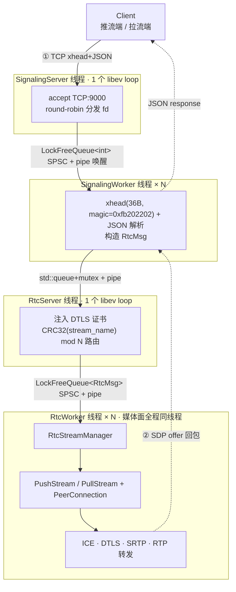
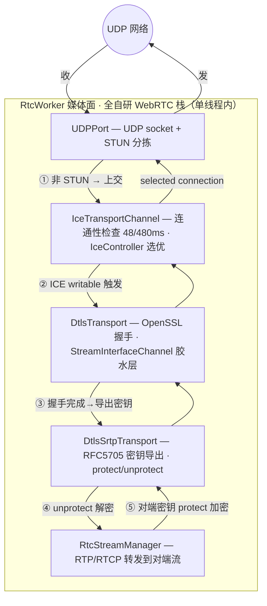

# xrtc-server

> C++14 手写的 WebRTC **SFU（选择性转发）+ 信令服务器**。不依赖 libwebrtc，ICE / STUN / DTLS / SRTP / RTP 转发**全套自研**；libev thread-per-core 事件驱动架构，媒体面零跨线程。

**技术栈**：C++14 · libev · OpenSSL(DTLS) · libsrtp · yaml-cpp · nlohmann/json · Google Test

---

## 项目定位

xrtc-server 是一个**只做转发、不做转码**的 WebRTC SFU：从推流端收 SRTP → 解密 → 按拉流端密钥重加密 → 转发，SSRC 透传，不触碰编解码层。配套一个自研二进制协议的信令服务，负责 SDP offer/answer 交换与推拉流编排。

一条推拉流全链路（信令 + ICE + DTLS + SRTP + RTP 转发）**全部手写实现**，共 14 个开发 Phase 完成，**已在云服务器部署，并与 Electron 客户端（D3D11VA 硬解 + DComp 渲染）完成端到端推拉流联调**。

---

## 技术亮点

1. **全自研 WebRTC 媒体栈** —— 不依赖 libwebrtc，ICE / STUN 编解码 / DTLS 握手 / SRTP 密钥体系 / RTP 转发逐层手写，对协议栈每一层的字节布局与状态机有完整掌控。
2. **自研 ICE 连通性检查** —— 48ms/480ms 强弱双频 ping、`IceController` 5 级排序（writable > write_state > receiving > priority > RTT）+ 10ms RTT 防抖，避免候选对 ping-pong 振荡。[↴ 深潜](DEEP-DIVE.md#m3)
3. **DTLS-SRTP 密钥体系** —— OpenSSL 经 `StreamInterfaceChannel` 胶水层对接自研 ICE 通道；RFC 5705 `export_keying_material` 导出 SRTP 密钥；`SrtpSession` 按 inbound/outbound 强制方向隔离。[↴ 深潜](DEEP-DIVE.md#m5)
4. **Trickle ICE 异步时序** —— 处理三类乱序：DTLS ClientHello 早于 Answer 到达（缓存重放）、SRTP 安装等待 DTLS 完成（信号 + 立即检查双触发）、ICE writable 后才启动 DTLS。[↴ 深潜](DEEP-DIVE.md#m4)
5. **thread-per-core 并发架构** —— libev 单 loop / 线程 + 无锁 SPSC 队列 + pipe 唤醒；`CRC32(stream_name) mod N` 路由保证同名推拉流落同一 RtcWorker，转发路径同步调用、媒体面零跨线程。[↴ 深潜](DEEP-DIVE.md#m1)
6. **真实并发 bug 修复** —— PeerConnection 延迟 10ms 析构，规避 ICE timer 回调栈内 `k_failed → delete stream → 析构 IceController` 而回调返回后仍访问 IceController 导致的 use-after-free。[↴ 深潜](DEEP-DIVE.md#m6)

> 以上每条的**开发难点、踩过的 bug、设计权衡**（含 commit 号），逐模块详见 **[DEEP-DIVE.md](DEEP-DIVE.md)**（模块 2 SDP/PC 亦在其中）。

---

## 系统架构

### 图 A｜系统总览（线程模型 + 信令数据流）



- **信令命令**：`PUSH(1) / PULL(2) / ANSWER(3) / STOP_PUSH(4) / STOP_PULL(5)`，短连接（一次请求/响应一条 TCP）。
- **跨线程消息** `RtcMsg`（`src/xrtc_server_def.h`）：携带 `cmdno / uid / stream_name / sdp / certificate / worker / conn`，是全系统跨线程传递的核心结构。
- **唤醒机制**：所有跨线程队列统一用 `pipe write(1 int)` 唤醒目标 libev loop。

### 图 B｜媒体栈分层（ICE → DTLS → SRTP → 转发）



- **STUN 分拣**：`UDPPort` 收到 UDP 包先做 CRC32 fingerprint 快检，区分 STUN 与媒体包；STUN Binding 走 ICE 连通性检查，媒体包走 DTLS/SRTP。
- **RTP/RTCP 解复用**：`infer_rtp_packet_type()` 按 payload type（RTP 64-127 / RTCP 192-223）分流。
- **转发触发**：`RtcStreamManager` 订阅 push/pull stream 的 `signal_rtp/rtcp_packet_received`，push 收到的包转给同名 pull（RTCP 双向：PLI→push 请求 I 帧，SR→pull）。

---

## 端到端数据流（一次推拉流的时间线）

```
推流端                          xrtc-server                        拉流端
  │  ① PUSH (TCP xhead+JSON) ──▶  CRC32 路由 → 建 PushStream
  │                               ICE 收集 candidate + DTLS 证书指纹
  │  ② ◀── SDP offer (recvonly, ICE, fingerprint)
  │  ③ ANSWER ──▶                 set_remote_sdp → 提取 remote ICE/DTLS/SSRC
  │  ④ STUN ping/pong  ◀─▶        创建 prflx candidate → IceConnection → 选优
  │  ⑤ DTLS ClientHello ◀─▶       OpenSSL 握手 → set_dtls_state(connected)
  │  ⑥ DTLS-SRTP 密钥导出         SrtpSession(send+recv) 就绪
  │  ⑦ SRTP RTP ──▶              unprotect → on_rtp_packet_received
  │                                                  ⑧ PULL ◀── (拉流端接入, 提取 push SSRC)
  │                                                  ⑨ ──▶ SDP offer (sendonly + SSRC)
  │                                                  ⑩ ◀── ANSWER → ICE/DTLS/SRTP
  │                               ⑪ push 包 → protect(pull 端 key) ──▶ 拉流端收 RTP
  │                               ⑫ ◀─▶ RTCP 双向转发 (PLI/SR)
```

> 完整逐段走读见 [`note/xrtc-server-architecture-summary.md`](note/xrtc-server-architecture-summary.md)（15 段，从 PUSH 到 RTP 转发）。

---

## 目录结构

| 路径 | 职责 |
|------|------|
| `src/main.cpp` · `src/global.cpp` | 入口与初始化（conf→log→signaling→rtc）、全局单例 |
| `src/xrtc_server_def.h` | `RtcMsg` 跨线程消息 + `CMDNO_*` 命令 |
| `src/base/` | EventLoop(libev 封装) · Socket · LockFreeQueue · Conf · Log · `xhead` 协议 |
| `src/server/signaling_server.*` | TCP 监听 + round-robin 分发 |
| `src/server/signaling_worker.*` | 协议解析 · 客户端 I/O · 转发请求给 RtcServer |
| `src/server/rtc_server.*` | 消息路由 · DTLS 证书管理 · CRC32 选 worker |
| `src/server/rtc_worker.*` | WebRTC 流处理（push/pull/answer），持有 RtcStreamManager |
| `src/server/tcp_connection.*` | 每连接状态机（SDS 缓冲 · STATE_HEAD/STATE_BODY） |
| `src/stream/` | `RtcStream` 基类 · `PushStream`(recvonly) · `PullStream`(sendonly+SSRC) · `RtcStreamManager` |
| `src/pc/` | `PeerConnection` · `SessionDescription`(SDP/SSRC) · `TransportController` · `DtlsTransport` · `DtlsSrtpTransport` |
| `src/ice/` | `IceAgent` · `IceTransportChannel` · `IceController` · `IceConnection` · `UDPPort` · `StunMessage` |
| `src/module/rtp_rtcp/` | RTP/RTCP 包处理 |
| `test/` | Google Test（`#define private public` 访问内部） |
| `conf/` | `general.yaml` · `signaling_server.yaml` · `rtc_server.yaml` |

---

## 构建 & 运行

```bash
# 构建
./auto_build.sh              # 或手动：cd build && cmake .. && make -j$(nproc)

# 运行测试
./build/xrtc-server-test
./build/xrtc-server-test --gtest_filter="*Worker*"   # 按模式过滤

# 启动服务（读取 conf/*.yaml）
./build/xrtc-server
```

**端到端演示**需要三方配合：

```
Electron 客户端 (推/拉流)  ──▶  signaling-server (信令中转)  ──▶  xrtc-server (SFU)
```

- **xrtc-server** — 本项目，媒体转发核心，监听 TCP:9000（信令）+ 动态 UDP（媒体）。
- **signaling-server** — 同仓库 `../signaling-server/`（Go），Web 信令中转。
- **客户端** — `electron-client-tutorial`（D3D11VA 硬解 + DComp 渲染），推流端采集编码、拉流端解码渲染。

---

## 关键设计 FAQ

**为什么用 CRC32(stream_name) 路由？** 保证同一 stream 的 PUSH 与 PULL 落在同一 RtcWorker，转发可同步调用、媒体面零跨线程开销。

**为什么 PULL 的 SDP offer 要带 SSRC？** SFU 不转码，只做 SRTP 解密→重加密。把推流端真实 SSRC 透传给拉流端，拉流端才知道要解码哪些流。

**为什么 DTLS 完成后才算 media 就绪？** SRTP 密钥由 DTLS 握手主密钥导出（RFC 5705），DTLS 不完成就没有 SRTP 密钥。

**SDP fingerprint 起什么作用？** WebRTC 的 DTLS 证书都是自签名的，无 CA 链。fingerprint 是证书 SHA-256 哈希，经 SDP 信令交换，握手时 OpenSSL 比对对端证书哈希，替代 CA 完成身份认证 / MITM 检测。

**为什么 PeerConnection 延迟 10ms 析构？** 见技术亮点 6 —— 规避 ICE timer 回调栈内 use-after-free。

---

## 项目状态

14 个开发 Phase 全部完成（TCP 协议 → 跨线程路由 → SDP → ICE → DTLS → SRTP → RTP 双向转发 → STOP/异常处理）。逐 Phase 进度与参考 commit 见 [`CLAUDE.md`](CLAUDE.md) 的 *Phase Progress*。
