# xrtc-server 跨模块横向深潜

> 拆掉模块之间的墙。从"一个字段的旅程"、"一个 socket 的一生"、"一条信号链的多米诺效应"三种视角，把 SDP / ICE / DTLS / SRTP / RTP 转发串成一个整体。
>
> 配套：系统总览 [`README.md`](../README.md)、模块纵向深潜 [`DEEP-DIVE.md`](../DEEP-DIVE.md)、架构走读 [`note/xrtc-server-architecture-summary.md`](xrtc-server-architecture-summary.md)。

## 目录

1. [`set_local_description`：整个媒体栈的"接生婆"](#1-set_local_description整个媒体栈的接生婆)
2. [同一个 UDP socket 如何服务三层协议](#2-同一个-udp-socket-如何服务三层协议)
3. [SDP 字段 → ICE/DTLS 的"最后一公里"](#3-sdp-字段--icedtls-的最后一公里)
4. [三包竞态：STUN / DTLS ClientHello / ANSWER 时序全集](#4-三包竞态stun--dtls-clienthello--answer-时序全集)
5. [信号链：ICE writable → DTLS → SRTP → RTP 就绪](#5-信号链ice-writable--dtls--srtp--rtp-就绪)
6. [TCP 信令 vs UDP 媒体：同一 libev LT 下的两种 I/O 哲学](#6-tcp-信令-vs-udp-媒体同一-libev-lt-下的两种-io-哲学)
7. [完整生命周期时间线](#7-完整生命周期时间线)
8. [你应该知道但可能没问的问题](#8-你应该知道但可能没问的问题)
9. [证书体系：HTTPS + DTLS 双层认证](#9-证书体系https--dtls-双层认证)
10. [PULL 流 + SSRC 透传](#10-pull-流--ssrc-透传)
11. [RTP/RTCP 数据包处理](#11-rtprtcp-数据包处理)
12. [STOP 与资源清理链](#12-stop-与资源清理链)
13. [ICE 5 级排序 + 两层限速：代码级走读](#13-ice-5-级排序--两层限速代码级走读)

---

## 1. `set_local_description`：整个媒体栈的"接生婆"

`set_local_description` 不只是往 SDP 里填 candidate。它创建了 ICE channel、UDP socket、DTLS/SRTP 传输对象、以及连接这一切的信号链。它是整个媒体栈的出生证明。

### 1.1 入口时间线

```
RtcWorker::_process_push(msg)
  → RtcStreamManager::create_push_stream(uid, stream_name, ...)
    → new PushStream(...)
    → stream->start(certificate)          // ① 初始化 PC + 启动 30s 超时定时器
    → offer = stream->create_offer()      // ② 媒体栈诞生 + 返回 SDP 文本
    → _push_streams[stream_name] = stream
```

`start()` 做两件事（`src/stream/rtc_stream.cpp:81-85`）：

```cpp
void RtcStream::start(rtc::RTCCertificate* certificate) {
    _ice_timeout_watcher = _el->create_timer(ice_timeout_cb, this, false);
    _el->start_timer(_ice_timeout_watcher, k_ice_timeout * 1000);  // 30s 兜底超时
    _pc->init(certificate);  // 传递 DTLS 证书到 TransportController
}
```

30s 超时含义：**如果 30s 内 PC 状态没到 k_connected → 触发 `on_stream_exception` → 清理流资源**。是整个系统的兜底超时。

### 1.2 `create_offer()` 的四个阶段

`PeerConnection::create_offer()`（`src/pc/peer_connection.cpp:99-151`）：

**阶段 A — 随机生成 ICE 凭据**（line 107）：
```cpp
IceParameters ice_params = IceCredentials::create_random_ice_credentials();
```
生成的 `ice-ufrag` 和 `ice-pwd` 被后续三个地方消费：SDP 文本、STUN MESSAGE-INTEGRITY HMAC 计算、UDPPort 的身份标识。

**阶段 B — 构造 SDP 对象模型**（lines 109-146）：
- 创建 `AudioContentDescription` + `VideoContentDescription`
- `add_transport_info(mid, ice_params, certificate)` 把 ufrag/pwd/fingerprint 写入 `TransportDescription`
- BUNDLE group：audio + video 共享同一传输通道

**阶段 C — `set_local_description()`**（line 148）：整个媒体栈的出生点，见 §1.3。

**阶段 D — 序列化为 SDP 文本**（line 150）：candidate 信息已通过信号回调填入，SDP 含 `a=candidate:...` 行。

### 1.3 `TransportController::set_local_description()` 的 8 个副作用

（`src/pc/transport_controller.cpp:35-82`）

```cpp
int TransportController::set_local_description(SessionDescription* desc) {
    for (auto content : desc->contents()) {
        std::string mid = content->mid();

        // BUNDLE: audio + video 共享同一 ICE/DTLS 通道
        if (desc->is_bundle(mid) && mid != desc->get_first_bundle_mid()) continue;

        // === 副作用 ①: 创建 ICE channel ===
        _ice_agent->create_channel(_el, mid, IceCandidateComponent::RTP);

        // === 副作用 ②: 设置本地 ICE 凭据 (ufrag + pwd) ===
        auto td = desc->get_transport_info(mid);
        _ice_agent->set_ice_params(mid, IceCandidateComponent::RTP,
            IceParameters(td->ice_ufrag, td->ice_pwd));

        // === 副作用 ③: 创建 DtlsTransport, 绑定到 ICE channel ===
        DtlsTransport* dtls_transport = new DtlsTransport(
            _ice_agent->get_channel(mid, IceCandidateComponent::RTP));
        dtls_transport->set_local_certificate(_local_certificate);

        // === 副作用 ④: 连接 DTLS 状态信号 → TransportController ===
        dtls_transport->signal_receiving_state.connect(this, ...);
        dtls_transport->signal_writable_state.connect(this, ...);
        dtls_transport->signal_dtls_state.connect(this, ...);

        // === 副作用 ⑤: 连接 ICE 状态信号 → TransportController ===
        _ice_agent->signal_ice_state.connect(this, ...);

        // === 副作用 ⑥: 创建 DtlsSrtpTransport ===
        DtlsSrtpTransport* dtls_srtp = new DtlsSrtpTransport(...);
        dtls_srtp->set_dtls_transport(dtls_transport, nullptr);

        // === 副作用 ⑦: 连接 SRTP 收包信号 → 上层 ===
        dtls_srtp->signal_rtp_packet_received.connect(this, ...);
        dtls_srtp->signal_rtcp_packet_received.connect(this, ...);
    }

    // === 副作用 ⑧: 触发 candidate 收集 (创建 UDP sockets!) ===
    _ice_agent->gathering_candidate();
    return 0;
}
```

### 1.4 `gathering_candidate()` → UDP socket 绑定

```
IceAgent::gathering_candidate()
  → for each channel: channel->gathering_candidate()
    → IceTransportChannel::gathering_candidate()   (ice_transport_channel.cpp:85-121)
```

```cpp
void IceTransportChannel::gathering_candidate() {
    if (_ice_params.ice_ufrag.empty() || _ice_params.ice_pwd.empty()) return;
    auto network_list = _alloctor->get_networks();

    for (auto network : network_list) {
        UDPPort* port = new UDPPort(_el, _transport_name, _component, _ice_params);
        port->signal_unknown_address.connect(this, &IceTransportChannel::_on_unknown_address);

        Candidate c;
        port->create_ice_candidate(network, _alloctor->min_port(),
            _alloctor->max_port(), c);
        _local_candidates.push_back(c);
    }
    signal_candidate_allocate_done(this, _local_candidates);
}
```

`UDPPort::create_ice_candidate()`（`src/ice/udp_port.cpp:41-97`）的实际 socket 操作：

```cpp
int UDPPort::create_ice_candidate(Network* network, int min_port, int max_port, Candidate& c) {
    _socket = create_udp_socket(network->ip().family());   // socket()
    sock_setnonblock(_socket);                             // O_NONBLOCK
    sock_bind(_socket, ..., min_port, max_port);           // bind()
    sock_get_address(_socket, nullptr, &port);             // getsockname()

    _async_socket = std::make_unique<AsyncUdpSocket>(_el, _socket);
    _async_socket->signal_read_packet.connect(this, &UDPPort::_on_read_packet);
    // ★ 这个连接是整个 UDP 收包链路的起点

    c.username = _ice_params.ice_ufrag;
    c.password = _ice_params.ice_pwd;
    ...
}
```

**总结**：`set_local_description` 不仅把 candidate 填入 SDP，更创建了绑定在本地网卡上的 UDP socket，并通过 `signal_read_packet` 连接把它变成了后续所有 ICE/DTLS/SRTP 数据的入口。

### 1.5 IceTransportChannel × Network → UDPPort 的数量关系

`IceTransportChannel` 是逻辑上的媒体传输通道，`UDPPort` 是附着在其上的物理 UDP socket。两者的数量关系受三层因素控制。

**第一层 — BUNDLE 控制逻辑通道数**（`transport_controller.cpp:44`）：

```cpp
if (desc->is_bundle(mid) && mid != desc->get_first_bundle_mid()) {
    continue;  // audio + video 共享同一个 ICE channel
}
```

**第二层 — RTCP mux 控制是否需要独立的 RTCP 通道**：创建时只传了 `IceCandidateComponent::RTP`。若不开启 RTCP mux，则需额外创建 `RTCP` 通道。

**第三层 — 网卡数量控制物理 socket 数**：`gathering_candidate()` 遍历 `NetworkManager::get_networks()`，为每个 Network 创建一个 `UDPPort`。

`NetworkManager` 有两种模式（`src/base/network.cpp:19-50`）：

| 模式 | 触发条件 | 行为 |
|------|---------|------|
| **云服务器手工配置** | `conf.netcard` + `conf.ipv4_addr` 非空 | 跳过网卡扫描，手工构造唯一的 Network 对象 |
| **本地自动扫描** | 上述配置为空 | `getifaddrs()` 遍历全部网卡，过滤 IPv4 非回环地址 |

云服务器必须手工配置的原因：公网 IP 在 NAT 环境下不绑定在任何本地网卡上，`getifaddrs()` 扫出来的是内网地址，客户端无法直连。

**数量公式**：

```
UDPPort 总数 = Network 数量 × IceTransportChannel 数量
```

| 场景 | Network 数 | IceTransportChannel 数 | UDPPort 总数 |
|------|-----------|----------------------|-------------|
| 云服务器（手工配公网 IP）+ BUNDLE + RTCP mux | 1 | 1 | **1** |
| 本地 eth0 + BUNDLE + RTCP mux | 1 | 1 | **1** |
| 本地 eth0 + wlan0 + BUNDLE + RTCP mux | 2 | 1 | **2** |
| 本地 eth0 + wlan0 + BUNDLE off + RTCP mux | 2 | 2 | **4** |
| 本地 eth0 + BUNDLE off + RTCP mux off | 1 | 4 | **4** |

每个 UDPPort 对应一个独立的 UDP socket，绑定在对应网卡的 IP 上。服务端 SDP offer 列出所有 candidate，客户端逐一尝试，ICE 协议从多条 path 中选出最优。

**层次全景**：

```
set_local_description()
  │
  ├─ IceAgent::create_channel() ──→ IceTransportChannel (逻辑通道)
  │    数量: BUNDLE + RTCP mux 决定
  │
  └─ IceAgent::gathering_candidate()
       │
       └─ for each channel:
            IceTransportChannel::gathering_candidate()
              │
              └─ for each Network (get_networks()):
                   UDPPort::create_ice_candidate()
                     ├─ socket() + bind() + O_NONBLOCK
                     ├─ AsyncUdpSocket 包裹
                     ├─ signal_read_packet → _on_read_packet
                     └─ Candidate 生成 (携带 ice-ufrag + ice-pwd)
```

### 1.6 Candidate Pair → IceConnection：从 UDP 四元组到逻辑通道

客户端也可能有多张网卡，每个网卡都可以向 SFU 的同一个 UDPPort 发送数据，形成多个 UDP 四元组。每个通过 STUN 校验的四元组对应一个 `IceConnection`。

**UDP 四元组 = Candidate Pair**：

```
客户端 WiFi:    192.168.1.100:50001  ──┐
                                        ├──→ SFU UDPPort 120.76.197.143:10028
客户端 以太网:  10.0.0.50:50002     ──┘

                                    同一个 UDPPort
                                   _connections map:
                                     key "192.168.1.100:50001" → IceConnection #1
                                     key "10.0.0.50:50002"     → IceConnection #2
```

`UDPPort` 内部用 `std::map<SocketAddress, IceConnection*> _connections` 按客户端地址索引（`src/ice/udp_port.cpp:107-110`）：

```cpp
IceConnection* UDPPort::get_connection(const rtc::SocketAddress& addr) {
    auto iter = _connections.find(addr);
    return iter == _connections.end() ? nullptr : iter->second;
}
```

当收到客户端 STUN Binding Request 且通过校验后，创建 `IceConnection`（`udp_port.cpp:327-342`）：

```cpp
IceConnection* UDPPort::create_connection(const Candidate& remote_candidate) {
    IceConnection* conn = new IceConnection(_el, this, remote_candidate);
    auto ret = _connections.insert(
        std::make_pair(conn->remote_candidate().address, conn));
    if (ret.second == false && ret.first->second != conn) {
        ret.first->second = conn;  // 同地址 → 替换旧连接
    }
    return conn;
}
```

**层次结构**：

```
UDPPort (物理层，一个 UDP socket，绑定一个本地地址)
  │
  ├─ IceConnection #1  四元组 (client_WiFi:50001, SFU:10028)
  │     ├─ write_state:     STATE_WRITABLE   ← ping 收到回复
  │     ├─ receiving:       true             ← 收到过对端数据
  │     ├─ rtt:             15ms
  │     └─ priority:        RFC 5245 计算值
  │
  ├─ IceConnection #2  四元组 (client_eth:50002, SFU:10028)
  │     ├─ write_state:     STATE_WRITE_INIT  ← 还没 ping 过
  │     ├─ receiving:       false
  │     ├─ rtt:             0
  │     └─ priority:        RFC 5245 计算值
  │
  └─ IceController ──── 从 N 个连接中选出 1 个最优
        │
        ├─ sort_and_switch_connection(): 5 级排序 + RTT 防抖(10ms)
        │     writable > write_state > receiving > priority > RTT
        │
        ├─ select_connection_to_ping(): 两层限速
        │     Channel 级 48ms/480ms，Connection 级 48ms/900ms/2500ms
        │
        └─ _selected_connection → 唯一的发送出口
```

**IceConnection 的职责**——它是"最小逻辑通道"，承载候选对上的完整 ICE 状态：

| 职责 | 代码位置 |
|------|---------|
| STUN ping/pong | `ping()` / `on_connection_request_response()` |
| write state 生命周期 | `set_write_state()`: INIT → WRITABLE → UNRELIABLE → TIMEOUT |
| receiving 方向探活 | `update_receiving()`: 综合 ping + data 时间戳 |
| RTT 平滑 | `received_ping_response()`: `rtt = old*0.75 + new*0.25` |
| 非 STUN 数据转发 | `on_read_packet()` → `signal_read_packet` → DtlsTransport |
| 数据发送 | `send_packet(data, len)` → `_port->send_to(remote_addr)` |

数据收发的唯一出口是 `_selected_connection`（`src/ice/ice_transport_channel.cpp:493-506`）：

```cpp
int IceTransportChannel::send_packet(const char* data, size_t len) {
    if (!_ice_controller->ready_to_send(_selected_connection)) return -1;
    return _selected_connection->send_packet(data, len);
}
```

**四层职责总结**：

| 层次 | 对象 | 职责 |
|------|------|------|
| 物理层 | UDPPort | 一个 UDP socket，绑定本地地址，`_connections` map 管理所有四元组 |
| 逻辑层 | IceConnection | 每个候选对一个，独立跟踪 write_state / receiving / RTT |
| 决策层 | IceController | 5 级排序 + 两层限速，选出最优连接 |
| 聚合层 | IceTransportChannel | 管理 UDPPort + IceController，向外暴露 writable/receiving 信号 |

所有 IceConnection 共享同一个物理 socket，但独立的状态决定了：哪个连接被选中发数据、哪个连接已失效需要淘汰。DTLS 握手、SRTP 加解密、RTP 转发最终都通过**那一个** `_selected_connection` 的 `send_packet()` 发出，通过 `on_read_packet()` → `signal_read_packet` 收进来。

### 1.7 ICE ping 定时器的冷启动条件

`IceTransportChannel` 持有一个周期性定时器（`_ping_watcher`），周期在 48ms/480ms 之间自适应。冷启动的唯一门控是 `_maybe_start_pinging()`（`ice_transport_channel.cpp:414-428`）：

```cpp
void IceTransportChannel::_maybe_start_pinging() {
    if (_start_pinging) return;  // 已启动，跳过

    if (_ice_controller->has_pingable_connection()) {
        _el->start_timer(_ping_watcher, _cur_ping_interval * 1000);
        _start_pinging = true;
    }
}
```

`has_pingable_connection()` → `_is_pingable()` 要求 `remote_candidate` **同时具备** username 和 password（`ice_controller.cpp:181-186`）：

```cpp
if (remote.username.empty() || remote.password.empty()) {
    return false;
}
```

两把凭据的来源和时序：

| 凭据 | 何时填入 | 来源 |
|------|---------|------|
| `remote_candidate.username` | STUN Binding Request 解析成功 | USERNAME 属性中提取的 `remote_ufrag` |
| `remote_candidate.password` | ANSWER 到达后补填 | `set_remote_ice_params()` → `maybe_set_remote_ice_params()` |

**冷启动条件 = 至少一个 IceConnection 同时具备 ufrag（来自 STUN）和 password（来自 ANSWER）**。

`_maybe_start_pinging()` 在两个地方被调用，**谁后到谁触发**：

```
路径 A — STUN 先到，ANSWER 后到:
  STUN Request → _on_unknown_address → _add_connection
    → _sort_connections_and_update_state → _maybe_start_pinging()
    → password 为空, has_pingable_connection() = false → 跳过

  ANSWER 到 → set_remote_ice_params() → maybe_set_remote_ice_params()
    → 补填 password → _sort_connections_and_update_state
    → _maybe_start_pinging()
    → username+password 都到位 ★ 启动!

路径 B — ANSWER 先到，STUN 后到:
  ANSWER → _remote_ice_params 写入, 此时还没有 connection → 跳过

  STUN Request → _on_unknown_address
    → remote_candidate.password = _remote_ice_params.ice_pwd (已在 ANSWER 中填入)
    → 创建时密码就已经非空 → _add_connection
    → _sort_connections_and_update_state → _maybe_start_pinging() ★ 启动!
```

`_start_pinging` 保证只启动一次。

### 1.8 定时器的三职责 + 两层限速

`IceTransportChannel` 持有的定时器不止发 ping——它是整个 ICE 状态机的**心跳驱动**。`_on_check_and_ping()`（`ice_transport_channel.cpp:448-465`）每个周期做三件事：

```cpp
void IceTransportChannel::_on_check_and_ping() {
    _update_connection_states();                          // ① 巡检所有连接
    auto result = _ice_controller->select_connection_to_ping(...); // ② 选 ping 目标
    if (result.conn) _ping_connection(conn);             // ③ 发 ping
    // interval 变化 → 重启定时器
}
```

**① `_update_connection_states()`**——遍历所有连接调 `conn->update_state(now)`，检测 ping 超时 → 降级 write_state（WRITABLE → UNRELIABLE → TIMEOUT）。状态变化时 `signal_state_change` → 触发 `_on_connection_state_change` → `_sort_connections_and_update_state` → `sort_and_switch_connection()` **可能切换 selected connection**。

**② `select_connection_to_ping()`**——Channel 级 + Connection 级两层限速，选本轮应该 ping 的候选对。

**③ `_ping_connection(conn)`**——对选中的候选对发出 STUN Binding Request，验证可达性。

```
每个定时器周期:
  ① 巡检所有连接 → 超时的降级/淘汰
  ② 连接状态变化 → 信号上报 → 可能触发 selected 切换
  ③ 选一个候选对发 ping → 验证可达性
  ④ 根据 weak/strong 调整定时器频率
```

以下详述步骤②中的两层限速设计。定时器周期是所有候选对的"最小分辨率"：**通道稳定时加大周期省带宽，不稳定时缩小周期尽快收敛到最优**。

**第一层 — Channel 级**（`ice_controller.cpp:224-225`）：

```cpp
int ping_interval = (_weak() || need_ping_more_at_weak)
    ? WEAK_PING_INTERVAL    // 48ms
    : STRONG_PING_INTERVAL; // 480ms
```

`_weak()` = 没有 selected_connection，或者 selected 不满足 writable && receiving。`need_ping_more_at_weak` = 存在 ping 未满 3 次的连接（新连接快速初探）。

**第二层 — Connection 级**（`ice_controller.cpp:335-347`）：

| 条件 | 间隔 | 含义 |
|------|------|------|
| `< 3 次 ping` | 48ms | 新连接，快速摸清质量 |
| channel weak 或连接不稳定 | 900ms | 中等频率 |
| channel strong 且连接稳定 | 2500ms | 低频保活 |

**两层同时满足才真发包**：

```
定时器 48ms 触发 → _on_check_and_ping()
  → select_connection_to_ping()
    → _find_next_pingable_connection()
      → _is_pingable 过滤：
        Channel 级: now >= last_ping_sent_ms + 48ms  ← 定时器已保证
        Connection 级: now >= conn.last_ping_sent + 2500ms ← 稳定连接未到间隔
      → 跳过 → 本轮不发包
```

**自适应调速器的本质**：

```
定时器周期 = 所有候选对的"最小分辨率"
  │
  ├─ weak 时 48ms: 高频探测, 每 48ms 至少 ping 一个 pair, 快速收敛到最优
  └─ strong 时 480ms: 低频, 已经选出来了, 不需要频繁换

Connection 级在此基础上进一步限速:
  weak 时: timer=48ms, 新连接 conn_interval=48ms → 每 48ms 一个
  strong 时: timer=480ms, 稳定连接 conn_interval=2500ms → 实际每 2500ms 才 ping 一次
```

**已知问题**：当前采用 Aggressive Nomination——每包 ping 都带 USE-CANDIDATE（`stun_request.cpp:120`），包括轮询探活其他 pair 的 ping。这会导致客户端被探活 ping "误导"切到非 selected 的 pair。正确做法是 Regular Nomination：只有 selected connection 的 ping 才带 USE-CANDIDATE。单网口场景下无实际影响（仅 1 个 IceConnection），多网卡时需修复。代码已标记 TODO。

---

## 2. 同一个 UDP socket 如何服务三层协议

同一个 UDP socket、同一个端口，收包走同一条路径，然后在四个分拣层逐级分流。

### 2.1 收包分拣链（完整）

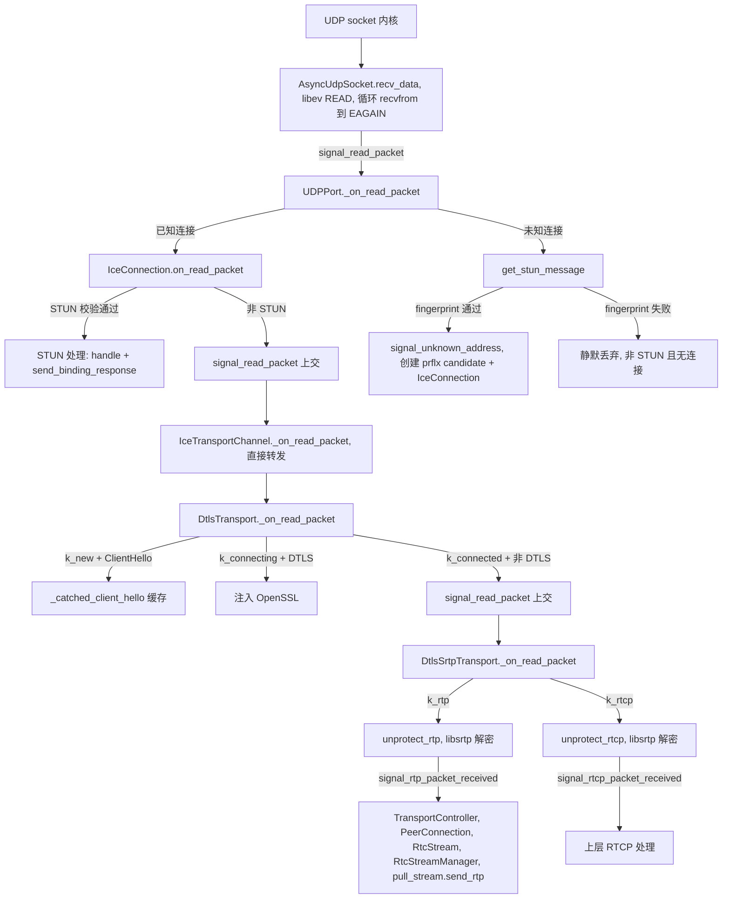
```mermaid
graph TD
    UDP[UDP socket 内核]
    UDP --> Async[AsyncUdpSocket.recv_data, libev READ, 循环 recvfrom 到 EAGAIN]
    Async -->|signal_read_packet| UDPPort[UDPPort._on_read_packet]

    UDPPort -->|已知连接| Conn[IceConnection.on_read_packet]
    UDPPort -->|未知连接| GetStun2[get_stun_message]

    Conn -->|STUN 校验通过| STUN[STUN 处理: handle + send_binding_response]
    Conn -->|非 STUN| SigRead1[signal_read_packet 上交]

    SigRead1 --> IceCh[IceTransportChannel._on_read_packet, 直接转发]
    IceCh --> DtlsRecv[DtlsTransport._on_read_packet]

    DtlsRecv -->|k_new + ClientHello| Cache[_catched_client_hello 缓存]
    DtlsRecv -->|k_connecting + DTLS| OpenSSL[注入 OpenSSL]
    DtlsRecv -->|k_connected + 非 DTLS| SigRead2[signal_read_packet 上交]

    SigRead2 --> SrtpRecv[DtlsSrtpTransport._on_read_packet]

    SrtpRecv -->|k_rtp| RtpDec[unprotect_rtp, libsrtp 解密]
    SrtpRecv -->|k_rtcp| RtcpDec[unprotect_rtcp, libsrtp 解密]

    RtpDec -->|signal_rtp_packet_received| RtpUp[TransportController, PeerConnection, RtcStream, RtcStreamManager, pull_stream.send_rtp]
    RtcpDec -->|signal_rtcp_packet_received| RtcpUp[上层 RTCP 处理]

    GetStun2 -->|fingerprint 通过| Unknown[signal_unknown_address, 创建 prflx candidate + IceConnection]
    GetStun2 -->|fingerprint 失败| Drop[静默丢弃, 非 STUN 且无连接]
```

### 2.2 四个分拣层

| 层级 | 分拣点 | 判断依据 | 去向 |
|------|--------|---------|------|
| **第 1 层** | `UDPPort::_on_read_packet` | 是否有已知连接？ | 有 → IceConnection；无 → `get_stun_message` |
| **第 2 层** | `IceConnection::on_read_packet` | CRC32 fingerprint 校验 | 通过 → STUN 处理；失败 → `signal_read_packet` 上交 |
| **第 3 层** | `DtlsTransport::_on_read_packet` | `buf[0]` 在 20-63？+ `buf[13]==1`? | DTLS → OpenSSL；其他 → `signal_read_packet` 上交 |
| **第 4 层** | `DtlsSrtpTransport::_on_read_packet` | `buf[1] & 0x7F` 在 [64,96)? | RTP → `unprotect_rtp`；RTCP → `unprotect_rtcp` |

### 2.3 发包容积链（完整）

加密 RTP 的发送路径从上到下贯穿整个栈：

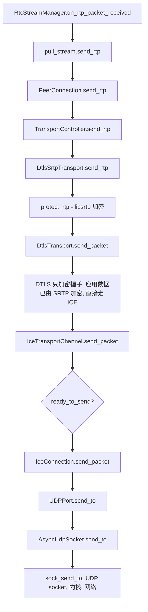
```mermaid
graph TD
    Mgr[RtcStreamManager.on_rtp_packet_received]
    Mgr --> Pull[pull_stream.send_rtp]
    Pull --> PC[PeerConnection.send_rtp]
    PC --> TC[TransportController.send_rtp]
    TC --> SrtpSend[DtlsSrtpTransport.send_rtp]

    SrtpSend --> Protect[protect_rtp - libsrtp 加密]
    Protect --> DtlsSend[DtlsTransport.send_packet]
    Note1[DTLS 只加密握手, 应用数据已由 SRTP 加密, 直接走 ICE]

    DtlsSend --> Note1
    Note1 --> IceCh[IceTransportChannel.send_packet]
    IceCh --> Ready{ready_to_send?}
    Ready --> Conn[IceConnection.send_packet]
    Conn --> Port[UDPPort.send_to]
    Port --> Async[AsyncUdpSocket.send_to]
    Async --> Kernel[sock_send_to, UDP socket, 内核, 网络]
```

---

## 3. SDP 字段 → ICE/DTLS 的"最后一公里"

### 3.1 字段提取

入口 `PeerConnection::set_remote_sdp()`（`src/pc/peer_connection.cpp:344`）：

```
"a=ice-ufrag:AbCd"   → TransportDescription::ice_ufrag  = "AbCd"
"a=ice-pwd:xxxxxx"   → TransportDescription::ice_pwd   = "xxxxxx"
"a=fingerprint:sha-256 AB:CD:..." → TransportDescription::identity_fingerprint
```

解析函数 `parse_transport_info()`（`peer_connection.cpp:171-207`）用 `starts_with` 匹配行前缀。提取完存入 `SessionDescription::_transport_infos`。

### 3.2 分发：同一个函数同时喂 ICE 和 DTLS

`TransportController::set_remote_description()`（`src/pc/transport_controller.cpp:219-245`）：

```cpp
auto td = remote_desc->get_transport_info(mid);
if (td) {
    // BRANCH A: ice-ufrag + ice-pwd → ICE 子系统
    _ice_agent->set_remote_ice_params(mid, IceCandidateComponent::RTP,
        IceParameters(td->ice_ufrag, td->ice_pwd));

    // BRANCH B: fingerprint → DTLS 子系统
    DtlsTransport* dtls = _get_dtls_transport(mid);
    if (dtls) {
        dtls->set_remote_fingerprint(td->identity_fingerprint->algorithm,
            td->identity_fingerprint->digest.data(),
            td->identity_fingerprint->digest.size());
    }
}
```

**注意顺序**：先设 ICE 参数，再设 DTLS 指纹。`set_remote_ice_params` 会触发 `_sort_connections_and_update_state()`，可能首次满足 ping 条件并启动 ICE 连通性检查。

### 3.3 ice-ufrag/pwd 的两把密码 + 各自消费点

ICE 涉及**两把**密码，对称分工。规则见 §8.1："发给谁，就用谁的密码"。

**本地密码 `_ice_params.ice_pwd`（SFU 密码）**：

| 消费点 | 场景 | 代码位置 |
|--------|------|---------|
| 验证客户端发来的 Binding Request | 收到 | `udp_port.cpp:195` — `validate_message_integrity(_ice_params.ice_pwd)` |
| 构造发给客户端的 Binding Response | 发出 | `ice_connection.cpp:62` — `add_message_integrity(_port->ice_pwd())` |

**远端密码 `_remote_ice_params.ice_pwd`（客户端密码）**：

进入 `IceTransportChannel` 后存在 `_remote_ice_params` 成员（`ice_transport_channel.cpp:75`），随后通过 `maybe_set_remote_ice_params` 补填到已有连接的 `remote_candidate.password`（`ice_connection.cpp:309-315`）。消费点：

| 消费点 | 场景 | 代码位置 |
|--------|------|---------|
| 分配给 `remote_candidate.password` | 创建 prflx 时赋值 | `ice_transport_channel.cpp:162` — 此时 ANSWER 可能未到，为空，需 §3.4 补填 |
| ping 门控 | 判断 `_is_pingable()` | `ice_controller.cpp:183` — `remote.password` 非空 = ANSWER 已到 |
| 构造发给客户端的 Binding Request (ping) | 发出 | `stun_request.cpp:131` — `add_message_integrity(remote_candidate().password)` |
| 验证客户端发来的 Binding Response | 收到 | `ice_connection.cpp:124` — `validate_message_integrity(_remote_candidate.password)` |

**注意**：之前说远端密码"不是 HMAC key，只是门控标志位"——这是错的。远端密码既做门控（`_is_pingable`），也做 HMAC key（ping 时构造 MI、收 response 时验证 MI）。"发给谁就用谁的密码"——发给客户端时用客户端密码，正是远端密码。

### 3.4 密码的"先有鸡还是先有蛋"问题

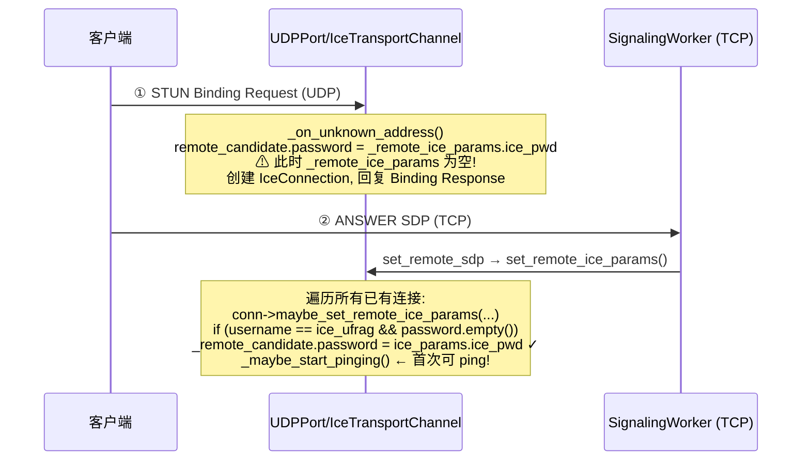
```mermaid
sequenceDiagram
    participant Client as 客户端
    participant UDP as UDPPort/IceTransportChannel
    participant TCP as SignalingWorker (TCP)

    Client->>UDP: ① STUN Binding Request (UDP)
    Note over UDP: _on_unknown_address()<br/>remote_candidate.password = _remote_ice_params.ice_pwd<br/>⚠ 此时 _remote_ice_params 为空!<br/>创建 IceConnection, 回复 Binding Response

    Client->>TCP: ② ANSWER SDP (TCP)
    TCP->>UDP: set_remote_sdp → set_remote_ice_params()
    Note over UDP: 遍历所有已有连接:<br/>conn->maybe_set_remote_ice_params(...)<br/>if (username == ice_ufrag && password.empty())<br/>  _remote_candidate.password = ice_params.ice_pwd ✓<br/>_maybe_start_pinging() ← 首次可 ping!

```

代码位置 `src/ice/ice_connection.cpp:309-315`：

```cpp
void IceConnection::maybe_set_remote_ice_params(const IceParameters& ice_params) {
    if (_remote_candidate.username == ice_params.ice_ufrag &&
            _remote_candidate.password.empty()) {
        _remote_candidate.password = ice_params.ice_pwd;
    }
}
```

### 3.5 fingerprint 的两个时序路径

`DtlsTransport::set_remote_fingerprint()`（`src/pc/dtls_transport.cpp:448-500`）：

**路径 A（正常：ANSWER 先到）**：
```
set_remote_fingerprint → 存 _remote_fingerprint_alg/value
  → _dtls 还不存在 → 跳过两个 if
  → _setup_dtls() → SetPeerCertificateDigest(已存的指纹) → 一把配好
```

**路径 B（乱序：ClientHello 先到）**：
```
ClientHello 触发 _setup_dtls() → 当时指纹空, SetPeerCertificateDigest 被跳过
  → ANSWER 后到 → _dtls 已存在 && !is_fingerprint_change
  → 直接对已创建的 _dtls 补调 SetPeerCertificateDigest  (line 475-482)
```

---

## 4. 三包竞态：STUN / DTLS ClientHello / ANSWER 时序全集

STUN Binding Request（UDP）、DTLS ClientHello（UDP）、ANSWER SDP（TCP）三者从客户端几乎同时发出，但在服务端以任意顺序到达。

### 4.1 六种时序

| # | 到达顺序 | 发生什么 | 延迟影响 |
|---|---------|---------|---------|
| **1** | STUN → DTLS → ANSWER | S 创建连接 → D 缓存到 `_catched_client_hello` → A 补指纹+密码 → ICE writable → 重放 D | **无延迟** |
| **2** | STUN → ANSWER → DTLS | S 创建连接 → A 补全凭据+指纹 → D 到达时 DTLS 已配好指纹 | **无延迟** |
| **3** | ANSWER → STUN → DTLS | A 先到（UDP 上无连接）→ S 创建连接+立即可 ping → ICE writable → D 到达 | **无延迟** |
| **4** | DTLS → STUN → ANSWER | D 先到**无连接** → `validate_fingerprint` 失败 → **UDPPort 静默丢弃** → S 创建 → A 补凭据 → 客户端**重传** D（1s） | **+1s DTLS 重传** |
| **5** | DTLS → ANSWER → STUN | D 被丢弃 → A 到达（无连接）→ S 创建 → 等重传 | **+1s** |
| **6** | ANSWER → DTLS → STUN | A 到达（无连接）→ D 被丢弃 → S 创建 → 等重传 | **+1s** |

### 4.2 时序 4 详细走读（唯一有延迟损失的路径）

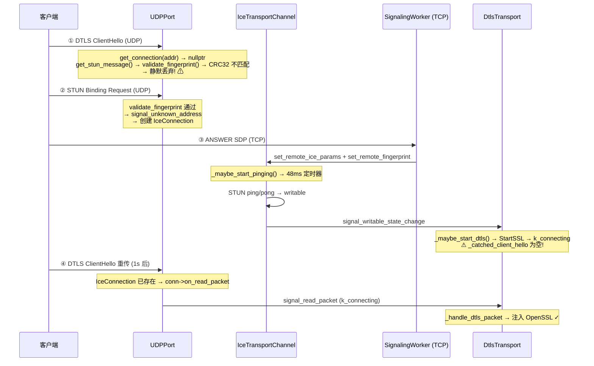
```mermaid
sequenceDiagram
    participant Client as 客户端
    participant UDP as UDPPort
    participant ICE as IceTransportChannel
    participant TCP as SignalingWorker (TCP)
    participant DTLS as DtlsTransport

    Client->>UDP: ① DTLS ClientHello (UDP)
    Note over UDP: get_connection(addr) → nullptr<br/>get_stun_message() → validate_fingerprint() → CRC32 不匹配<br/>→ 静默丢弃! ⚠

    Client->>UDP: ② STUN Binding Request (UDP)
    Note over UDP: validate_fingerprint 通过<br/>→ signal_unknown_address<br/>→ 创建 IceConnection

    Client->>TCP: ③ ANSWER SDP (TCP)
    TCP->>ICE: set_remote_ice_params + set_remote_fingerprint
    Note over ICE: _maybe_start_pinging() → 48ms 定时器

    ICE->>ICE: STUN ping/pong → writable
    ICE->>DTLS: signal_writable_state_change
    Note over DTLS: _maybe_start_dtls() → StartSSL → k_connecting<br/>⚠ _catched_client_hello 为空!

    Client->>UDP: ④ DTLS ClientHello 重传 (1s 后)
    Note over UDP: IceConnection 已存在 → conn->on_read_packet
    UDP->>DTLS: signal_read_packet (k_connecting)
    Note over DTLS: _handle_dtls_packet → 注入 OpenSSL ✓

```

**设计取舍**：UDPPort 不可能为每个未知 UDP 包都缓存（DoS 向量），所以选择"丢弃 + 依赖 DTLS 重传"。+1s 是 RFC 6347 规定的 DTLS 初始重传超时。

### 4.3 `_catched_client_hello` 的真实作用范围

只处理 **DTLS ClientHello 在 STUN 之后但在 DTLS 启动之前到达**的情况（时序 1），不处理 D 先于 STUN 到达的情况。

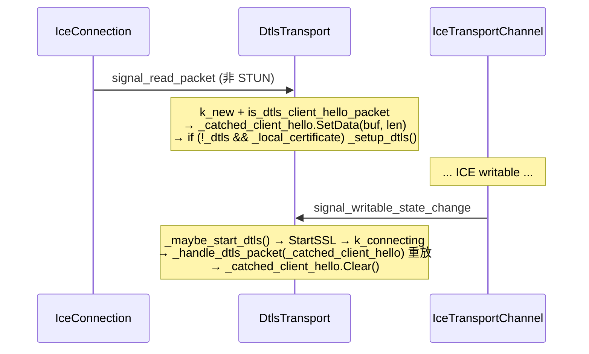
```mermaid
sequenceDiagram
    participant Conn as IceConnection
    participant DTLS as DtlsTransport
    participant ICE as IceTransportChannel

    Conn->>DTLS: signal_read_packet (非 STUN)
    Note over DTLS: k_new + is_dtls_client_hello_packet<br/>→ _catched_client_hello.SetData(buf, len)<br/>→ if (!_dtls && _local_certificate) _setup_dtls()

    Note over ICE: ... ICE writable ...

    ICE->>DTLS: signal_writable_state_change
    Note over DTLS: _maybe_start_dtls() → StartSSL → k_connecting<br/>→ _handle_dtls_packet(_catched_client_hello) 重放<br/>→ _catched_client_hello.Clear()

```

---

## 5. 信号链：ICE writable → DTLS → SRTP → RTP 就绪

这是最具"多米诺骨牌效应"的一条链。

### 5.1 信号订阅全景

在 `TransportController::set_local_description()` 中建立：

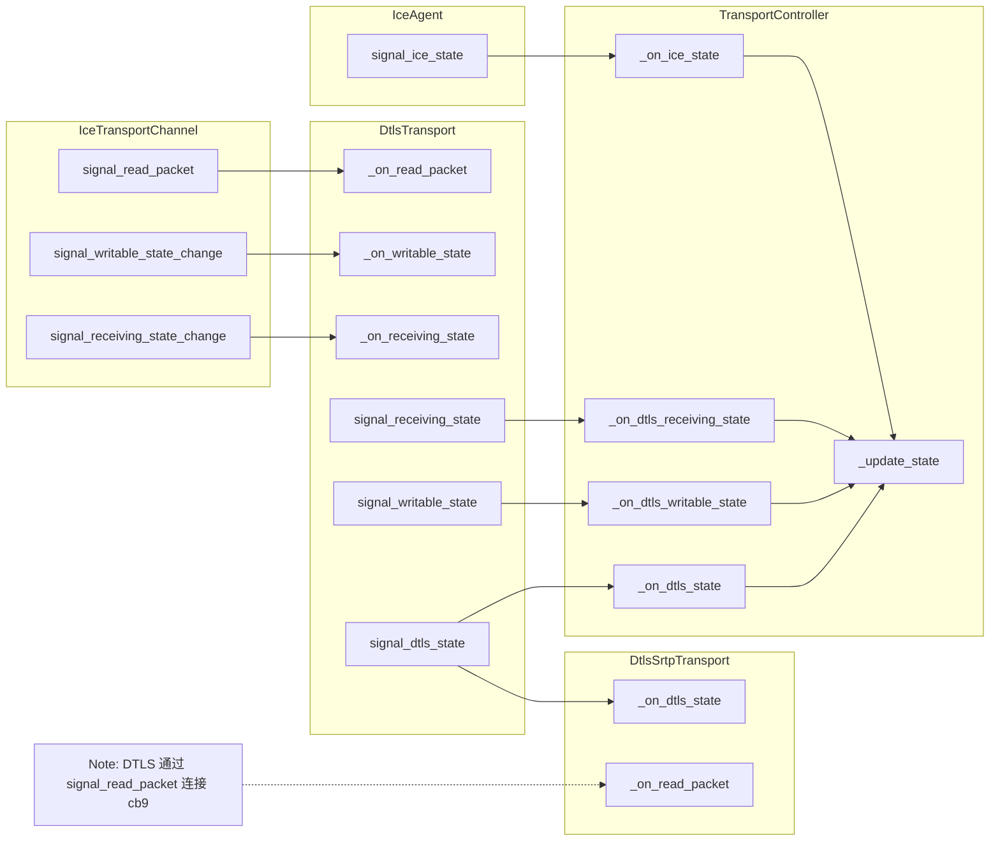
```mermaid
graph LR
    subgraph ICE[IceTransportChannel]
        sig1[signal_read_packet]
        sig2[signal_writable_state_change]
        sig3[signal_receiving_state_change]
    end

    subgraph DTLS[DtlsTransport]
        cb1[_on_read_packet]
        cb2[_on_writable_state]
        cb3[_on_receiving_state]
        sig4[signal_receiving_state]
        sig5[signal_writable_state]
        sig6[signal_dtls_state]
    end

    subgraph TC[TransportController]
        cb4[_on_dtls_receiving_state]
        cb5[_on_dtls_writable_state]
        cb6[_on_dtls_state]
        cb7[_on_ice_state]
        update[_update_state]
    end

    subgraph ICEAG[IceAgent]
        sig7[signal_ice_state]
    end

    subgraph SRTP[DtlsSrtpTransport]
        cb8[_on_dtls_state]
        cb9[_on_read_packet]
    end

    sig1 --> cb1
    sig2 --> cb2
    sig3 --> cb3
    sig4 --> cb4 --> update
    sig5 --> cb5 --> update
    sig6 --> cb6 --> update
    sig7 --> cb7 --> update
    sig6 --> cb8
    Note[Note: DTLS 通过 signal_read_packet 连接 cb9]
    Note -..-> cb9

```

### 5.2 多米诺骨牌

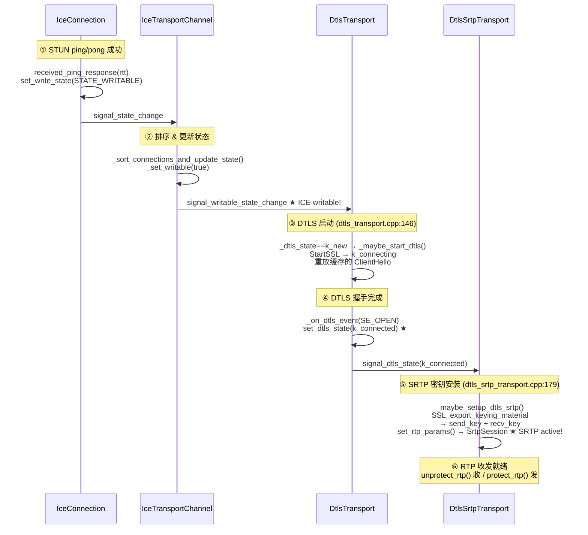
```mermaid
sequenceDiagram
    participant Conn as IceConnection
    participant Ch as IceTransportChannel
    participant DTLS as DtlsTransport
    participant SRTP as DtlsSrtpTransport

    Note over Conn: ① STUN ping/pong 成功
    Conn->>Conn: received_ping_response(rtt)<br/>set_write_state(STATE_WRITABLE)
    Conn->>Ch: signal_state_change

    Note over Ch: ② 排序 & 更新状态
    Ch->>Ch: _sort_connections_and_update_state()<br/>_set_writable(true)
    Ch->>DTLS: signal_writable_state_change ★ ICE writable!

    Note over DTLS: ③ DTLS 启动 (dtls_transport.cpp:146)
    DTLS->>DTLS: _dtls_state==k_new → _maybe_start_dtls()<br/>StartSSL → k_connecting<br/>重放缓存的 ClientHello

    Note over DTLS: ④ DTLS 握手完成
    DTLS->>DTLS: _on_dtls_event(SE_OPEN)<br/>_set_dtls_state(k_connected) ★
    DTLS->>SRTP: signal_dtls_state(k_connected)

    Note over SRTP: ⑤ SRTP 密钥安装 (dtls_srtp_transport.cpp:179)
    SRTP->>SRTP: _maybe_setup_dtls_srtp()<br/>SSL_export_keying_material<br/>→ send_key + recv_key<br/>set_rtp_params() → SrtpSession ★ SRTP active!

    Note over SRTP: ⑥ RTP 收发就绪<br/>unprotect_rtp() 收 / protect_rtp() 发

```

### 5.3 PC 状态聚合

4 个信号源汇聚到 `TransportController::_update_state()`（`src/pc/transport_controller.cpp:128-171`）：

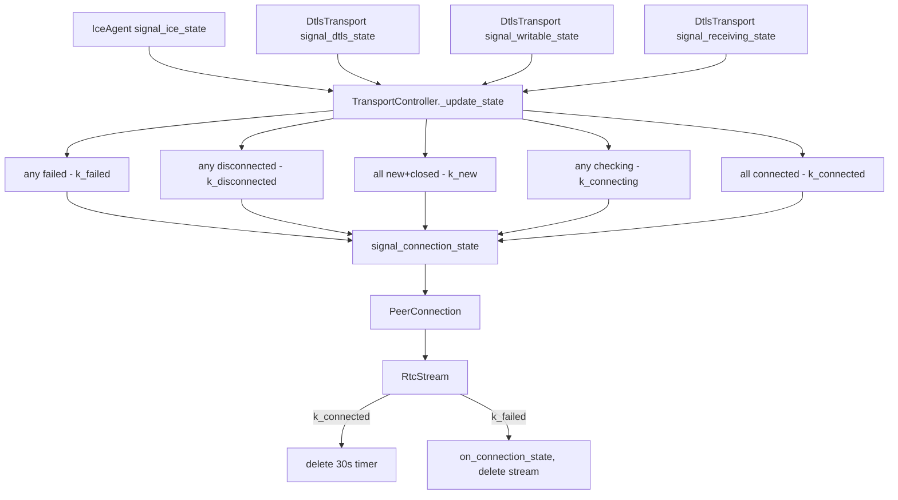
```mermaid
graph TD
    ICE[IceAgent signal_ice_state]
    DTLS1[DtlsTransport signal_dtls_state]
    DTLS2[DtlsTransport signal_writable_state]
    DTLS3[DtlsTransport signal_receiving_state]

    ICE --> Update[TransportController._update_state]
    DTLS1 --> Update
    DTLS2 --> Update
    DTLS3 --> Update

    Update --> R1[any failed - k_failed]
    Update --> R2[any disconnected - k_disconnected]
    Update --> R3[all new+closed - k_new]
    Update --> R4[any checking - k_connecting]
    Update --> R5[all connected - k_connected]

    R1 --> Sig[signal_connection_state]
    R2 --> Sig
    R3 --> Sig
    R4 --> Sig
    R5 --> Sig

    Sig --> PC[PeerConnection]
    PC --> Stream[RtcStream]
    Stream -->|k_connected| DelTimer[delete 30s timer]
    Stream -->|k_failed| Cleanup[on_connection_state, delete stream]
```

---

## 6. TCP 信令 vs UDP 媒体：同一 libev LT 下的两种 I/O 哲学

libev 只有 LT（水平触发）模式，但 TCP 和 UDP 在 LT 下的读写策略截然不同。核心原因是**字节流 vs 数据报**的本质差异。

### 6.1 读策略

**TCP**（`src/server/signaling_worker.cpp:328-360`）：每次 READ 事件只做**一次** `read()`，读取精确的 `bytes_expected` 字节（36 或 body_len）。

```cpp
void SignalingWorker::_read_query(int fd) {
    int read_len = c->bytes_expected;                      // 精确期望字节数
    int qb_len = sdslen(c->querybuf);                      // 已有数据偏移
    c->querybuf = sdsMakeRoomFor(c->querybuf, read_len);
    nread = sock_read_data(fd, c->querybuf + qb_len, read_len);  // 一次 read()
    sdsIncrLen(c->querybuf, nread);
    _process_query_buffer(c);                              // 尝试推进状态机
}
```

**为什么不循环读到 EAGAIN？** 因为 `bytes_expected` 精准限定了当前阶段需要多少字节。多余数据属于下一个请求（短连接下不存在）。LT 保证：如果内核缓冲还有数据而这次没读完，libev 会**立即重新触发**。

**UDP**（`src/base/async_udp_socket.cpp:58-76`）：每次 READ 事件**循环** `recvfrom()` 直到 EAGAIN。

```cpp
void AsyncUdpSocket::recv_data() {
    while (true) {
        int len = sock_recv_from(_socket, _buf, _size, ...);
        if (len <= 0) return;  // EAGAIN → 退出循环
        signal_read_packet(this, _buf, len, remote_addr, ts);
    }
}
```

**为什么要循环？** UDP 是数据报，一个 `recvfrom` 只取一个。如果网络突发导致内核缓冲积压了多个数据报，LT 会对每个剩余数据报各触发一次 `epoll_wait` → 回调。while 循环一次性排空，避免多余系统调用。**本质是用 ET 风格跑在 LT 之上**。

### 6.2 写策略

**TCP**（`src/server/signaling_worker.cpp:362-393`）：
- 写事件**按需启用**：`_add_reply` 才 `start_io_event(WRITE)`，发完立即 `stop_io_event(WRITE)`
- **支持部分写**：`write()` 可能只发部分字节，用 `cur_resp_pos` 跟踪偏移，LT 重触发时继续
- **致命错误**：`write()` 返回 -1 → `_close_conn`

**UDP**（`src/base/async_udp_socket.cpp:129-163`）：
- 先乐观 `sendto()`，失败再入队 + 启用 WRITE
- **不支持部分写**：`sendto` 要么全发要么全不发（数据报原子性）
- **写缓冲区满不是致命错误**：入队等待下次触发，不关闭 socket

### 6.3 汇总对比

| 维度 | TCP 信令 | UDP 媒体 |
|------|---------|---------|
| **读策略** | 一次 `read()` 读精确字节数，靠 LT 重触发 | `while(true)` 循环到 EAGAIN |
| **读粒度** | 字节流，需 sds 累积 + 状态机拼包 | 数据报，每包完整独立 |
| **状态机** | STATE_HEAD → STATE_BODY | 无状态机（上层分拣） |
| **写启用** | 按需启用，发完关闭 | 按需启用，队列空关闭 |
| **部分写** | 支持（`cur_resp_pos` 跟踪偏移） | 不支持（数据报原子性） |
| **写失败** | `write()` -1 → 关闭连接 | `sendto()` 0 → 入队等待 |
| **连接生命周期** | 短连接（`bytes_processed=65536`） | 长连接（ICE 会话期间） |
| **反压** | TCP 流控 + `reply_list` | `_udp_packet_list` |

---

## 7. 完整生命周期时间线

### Phase 1 — 媒体栈诞生 (set_local_description)

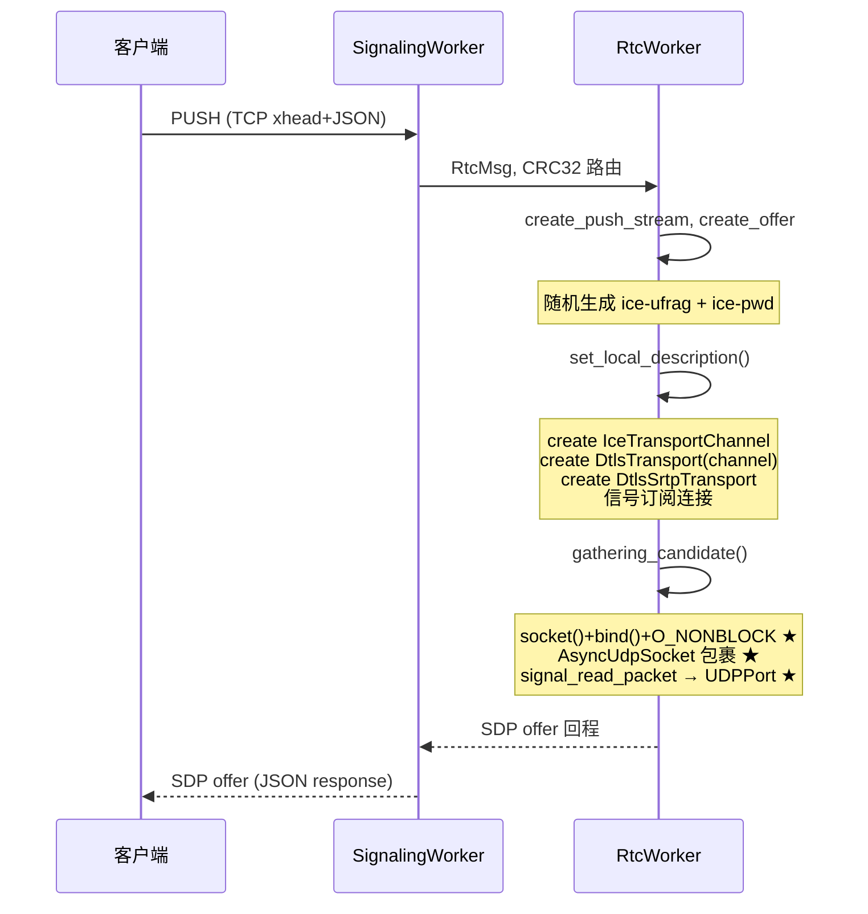
```mermaid
sequenceDiagram
    participant Client as 客户端
    participant Sig as SignalingWorker
    participant Rtc as RtcWorker

    Client->>Sig: PUSH (TCP xhead+JSON)
    Sig->>Rtc: RtcMsg, CRC32 路由
    Rtc->>Rtc: create_push_stream, create_offer
    Note over Rtc: 随机生成 ice-ufrag + ice-pwd
    Rtc->>Rtc: set_local_description()
    Note over Rtc: create IceTransportChannel<br/>create DtlsTransport(channel)<br/>create DtlsSrtpTransport<br/>信号订阅连接
    Rtc->>Rtc: gathering_candidate()
    Note over Rtc: socket()+bind()+O_NONBLOCK ★<br/>AsyncUdpSocket 包裹 ★<br/>signal_read_packet → UDPPort ★
    Rtc-->>Sig: SDP offer 回程
    Sig-->>Client: SDP offer (JSON response)
```

### Phase 2 — 远端信息注入 (set_remote_description)

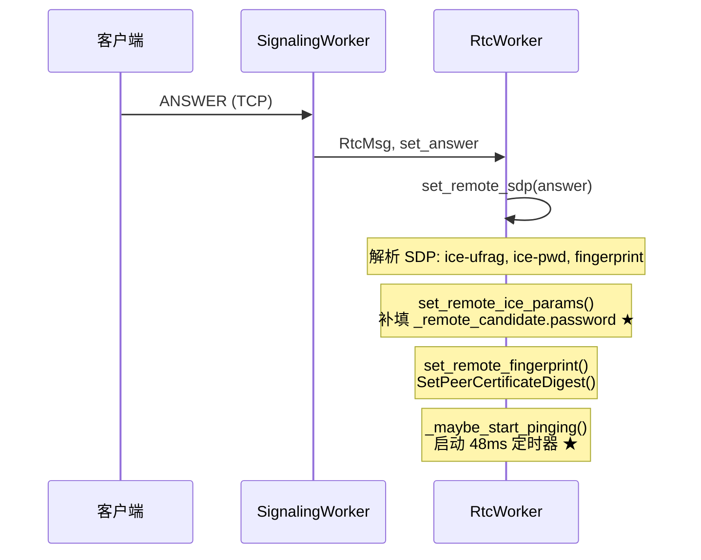
```mermaid
sequenceDiagram
    participant Client as 客户端
    participant Sig as SignalingWorker
    participant Rtc as RtcWorker

    Client->>Sig: ANSWER (TCP)
    Sig->>Rtc: RtcMsg, set_answer
    Rtc->>Rtc: set_remote_sdp(answer)
    Note over Rtc: 解析 SDP: ice-ufrag, ice-pwd, fingerprint
    Note over Rtc: set_remote_ice_params()<br/>补填 _remote_candidate.password ★
    Note over Rtc: set_remote_fingerprint()<br/>SetPeerCertificateDigest()
    Note over Rtc: _maybe_start_pinging()<br/>启动 48ms 定时器 ★
```

### Phase 3 — ICE 连通性检查

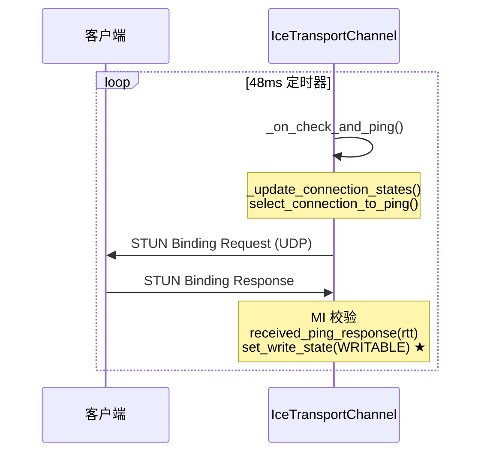
```mermaid
sequenceDiagram
    participant Client as 客户端
    participant ICE as IceTransportChannel

    loop 48ms 定时器
        ICE->>ICE: _on_check_and_ping()
        Note over ICE: _update_connection_states()<br/>select_connection_to_ping()
        ICE->>Client: STUN Binding Request (UDP)
        Client->>ICE: STUN Binding Response
        Note over ICE: MI 校验<br/>received_ping_response(rtt)<br/>set_write_state(WRITABLE) ★
    end
```

### Phase 4 — DTLS 握手

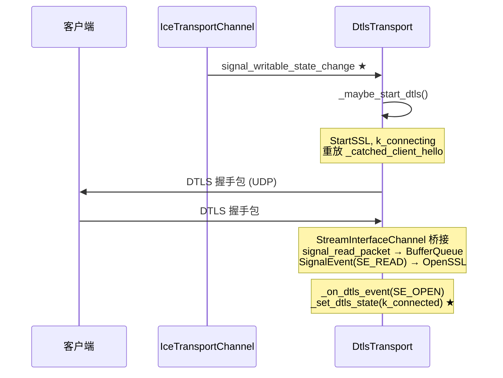
```mermaid
sequenceDiagram
    participant Client as 客户端
    participant ICE as IceTransportChannel
    participant DTLS as DtlsTransport

    ICE->>DTLS: signal_writable_state_change ★
    DTLS->>DTLS: _maybe_start_dtls()
    Note over DTLS: StartSSL, k_connecting<br/>重放 _catched_client_hello
    DTLS->>Client: DTLS 握手包 (UDP)
    Client->>DTLS: DTLS 握手包
    Note over DTLS: StreamInterfaceChannel 桥接<br/>signal_read_packet → BufferQueue<br/>SignalEvent(SE_READ) → OpenSSL
    Note over DTLS: _on_dtls_event(SE_OPEN)<br/>_set_dtls_state(k_connected) ★
```

### Phase 5 — SRTP 密钥安装

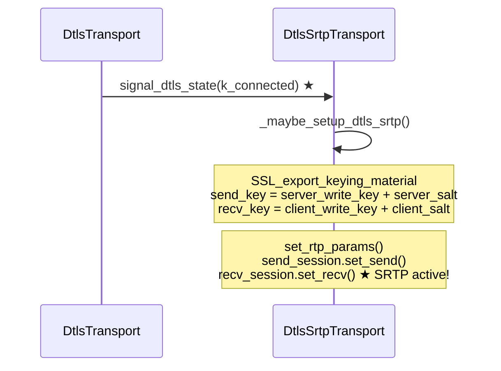
```mermaid
sequenceDiagram
    participant DTLS as DtlsTransport
    participant SRTP as DtlsSrtpTransport

    DTLS->>SRTP: signal_dtls_state(k_connected) ★
    SRTP->>SRTP: _maybe_setup_dtls_srtp()
    Note over SRTP: SSL_export_keying_material<br/>send_key = server_write_key + server_salt<br/>recv_key = client_write_key + client_salt
    Note over SRTP: set_rtp_params()<br/>send_session.set_send()<br/>recv_session.set_recv() ★ SRTP active!
```

### Phase 6 — RTP 流转发

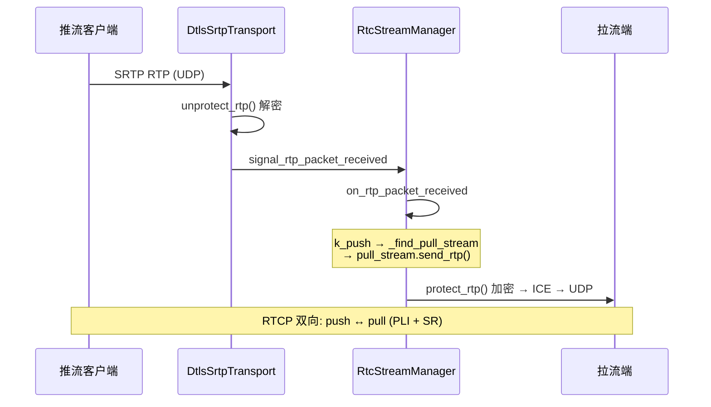
```mermaid
sequenceDiagram
    participant Client as 推流客户端
    participant SRTP as DtlsSrtpTransport
    participant Mgr as RtcStreamManager
    participant Pull as 拉流端

    Client->>SRTP: SRTP RTP (UDP)
    SRTP->>SRTP: unprotect_rtp() 解密
    SRTP->>Mgr: signal_rtp_packet_received
    Mgr->>Mgr: on_rtp_packet_received
    Note over Mgr: k_push → _find_pull_stream<br/>→ pull_stream.send_rtp()
    Mgr->>Pull: protect_rtp() 加密 → ICE → UDP
    Note over Client, Pull: RTCP 双向: push ↔ pull (PLI + SR)
```

---

## 8. 你应该知道但可能没问的问题

### 8.1 STUN MESSAGE-INTEGRITY 的密码使用规则："发给谁，就用谁的密码"

STUN Binding Request 的 MI 用**接收方**的密码计算，Binding Response 复用**同一个**密码。双方各有自己的 ice-pwd，形成完美的对称：

| 场景 | 方向 | 密码 | 代码位置 |
|------|------|------|---------|
| 客户端 → SFU 的 Request | 收到 | `_ice_params.ice_pwd`（SFU 密码） | `udp_port.cpp:195` 验证 |
| SFU → 客户端的 Response | 发出 | `_port->ice_pwd()` = 同上 | `ice_connection.cpp:62` 构造 |
| SFU → 客户端的 Request (ping) | 发出 | `remote_candidate().password` = `_remote_ice_params.ice_pwd`（客户端密码） | `stun_request.cpp:131` 构造 |
| 客户端 → SFU 的 Response | 收到 | `_remote_candidate.password` = 同上 | `ice_connection.cpp:124` 验证 |

**规则**：Request 发给谁就用谁的密码，Response 跟 Request 用同一个密码。

另外，远端密码也是 `_is_pingable` 的门控条件——**密码非空才说明 ANSWER 已到达、对端身份已确认**，此时连接才可 ping。

### 8.2 `DtlsTransport::send_packet()` 为什么绕过 DTLS 加密？

```cpp
// src/pc/dtls_transport.cpp:554
int DtlsTransport::send_packet(const char* data, size_t len) {
    return _channel->send_packet(data, len);  // 直接走 ICE!
}
```

因为调用者是 `DtlsSrtpTransport::send_rtp()`——数据在到达这里之前**已经被 SRTP 加密过了**。DTLS 只加密握手消息（通过 OpenSSL 内部 BIO write），应用数据不需要经过 DTLS 层。这是 DTLS-SRTP 标准（RFC 5764）的设计：**DTLS 握手 → 密钥导出 → SRTP 接管应用数据**。

### 8.3 30s ICE 超时和 PC 状态 `k_connected` 的关系

```cpp
// src/stream/rtc_stream.cpp:72-78
void ice_timeout_cb(...) {
    if (stream->_state != PeerConnectionState::k_connected) {
        stream->_listener->on_stream_exception(stream);  // 删除流
    }
}
```

30s 一次性定时器在 `start()` 时创建。如果 30s 内 PC 到达 `k_connected`，定时器被删除。如果没到达，触发异常清理。这是 ICE/DTLS 握手的总超时兜底。

### 8.4 PushStream 和 PullStream 的 `create_offer()` 本质区别

```cpp
// push_stream.cpp: recvonly → SDP 不含 SSRC
// pull_stream.cpp: sendonly → SDP 含 push 端的 SSRC (透传)
```

虽然方向不同，但它们调用的是**同一个** `PeerConnection::create_offer()` → **同一个** `TransportController::set_local_description()`。这意味着 PushStream 和 PullStream **各自**拥有独立的 ICE channel、UDP socket、DTLS 上下文、SRTP session。两者之间的 RTP 数据通过 `RtcStreamManager` 做应用层转发：push 收（解密）→ pull 发（加密）。

### 8.5 `DtlsTransport` 和 `DtlsSrtpTransport` 的"组合优于继承"关系

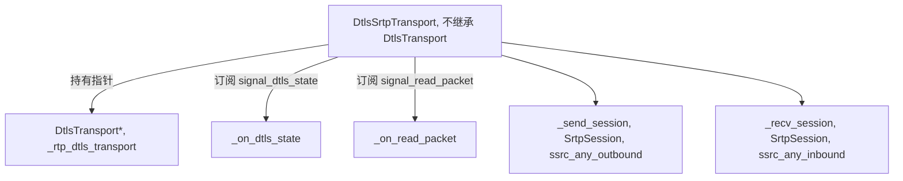
```mermaid
graph TD
    SRTP[DtlsSrtpTransport, 不继承 DtlsTransport]
    DTLS[DtlsTransport*, _rtp_dtls_transport]

    SRTP -->|持有指针| DTLS
    SRTP -->|订阅 signal_dtls_state| OnState[_on_dtls_state]
    SRTP -->|订阅 signal_read_packet| OnRead[_on_read_packet]
    SRTP --> Send[_send_session, SrtpSession, ssrc_any_outbound]
    SRTP --> Recv[_recv_session, SrtpSession, ssrc_any_inbound]

```

`DtlsTransport` **不知道**自己上面有 `DtlsSrtpTransport`。两者可独立测试。`_maybe_setup_dtls_srtp` 被 `_on_dtls_state`（握手完成信号）和 `set_dtls_transport`（兜底）双触发，内部用 `is_srtp_active() || !is_dtls_writable()` 做幂等——"信号驱动 + 手动兜底"解决时序竞争。

### 8.6 `PeerConnection::destroy()` 延迟析构

```cpp
// src/pc/peer_connection.cpp:88-96
void PeerConnection::destroy() {
    _destroy_timer = _el->create_timer(destroy_timer_cb, this, false);
    _el->start_timer(_destroy_timer, 10000);  // 10ms 后 delete this
}
```

问题场景：ICE timer → `_on_check_and_ping()` → `_update_connection_states()` → conn timeout → signal 上报 → delete stream → 析构 IceController。但 `_on_check_and_ping` 返回后还要调用 `_ice_controller->select_connection_to_ping()`——如果在回调栈内同步析构，`_ice_controller` 已被释放 → coredump。

延迟 10ms 确保当前 event loop 迭代完整退出后才析构。`~PeerConnection()` 设为 private，编译期拦截所有直接 `delete`。

### 8.7 `StreamInterfaceChannel` 的 BIO 桥接

```cpp
// src/pc/dtls_transport.cpp:62-84
class StreamInterfaceChannel {
    BufferQueue _packets;  // 容量 2, 每个最大 2048 字节

    // ICE 收包 → 写入 BufferQueue → 唤醒 OpenSSL
    bool on_received_packet(const char* data, size_t size) {
        _packets.WriteBack(data, size, nullptr);
        SignalEvent(this, rtc::SE_READ, 0);  // "叫 OpenSSL 来读"
    }

    // OpenSSL 调用 Read() → 从 BufferQueue 取
    rtc::StreamResult Read(void* buffer, size_t buffer_len, size_t* read, ...) {
        if (!_packets.ReadFront(buffer, buffer_len, read))
            return rtc::SR_BLOCK;  // 队列空 → 阻塞 OpenSSL
        return rtc::SR_SUCCESS;
    }

    // OpenSSL 调用 Write() → 直接经 ICE 发出
    rtc::StreamResult Write(const void* data, size_t data_len, ...) {
        _channel->send_packet((const char*)data, data_len);
    }
};
```

两个方向的 `SignalEvent` 含义不同：我们发 `SE_READ` 是"叫 OpenSSL 来读 BufferQueue"，OpenSSL 发 `SE_OPEN` 是"握手完成"、发 `SE_READ` 是"解密数据就绪"。谁点火、谁接收是关键区分。

---

## 9. 证书体系：HTTPS + DTLS 双层认证

一个完整的 xrtc-server + Electron 客户端推拉流系统，涉及 **3 个证书**，分属两层。

### 9.1 全景

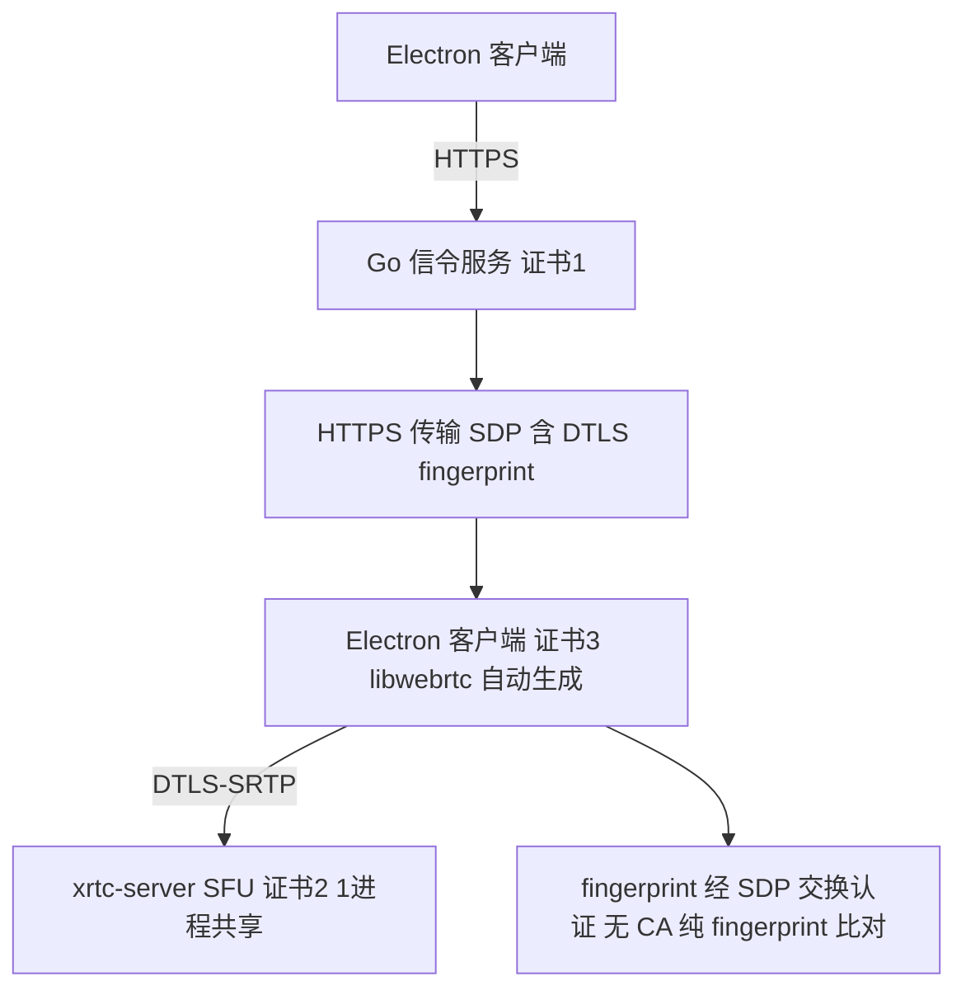
```mermaid
graph TD
    Client1[Electron 客户端] -->|HTTPS| Go[Go 信令服务 证书1]
    Go --> SDP[HTTPS 传输 SDP 含 DTLS fingerprint]
    SDP --> Client2[Electron 客户端 证书3 libwebrtc 自动生成]
    Client2 -->|DTLS-SRTP| SFU[xrtc-server SFU 证书2 1进程共享]
    Client2 --> Note[fingerprint 经 SDP 交换认证 无 CA 纯 fingerprint 比对]
```

### 9.2 证书 ①：HTTPS 证书（Go 信令服务）

- **谁持有**：Go 信令服务
- **数量**：1 个/进程
- **生成方式**：开发自签名（`openssl req -x509`），生产 CA 签发
- **文件**：参考工程 `conf/fullchain.pem` + `conf/privkey.pem`
- **用途**：客户端通过 HTTPS 连接信令服务，SDP offer/answer 经加密信道传输

```
Electron 客户端  ── HTTPS (TLS 1.2/1.3) ──→  Go 信令服务 (:8081)
                    证书 ① 公钥加密              证书 ① 私钥解密
```

**为什么 HTTPS 必不可少？** SDP 中包含 DTLS fingerprint——这个值决定了后续媒体层的身份认证。如果信令通道被中间人攻击，攻击者可以替换 SDP 中的 fingerprint，从而在 DTLS 握手时冒充对端。HTTPS 保证了 fingerprint 从发出到接收全程不被篡改。

### 9.3 证书 ②：DTLS 证书（xrtc-server SFU）

- **谁持有**：xrtc-server
- **数量**：1 个/xrtc-server 进程，所有 PushStream/PullStream 共享
- **生成方式**：`rtc::RTCCertificateGenerator::GenerateCertificate()` 自签名，有效期 1 年

生成代码（`src/server/rtc_server.cpp:55-73`）：

```cpp
int RtcServer::_generate_and_check_certificate() {
    if (!_certificate || _certificate->HasExpired(time(NULL) * 1000)) {
        rtc::KeyParams key_params;
        _certificate = rtc::RTCCertificateGenerator::GenerateCertificate(
            key_params, k_year_in_ms);   // 自签名，365 天有效
    }
    return 0;
}
```

共享方式——每条消息携带同一个证书指针（`src/server/rtc_server.cpp:225`）：

```cpp
// _process_rtc_msg() 中
msg->certificate = _certificate.get();  // 所有流共用一个证书
```

传递链：`RtcServer` → `RtcMsg::certificate` → `RtcWorker::_process_push/pull` → `RtcStreamManager::create_push/pull_stream` → `RtcStream::start` → `PeerConnection::init` → `TransportController::set_local_certificate` → `DtlsTransport::set_local_certificate`

**为什么可以共享？** DTLS 认证不走 CA 链，走 SDP fingerprint 比对。证书只是公私钥对的容器，复用同一对密钥不影响安全性——每个流独立的 DTLS 会话由各自的 `SSLStreamAdapter` 实例管理，handshake 时各自生成独立的 session key，不会跨流泄露。

**fingerprint 如何进入 SDP**：`PeerConnection::create_offer()` 中调用 `SessionDescription::add_transport_info(mid, ice_params, _certificate)`，内部计算 `_certificate->GetSSLCertificate().GetFingerprint("sha-256")` 并写入 `TransportDescription::identity_fingerprint`，最终序列化为 SDP 的 `a=fingerprint:sha-256 AA:BB:CC:...` 行。

### 9.4 证书 ③：DTLS 证书（客户端）

- **谁持有**：Electron 客户端（libwebrtc 内部）
- **数量**：1 个/`RTCPeerConnection` 实例
- **生成方式**：libwebrtc 在 `PeerConnection` 构造时自动生成 RSA/ECDSA 密钥对 + 自签名证书
- **开发者不需要写任何代码**：完全由 libwebrtc 内部管理

客户端的 fingerprint 写入 SDP answer 的 `a=fingerprint:sha-256 XX:YY:ZZ:...` 行。SFU 收到 answer 后解析 → `DtlsTransport::set_remote_fingerprint()` → `SetPeerCertificateDigest()`。

### 9.5 DTLS 握手中的证书交换

DTLS 1.2 完整的握手消息序列（与 TLS 1.2 相同，加了 cookie）：

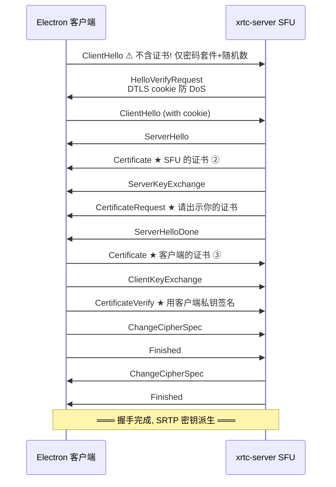
```mermaid
sequenceDiagram
    participant Client as Electron 客户端
    participant Server as xrtc-server SFU

    Client->>Server: ClientHello ⚠ 不含证书! 仅密码套件+随机数
    Server->>Client: HelloVerifyRequest<br/>DTLS cookie 防 DoS
    Client->>Server: ClientHello (with cookie)

    Server->>Client: ServerHello
    Server->>Client: Certificate ★ SFU 的证书 ②
    Server->>Client: ServerKeyExchange
    Server->>Client: CertificateRequest ★ 请出示你的证书
    Server->>Client: ServerHelloDone

    Client->>Server: Certificate ★ 客户端的证书 ③
    Client->>Server: ClientKeyExchange
    Client->>Server: CertificateVerify ★ 用客户端私钥签名
    Client->>Server: ChangeCipherSpec
    Client->>Server: Finished

    Server->>Client: ChangeCipherSpec
    Server->>Client: Finished

    Note over Client, Server: ═══ 握手完成, SRTP 密钥派生 ═══

```

**为什么 ClientHello 里没有证书？** 因为 DTLS 握手用的是标准 TLS 1.2 握手流程——Certificate 消息是独立的握手消息（类型 11），在 ServerHello 之后、ClientKeyExchange 之前。ClientHello 只包含随机数、密码套件列表、Session ID、支持的扩展等，不包含证书。

### 9.6 为什么不需要 CA？fingerprint 机制

这是 WebRTC DTLS 设计最精妙的地方：

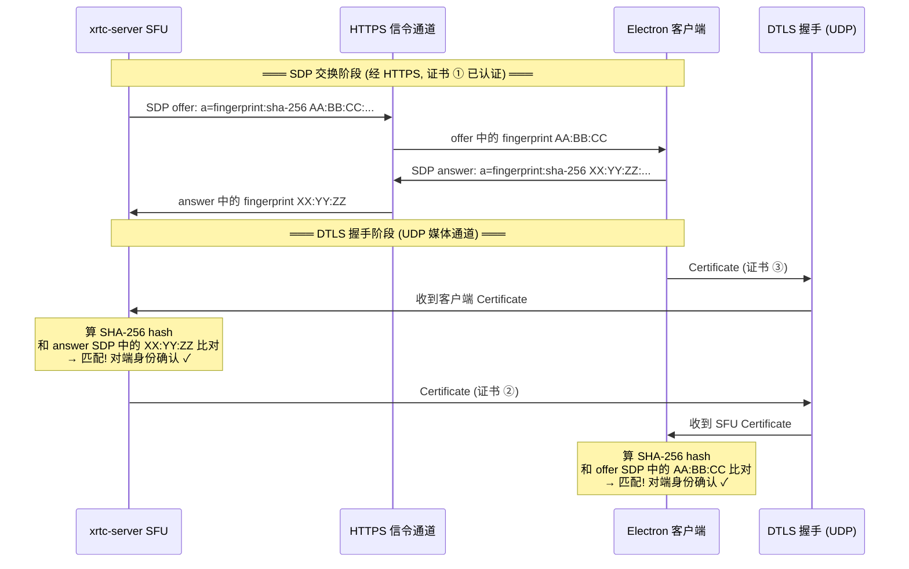
```mermaid
sequenceDiagram
    participant SFU as xrtc-server SFU
    participant SDP as HTTPS 信令通道
    participant Client as Electron 客户端
    participant DTLS as DTLS 握手 (UDP)

    Note over SFU, Client: ═══ SDP 交换阶段 (经 HTTPS, 证书 ① 已认证) ═══

    SFU->>SDP: SDP offer: a=fingerprint:sha-256 AA:BB:CC:...
    SDP->>Client: offer 中的 fingerprint AA:BB:CC
    Client->>SDP: SDP answer: a=fingerprint:sha-256 XX:YY:ZZ:...
    SDP->>SFU: answer 中的 fingerprint XX:YY:ZZ

    Note over SFU, Client: ═══ DTLS 握手阶段 (UDP 媒体通道) ═══

    Client->>DTLS: Certificate (证书 ③)
    DTLS->>SFU: 收到客户端 Certificate
    Note over SFU: 算 SHA-256 hash<br/>和 answer SDP 中的 XX:YY:ZZ 比对<br/>→ 匹配! 对端身份确认 ✓

    SFU->>DTLS: Certificate (证书 ②)
    DTLS->>Client: 收到 SFU Certificate
    Note over Client: 算 SHA-256 hash<br/>和 offer SDP 中的 AA:BB:CC 比对<br/>→ 匹配! 对端身份确认 ✓

```

**信任链**：
1. SDP 走 HTTPS → fingerprint 值被证书 ① 保护，不可能被中间人篡改
2. DTLS 握手时收到对端证书 → hash 比对 → 匹配即证明"你就是刚才通过 HTTPS 跟我协商 SDP 的那个人"
3. 自签名证书的一对一绑定完成，无需 CA 参与

RFC 8122 将这种模式称为 "Certificate Fingerprint"——SDP 中携带的 fingerprint 充当了"带外预共享的信任锚"，替代了 PKI 中 CA 的角色。

### 9.7 总结

| 证书 | 谁持有 | 数量 | 生成 | 认证方式 | 信任锚 | 用途 |
|------|--------|------|------|---------|--------|------|
| HTTPS | Go 信令服务 | 1/进程 | 自签名或 CA | TLS 标准 CA 链 / 自签名 | CA 根证书 | 保护 SDP 传输 |
| DTLS (SFU) | xrtc-server | 1/进程 | `RTCCertificateGenerator` | SDP offer fingerprint | HTTPS 信道 | DTLS 握手 + SRTP 密钥 |
| DTLS (客户端) | libwebrtc | 1/PeerConnection | libwebrtc 自动生成 | SDP answer fingerprint | HTTPS 信道 | DTLS 握手 + SRTP 密钥 |

**两层认证，三份证书**：HTTPS（证书 ①）保护信令面的 SDP 交换 → SDP 中的 fingerprint 成为媒体面的信任锚 → DTLS 握手（证书 ②+③）通过 fingerprint 比对完成双方身份认证 → 握手主密钥派生 SRTP 加密密钥。

---

## 10. PULL 流 + SSRC 透传

PushStream 和 PullStream 是两个完全独立的媒体栈实例，各有一套 ICE/DTLS/SRTP。两者的连接点只在 `RtcStreamManager`——它从 push 端提取 SSRC 注入 pull 端 offer，并在运行时做 RTP/RTCP 应用层转发。

### 10.1 创建流程

```
SignalingWorker::_process_pull()
  → g_rtc_server->send_rtc_msg(msg)
    → CRC32(stream_name) 路由到同一 RtcWorker
      → RtcWorker::_process_pull()
        → RtcStreamManager::create_pull_stream()
```

`create_pull_stream()` 内部五步（`rtc_stream_manager.cpp:52-82`）：

```cpp
// ① 查找已有 PushStream
PushStream* push_stream = _find_push_stream(stream_name);
if (!push_stream) return -1;  // 没推流就拉不了

// ② 从 push 的 remote SDP 提取 SSRC
std::vector<StreamParams> audio_source, video_source;
push_stream->get_audio_source(audio_source);
push_stream->get_video_source(video_source);

// ③ 移除旧的 pull（同一 stream_name 只有一个）
_remove_pull_stream(uid, stream_name);

// ④ 新建 PullStream，注入 push 的 SSRC
PullStream* stream = new PullStream(_el, _allocator.get(), uid, stream_name, ...);
stream->add_audio_source(audio_source);
stream->add_video_source(video_source);
stream->start(certificate);

// ⑤ 生成带 SSRC 的 offer，存 map
offer = stream->create_offer();
_pull_streams[stream_name] = stream;
```

### 10.2 PushStream 如何提取 SSRC

`push_stream.cpp:36-61`——`get_audio_source()` / `get_video_source()` 委托给 `_get_source(mid, source)`：

```cpp
auto remote_desc = _pc->remote_desc();      // push 端收到 answer 后存入的
auto content = remote_desc->get_content(mid); // "audio" / "video"
source = content->streams();                 // vector<StreamParams>
```

`StreamParams`（`pc/stream_params.h`）承载：

```cpp
struct StreamParams {
    std::string id;                     // track id
    std::vector<uint32_t> ssrcs;        // 推流端真实 SSRC
    std::vector<SsrcGroup> ssrc_groups; // FID 等分组
    std::string cname;                  // CNAME
    std::string stream_id;              // msid
};
```

这些数据来自 push 客户端 ANSWER SDP 的 `a=ssrc:` 行解析（`peer_connection.cpp:215-273` 的 `parse_ssrc_info()`）。

### 10.3 PullStream 的 offer 怎么用这些 SSRC

```cpp
// pull_stream.cpp:22-33
options.send_audio = _audio;     // sendonly
options.recv_audio = false;
options.send_video = _video;
options.recv_video = false;
```

`PeerConnection::create_offer()` 对 `send` 方向（line 115-119, 127-133）：

```cpp
if (options.send_audio) {
    for (auto stream : _audio_source) {       // push 端的 SSRC
        audio->add_stream(stream);            // 注入到 SDP m=audio section
    }
}
```

SDP 序列化（`session_description.cpp:252`）写出 push 端原始 SSRC：

```
a=ssrc-group:FID 67890 67891
a=ssrc:67890 cname:clientVideoCname
a=ssrc:67890 msid:stream1 video_track
```

**关键约束**：SFU 不转码，只做 SRTP 解密→重加密。SSRC 是 RTP 包头核心标识，一旦改写，拉流端无法把收到的 RTP 与 SDP 声明的流对应。

### 10.4 PushStream vs PullStream 对比

| 维度 | PushStream | PullStream |
|------|-----------|-----------|
| SDP direction | `a=recvonly` | `a=sendonly` |
| offer 中 SSRC | 无 | push 端的原始 SSRC |
| send_audio/video | false | true |
| recv_audio/video | true | false |
| 数据方向 | 从 push 客户端接收 | 发送给 pull 客户端 |
| 媒体栈 | 独立 ICE/DTLS/SRTP | 独立 ICE/DTLS/SRTP |

---

## 11. RTP/RTCP 数据包处理

### 11.1 两级解复用

```
UDP 收包 → DtlsTransport (第一级) → DtlsSrtpTransport (第二级)
             DTLS vs 非 DTLS            RTP vs RTCP
```

**第一级**——`DtlsTransport::_on_read_packet()`（`dtls_transport.cpp:176-233`）：

| 判断 | 条件 | 去向 |
|------|------|------|
| DTLS | `len >= 13 && buf[0] 在 20..63` | OpenSSL |
| RTP/RTCP | `len >= 12 && (buf[0] & 0xC0) == 0x80` 且 DTLS 已 connected | `signal_read_packet` 上交 |

- DTLS ContentType: 20=ChangeCipherSpec, 21=Alert, 22=Handshake, 23=ApplicationData
- RTP version bits (byte0 高 2 位) = 2 (二进制 `10`) —— SRTP 加密后版本位仍可见

**第二级**——`DtlsSrtpTransport::_on_read_packet()`（`dtls_srtp_transport.cpp:104-120`）调用 `infer_rtp_packet_type()`：

```cpp
// rtp_utils.cpp: infer_rtp_packet_type()
RtpPacketType infer_rtp_packet_type(ArrayView<const char> packet) {
    // ① 先检查 RTP
    if (is_rtp_packet(packet)) return k_rtp;
    // ② 再检查 RTCP
    if (is_rtcp_packet(packet)) return k_rtcp;
    // ③ 都不是
    return k_unknown;
}

// is_rtp_packet: len>=12 && version==2 && PT 不在 [64,96)
// is_rtcp_packet: len>=4 && (buf[1] & 0x7F) 在 [64,96)
```

**PT 区分规则**（RFC 5761）：byte1 的低 7 位在 [64,96) 为 RTCP 保留范围，其余为 RTP。

### 11.2 解密与转发链

```
DtlsSrtpTransport::_on_read_packet()
  ├─ k_rtp → _on_rtp_packet_received()
  │           ├─ unprotect_rtp() 原地解密，剥离尾部 auth tag
  │           └─ signal_rtp_packet_received → TransportController → PeerConnection
  │
  └─ k_rtcp → _on_rtcp_packet_received()
               ├─ unprotect_rtcp() 原地解密，剥离 SRTCP index + auth tag
               └─ signal_rtcp_packet_received → TransportController → PeerConnection
```

`SrtpSession` 方向隔离（`srtp_transport.cpp`）：

| Session | 职责 | libsrtp 方向 |
|---------|------|-------------|
| `_send_session` | 加密发出 | `ssrc_any_outbound`，只允许 `protect_rtp/protect_rtcp` |
| `_recv_session` | 解密收到 | `ssrc_any_inbound`，只允许 `unprotect_rtp/unprotect_rtcp` |

### 11.3 RtcStreamManager 转发逻辑

```cpp
// rtc_stream_manager.cpp:193-214

// RTP: push → pull 单向
void on_rtp_packet_received(stream, data, len) {
    if (k_push == stream->type()) {
        PullStream* pull = _find_pull_stream(stream->stream_name());
        if (pull) pull->send_rtp(data, len);
    }
}

// RTCP: 双向
void on_rtcp_packet_received(stream, data, len) {
    if (k_push == stream->type()) {
        PullStream* pull = _find_pull_stream(stream->stream_name());
        if (pull) pull->send_rtcp(data, len);    // push 的 RR/PLI → pull
    } else if (k_pull == stream->type()) {
        PushStream* push = _find_push_stream(stream->stream_name());
        if (push) push->send_rtcp(data, len);    // pull 的 PLI → push (请求 I 帧)
    }
}
```

**RTCP 双向的必要性**：拉流端发 PLI（Picture Loss Indication）请求 I 帧，必须到达推流端；推流端发 SR（Sender Report）让拉流端做音视频同步。

### 11.4 发包路径

```
pull_stream->send_rtp(data, len)
  → PeerConnection::send_rtp()                   // hardcoded mid="audio"
    → TransportController::send_rtp("audio", ...)
      → DtlsSrtpTransport::send_rtp()
        ├─ get_send_auth_tag_len() 预留 auth tag
        ├─ protect_rtp() SRTP 加密
        └─ _rtp_dtls_transport->send_packet()
            → DtlsTransport::send_packet()       // 直接走 ICE，不经过 DTLS 加密
              → IceTransportChannel::send_packet()
                → _selected_connection->send_packet()
                  → UDPPort::send_to() → UDP socket
```

---

## 12. STOP 与资源清理链

### 12.1 两个清理入口

| 入口 | 触发条件 | 调用栈 |
|------|---------|--------|
| `on_connection_state(k_failed)` | ICE/DTLS 状态机检测到失败 | 在 ICE ping timer 回调栈内 |
| `on_stream_exception()` | 30 秒 ICE 超时定时器触发 | 独立 timer 回调，不在 ping 栈内 |

两者都会调用 `_remove_push_stream(stream)` / `_remove_pull_stream(stream)`，收敛到同一个 `delete` 路径。

### 12.2 UID 校验 + delete

```cpp
void RtcStreamManager::_remove_push_stream(uint64_t uid, const string& stream_name) {
    PushStream* push_stream = _find_push_stream(stream_name);
    if (push_stream && uid == push_stream->get_uid()) {
        _push_streams.erase(stream_name);   // 先从 map 移除
        delete push_stream;                  // 再销毁
    }
}
```

### 12.3 析构瀑布

`delete push_stream` 触发的完整析构路径：

```
~PushStream()                                       // 日志
  → ~RtcStream()
    ├─ delete_timer(_ice_timeout_watcher)           // 取消 30s 超时
    └─ _pc->destroy()                               // ★ 不直接 delete

_pc->destroy():
  → create_timer(destroy_timer_cb, 10ms)            // 一次性定时器
  → return                                          // 当前栈退出

[10ms 后，事件循环空闲]
destroy_timer_cb():
  → delete pc

~PeerConnection():                                   // private 析构
  → ~unique_ptr<TransportController>

~TransportController():
  ├─ for each DtlsSrtpTransport: delete
  │    → ~SrtpTransport()
  │      ├─ reset _send_session (SrtpSession)       // libsrtp 发送 session
  │      └─ reset _recv_session (SrtpSession)       // libsrtp 接收 session
  ├─ for each DtlsTransport: delete
  │    → ~SSLStreamAdapter()                         // OpenSSL DTLS 上下文
  └─ delete _ice_agent

~IceAgent():
  → for each IceTransportChannel: delete

~IceTransportChannel():
  ├─ delete_timer(_ping_watcher)                     // 停 ping 定时器
  ├─ for each IceConnection: conn->destroy()
  │    → signal_connection_destroy → IceController 清理引用
  │    → delete this
  ├─ for each UDPPort: delete port
  │    ~UDPPort():
  │      ├─ close(_socket)                           // ★ 关闭 UDP socket fd
  │      └─ ~AsyncUdpSocket()
  │           ├─ delete_io_event(_socket_watcher)    // 从 libev 移除
  │           └─ delete[] _buf                       // 释放 1500 字节缓冲
  └─ _ice_controller.reset()                         // unique_ptr 销毁
```

### 12.4 为什么需要 10ms 延迟析构

```
ICE ping timer (48ms) → _on_check_and_ping()
  → _update_connection_states()
    → conn->update_state(now)
      → set_write_state(STATE_WRITE_TIMEOUT)
        → signal_state_change
          → _on_connection_state_change
            → _sort_connections_and_update_state
              → _compute_ice_transport_state → k_failed
                → signal_ice_state_change
                  → IceAgent::_update_state → signal_ice_state
                    → TransportController::_on_ice_state → _update_state → k_failed
                      → signal_connection_state → PeerConnection → RtcStream
                        → _listener->on_connection_state(k_failed)
                          → _remove_push_stream → delete push_stream
                            → ~RtcStream → _pc->destroy()
                              → create_timer(10ms) → return
  ← 回到 _on_check_and_ping()                        ★ 如果没有延迟，_ice_controller 已被 delete！
  → _ice_controller->select_connection_to_ping()     ★ nullptr dereference → coredump
```

**10ms**：足够当前 event loop 迭代完成并返回 libev，但人眼无感知。`~PeerConnection()` 设为 private + `destroy_timer_cb` 为 friend，编译期强制走延迟析构路径。

### 12.5 STOP 命令 vs 异常清理对比

| 维度 | STOP_PUSH / STOP_PULL | on_connection_state(k_failed) | on_stream_exception |
|------|----------------------|------------------------------|-------------------|
| 触发 | 客户端主动发 STOP | ICE 连接全断 | 30s 超时 |
| 调用链 | SignalingWorker → RtcServer → RtcWorker | ICE ping timer 回调栈内 | 独立 timer |
| 响应 | 返回 JSON `{errno:0}` | 无响应 | 无响应 |
| UID 校验 | 有（外部传入） | 有（从 stream 对象取） | 有（从 stream 对象取） |
| 收敛点 | `_remove_push/pull_stream(uid, name)` | `_remove_push/pull_stream(stream)` | `_remove_push/pull_stream(stream)` |

---

## 13. ICE 5 级排序 + 两层限速：代码级走读

> 从第一个 UDP 包到达、创建 IceConnection、冷启动定时器，到稳态每周期探活、选连接、排序、升降档的完整代码链路。所有代码位置指向 `src/ice/`。

### 13.1 关键常量速查

| 常量 | 值 | 定义位置 | 含义 |
|------|-----|---------|------|
| `WEAK_PING_INTERVAL` | 48ms | `ice_def.h` | Channel weak 时的发包间隔（10000bps 带宽假设） |
| `STRONG_PING_INTERVAL` | 480ms | `ice_def.h` | Channel strong 时的发包间隔（1000bps 带宽假设） |
| `STABLING_CONNECTION_PING_INTERVAL` | 900ms | `ice_def.h` | 单连接不稳定时的保活间隔 |
| `STABLE_CONNECTION_PING_INTERVAL` | 2500ms | `ice_def.h` | 单连接稳定时的保活间隔 |
| `MIN_PINGS_AT_WEAK_PING_INTERVAL` | 3 | `ice_def.h` | 新连接快速初探的 ping 次数阈值 |
| `k_min_inprovement` | 10ms | `ice_controller.cpp:11` | RTT 切换防抖：top 必须比当前 selected 至少小 10ms |
| `RTT_RATIO` | 3 | `ice_connection.cpp:19` | RTT 指数平滑权重：old : new = 3 : 1 |
| `CONNECTION_WRITE_CONNECT_FAILS` | 5 | `ice_def.h` | 连续未回复 ping 数 ≥5 → 触发降级检查 |
| `CONNECTION_WRITE_CONNECT_TIMEOUT` | 5000ms | `ice_def.h` | WRITABLE → UNRELIABLE 的超时阈值 |
| `CONNECTION_WRITE_TIMEOUT` | 15000ms | `ice_def.h` | UNRELIABLE/INIT → TIMEOUT 的超时阈值 |
| `WEAK_CONNECTION_RECEIVE_TIMEOUT` | 2500ms | `ice_def.h` | receiving 方向的超时 |
| `PING_INTERVAL_DIFF` | 5ms | `ice_transport_channel.cpp:13` | 时钟容差，防定时器触发早于精确间隔导致错过周期 |

### 13.2 冷启动：从第一个 UDP 包到定时器启动

整个 ICE 探活系统的起点不是定时器，而是一个 UDP 包的到达。

**第一步 — `_on_unknown_address`**（`ice_transport_channel.cpp:138`）。

客户端发来 STUN Binding Request。`UDPPort::_on_read_packet` 发现 `get_connection(addr)` 为 nullptr（未知地址），走 `get_stun_message` → CRC32 fingerprint 校验通过 → 发射 `signal_unknown_address`。`IceTransportChannel::_on_unknown_address` 接住后做五件事：

```cpp
// 1. 从 STUN 消息中提取 PRIORITY 属性
const StunUint32Attribute* priority_attr = stun_msg->get_uint32_t(STUN_ATTR_PRIORITY);

// 2. 构造 prflx candidate
Candidate remote_candidate;
remote_candidate.address = addr;          // 对端 IP:Port
remote_candidate.username = remote_ufrag; // 对端 ICE ufrag（从 STUN USERNAME 提取）
remote_candidate.password = _remote_ice_params.ice_pwd; // ⚠ 此时可能为空！
remote_candidate.type = PRFLX_PORT_TYPE;  // "prflx"

// 3. 创建 IceConnection
IceConnection* conn = port->create_connection(remote_candidate);

// 4. 注册到 controller + 连接三条信号线
_add_connection(conn);

// 5. 回复 STUN Binding Response（用 SFU 的 ice-pwd 做 MESSAGE-INTEGRITY）
conn->handle_stun_binding_request(stun_msg);

// 6. 首次排序 + 选路 + 可能启动定时器
_sort_connections_and_update_state();
```

**密码的"先有鸡还是先有蛋"**：第 2 步 `remote_candidate.password = _remote_ice_params.ice_pwd`——如果 ANSWER 还没到，`_remote_ice_params` 为空，密码就是空字符串。这会导致第 6 步 `_is_pingable` 返回 false，定时器暂不启动。后面客户端发来 ANSWER → `set_remote_ice_params` → `maybe_set_remote_ice_params` 补填密码 → 再次调 `_sort_connections_and_update_state` → 这次 `_is_pingable` 为 true → 定时器启动。

**第二步 — `_add_connection`**（`ice_transport_channel.cpp:195`）。连接三条信号线：

| 信号 | 触发时机 | 槽函数 | 做什么 |
|------|---------|--------|--------|
| `signal_state_change` | `set_write_state` / `update_receiving` 状态变化 | `_on_connection_state_change` | 重新排序 + 可能切换 selected |
| `signal_connection_destroy` | `IceConnection::destroy()` | `_on_connection_destroyed` | 从 controller 清理；若销毁的是 selected → 重选 |
| `signal_read_packet` | `on_read_packet` 判定非 STUN 包 | `_on_read_packet` | 透传给 DtlsTransport |

同时在 controller 侧：`_connections.push_back(conn)` + `_unpinged_connections.insert(conn)`（`ice_controller.cpp:164`）。

**第三步 — `_sort_connections_and_update_state`**（`ice_transport_channel.cpp:360`）。编排三件事：

```cpp
void IceTransportChannel::_sort_connections_and_update_state() {
    _maybe_switch_selected_connection(
        _ice_controller->sort_and_switch_connection());  // A. 排序 + 可能切换
    _update_state();                                      // B. 聚合 writable/receiving
    _maybe_start_pinging();                               // C. 可能首次启动定时器
}
```

**A. `sort_and_switch_connection()`**（`ice_controller.cpp:82`）。冷启动时 `_selected_connection == nullptr`，直接走到 `return top_connection`——"还没有 selected，排序后第一个就是"。`_switch_selected_connection` 将其设为 selected。

**B. `_update_state()`**（`ice_transport_channel.cpp:293`）：

```cpp
bool writable = _selected_connection && _selected_connection->writable();
_set_writable(writable);

bool receiving = false;
for (auto conn : _ice_controller->connections()) {
    if (conn->receiving()) { receiving = true; break; }  // 任意连接 receiving 就行
}
_set_receiving(receiving);
```

**方向不对称**：`writable` 只看 selected connection（数据发送走它），`receiving` 看任意连接（对端可能从多个路径发数据过来）。

**C. `_maybe_start_pinging()`**（`ice_transport_channel.cpp:414`）：

```cpp
void IceTransportChannel::_maybe_start_pinging() {
    if (_start_pinging) return;    // ★ 只启动一次，永不重复
    if (_ice_controller->has_pingable_connection()) {
        _el->start_timer(_ping_watcher, _cur_ping_interval * 1000);  // 48ms
        _start_pinging = true;
    }
}
```

`has_pingable_connection()`（`ice_controller.cpp:145`）遍历所有连接调 `_is_pingable`。只要有一个满足条件，定时器就启动。

**冷启动时序小结**：

```
UDP 收 STUN Binding Request
  → _on_unknown_address
    → create_connection (new IceConnection)
    → _add_connection (注册信号 + 加入 controller)
    → send_stun_binding_response (回复 Binding Response)
    → _sort_connections_and_update_state
      → sort_and_switch_connection (冷启动: 无 selected → 直接选 top)
      → _update_state (writable=false, receiving=false)
      → _maybe_start_pinging (密码空 → has_pingable=false → 暂不启动)

... ANSWER 到达 ...

set_remote_ice_params
  → maybe_set_remote_ice_params (补填 _remote_candidate.password)
  → _sort_connections_and_update_state
    → _maybe_start_pinging (密码非空 → has_pingable=true → start_timer 48ms ★)
```

---

### 13.3 稳态：`_on_check_and_ping` 每周期循环

定时器启动后，libev 每 `_cur_ping_interval`（初始 48ms）回调 `ice_ping_cb` → `_on_check_and_ping`（`ice_transport_channel.cpp:448`）。五个步骤：

```cpp
void IceTransportChannel::_on_check_and_ping() {
    _update_connection_states();                            // ① 探活降级
    auto result = _ice_controller->select_connection_to_ping(
        _last_ping_sent_ms - PING_INTERVAL_DIFF);          // ② 两层限速选连接
    if (result.conn) {
        _ping_connection(conn);                            // ③ 发出 STUN Binding Request
        _ice_controller->mark_connection_pinged(conn);     // ④ unpinged → pinged
    }
    if (_cur_ping_interval != result.ping_interval) {      // ⑤ 升降档
        _cur_ping_interval = result.ping_interval;
        _el->stop_timer(_ping_watcher);
        _el->start_timer(_ping_watcher, _cur_ping_interval * 1000);
    }
}
```

**`PING_INTERVAL_DIFF = 5ms` 时钟容差**：`select_connection_to_ping` 的参数是 `_last_ping_sent_ms - 5`。假如定时器因系统调度在 479ms 触发而非精确 480ms，用 `last_ping_sent_ms - 5` 相当于把门控放宽 5ms，避免因时钟粒度错过周期。

**① `_update_connection_states`**（`ice_transport_channel.cpp:474`）。遍历所有连接，逐个调 `conn->update_state(now)`。降级逻辑见 §13.7。

**② `select_connection_to_ping`**：核心调度逻辑，见 §13.4 两层限速。

**③ `_ping_connection`**（`ice_transport_channel.cpp:488`）：

```cpp
void IceTransportChannel::_ping_connection(IceConnection* conn) {
    _last_ping_sent_ms = rtc::TimeMillis();  // ★ Channel 级全局时间戳
    conn->ping(_last_ping_sent_ms);
}
```

`conn->ping(now)`（`ice_connection.cpp:354`）：创建 `ConnectionRequest`（含 STUN Binding Request + 随机 transaction_id），记录 `SentPing(id, now)` 到 `_pings_since_last_responses` 列表，通过 `StunRequestManager::send()` 序列化并发出。`_num_pings_sent++`。

**④ `mark_connection_pinged`**（`ice_controller.cpp:113`）：从 `_unpinged_connections` 移入 `_pinged_connections`。

**⑤ 升降档**：`_weak()` 状态变化导致 `ping_interval` 在 48ms ↔ 480ms 之间切换时，停止当前定时器、按新间隔重启。

---

### 13.4 第一层限速：Channel 级速率门

`select_connection_to_ping`（`ice_controller.cpp:214`）先定 `ping_interval`，再用它做门控。

```cpp
PingResult IceController::select_connection_to_ping(int64_t last_ping_sent_ms) {
    // Step 1: 确定 channel 级 ping_interval
    bool need_ping_more_at_weak = false;
    for (auto conn : _connections) {
        if (conn->num_pings_sent() < MIN_PINGS_AT_WEAK_PING_INTERVAL) {  // < 3
            need_ping_more_at_weak = true;
            break;
        }
    }
    int ping_interval = (_weak() || need_ping_more_at_weak)
        ? WEAK_PING_INTERVAL     // 48ms
        : STRONG_PING_INTERVAL;  // 480ms

    // Step 2: Channel 级门控
    int now = rtc::TimeMillis();
    const IceConnection* conn = nullptr;
    if (now >= last_ping_sent_ms + ping_interval) {  // ★ 两用的 last_ping_sent_ms
        conn = _find_next_pingable_connection(now);   // 进入连接级选择
    }

    return PingResult(conn, ping_interval);
}
```

**`ping_interval` 的三个决策分支**：

| 条件 | interval | 场景 |
|------|----------|------|
| `_weak()` = true | **48ms** | selected 连接断了，急需探测新路径 |
| 存在 `num_pings_sent < 3` 的连接 | **48ms** | 新建连接快速完成初探（3 次 ping） |
| 以上都不满足 | **480ms** | 已有稳定连接，低频保活即可 |

`_weak()` 定义（`ice_controller.h:54`）：

```cpp
bool _weak() {
    return _selected_connection == nullptr
        || _selected_connection->weak();
}
// IceConnection::weak(): return !(writable() && receiving());
// 即"双向都通"才不算 weak
```

**`need_ping_more_at_weak` 的作用**：即使 selected connection 是 writable + receiving（不是 weak），只要还存在某个新连接未完成 3 次初探，channel 也维持 48ms 快速节奏，给所有连接公平的初探机会。

**门控的含义**：`last_ping_sent_ms` 是 channel 级全局时间戳——每次 `_ping_connection` 更新。整个 channel 所有连接共享一个发包时钟，**一次定时器触发最多发一个 ping**。

---

### 13.5 第二层限速：Connection 级间隔 + Round-Robin

Channel 级放行后，`_find_next_pingable_connection`（`ice_controller.cpp:252`）做连接级选择：

```cpp
const IceConnection* IceController::_find_next_pingable_connection(int64_t now) {
    // ① selected connection 优先
    if (_selected_connection && _selected_connection->writable() &&
            _is_connection_past_ping_interval(_selected_connection, now)) {
        return _selected_connection;
    }

    // ② unpinged 集合中还有可 ping 的吗？
    bool has_pingable = false;
    for (auto conn : _unpinged_connections) {
        if (_is_pingable(conn, now)) { has_pingable = true; break; }
    }

    // ③ unpinged 全部不可 ping → 一轮结束，全部倒回，开始新一轮
    if (!has_pingable) {
        _unpinged_connections.insert(_pinged_connections.begin(),
            _pinged_connections.end());
        _pinged_connections.clear();
    }

    // ④ 在 unpinged 中选最 overdue 的连接
    IceConnection* find_conn = nullptr;
    for (auto conn : _unpinged_connections) {
        if (!_is_pingable(conn, now)) continue;
        if (_more_pingable(conn, find_conn)) {
            find_conn = conn;  // last_ping_sent 更小 → 等得更久 → 优先
        }
    }
    return find_conn;
}
```

**Round-Robin 双集合机制**：

```
unpinged: {A, B, C}  pinged: {}
  周期1: ping A → unpinged: {B, C}, pinged: {A}
  周期2: ping B → unpinged: {C},    pinged: {A, B}
  周期3: ping C → unpinged: {},     pinged: {A, B, C}
  周期4: unpinged 无可 ping → 倒回 → unpinged: {A, B, C}, pinged: {}  ← 新一轮
```

**为什么 selected connection 优先？** 它是数据发送的出口——所有 DTLS 握手包和 RTP 媒体包都经过它。优先 ping selected connection 保证数据通道的 writable 状态始终是最新鲜的。

**`_more_pingable`**（`ice_controller.cpp:293`）：比较 `last_ping_sent`，值更小的优先。等价于"谁等得最久就先 ping 谁"，保证 round-robin 公平。

**`_is_pingable` 的三级判断**（`ice_controller.cpp:181`）：

```cpp
bool IceController::_is_pingable(IceConnection* conn, int64_t now) {
    // ① 对端凭据必须完整（ANSWER 已到达）
    if (remote.username.empty() || remote.password.empty()) return false;

    // ② channel weak → 跳过连接级间隔限制，任何有凭据的连接都可以 ping
    if (_weak()) return true;

    // ③ channel strong → 必须过连接级 ping 间隔
    return _is_connection_past_ping_interval(conn, now);
}
```

**连接级间隔三级**（`_get_connection_ping_interval`，`ice_controller.cpp:335`）：

| 条件 | 间隔 | 语义 |
|------|------|------|
| `num_pings_sent < 3` | **48ms** | 新连接快速初探 |
| `_weak()` 或 `!conn->stable(now)` | **900ms** | 连接不稳定，中频探测 |
| 以上都不满足 | **2500ms** | 连接稳定，低频保活 |

`conn->stable()` 的定义（`ice_connection.cpp:324`）：

```cpp
bool IceConnection::stable(int64_t now) const {
    return _rtt_samples > RTT_RATIO + 1    // RTT 样本 > 4（至少 5 次采样，平滑值可靠）
        && !_miss_response(now);           // 没有 ping 等待超过 2*RTT（无丢包）
}
```

---

### 13.6 两层限速完整矩阵

```
                    Channel 级门                          Connection 级门
                    ────────────                          ─────────────────
                    控制整体发包节奏                       保护单连接不被过度 ping

WEAK (48ms):       每 48ms 最多 1 个 ping                 跳过（_weak() 直接返回 true）
STRONG (480ms):    每 480ms 最多 1 个 ping                新连接 48ms / 不稳定 900ms / 稳定 2500ms
```

**两层都通过才真正发包**。举例：

| 场景 | Channel 级 | Connection 级 | 实际效果 |
|------|-----------|--------------|---------|
| 新连接 + channel weak | 48ms | 跳过（48ms 初探） | ~48ms |
| 新连接 + channel strong | 480ms | 48ms | 实际受 channel 门限 ~480ms |
| 稳定连接 + channel strong | 480ms | 2500ms | 实际受 connection 门限 ~2500ms |
| 连接断开 + channel weak | 48ms | 跳过 | 48ms 加速探测，尽快找到新路径 |

**关键**：Channel weak 时 connection 级门被绕过——此时 selected 连接已断，一切以最快找到新路径为优先，不需要保护连接。

---

### 13.7 连接写状态降级：`update_state`

`IceConnection::update_state()`（`ice_connection.cpp:244`）是探活的核心，每次 `_on_check_and_ping` 循环第一步就调它。

**RTT 容忍窗口**：

```cpp
int rtt = 2 * _rtt;  // 2 倍当前 RTT 作为容忍窗口
if (rtt < MIN_RTT) rtt = MIN_RTT;      // 钳位下限 100ms
else if (rtt > MAX_RTT) rtt = MAX_RTT; // 钳位上限 60s
```

**两阶段退化**：

```
阶段 1: STATE_WRITABLE → STATE_WRITE_UNRELIABLE
  条件 (AND):
    _too_many_ping_failed(5, rtt, now)   → 第 5 个未回复 ping 已过 rtt 容忍窗口
    _too_long_without_response(5000, now) → 最早未回复 ping 等待 >5s

阶段 2: STATE_WRITE_UNRELIABLE / STATE_WRITE_INIT → STATE_WRITE_TIMEOUT
  条件:
    _too_long_without_response(15000, now) → 最早未回复 ping 等待 >15s
```

`_too_many_ping_failed` 的逻辑（`ice_connection.cpp:211`）：

```cpp
bool IceConnection::_too_many_ping_failed(size_t max_pings, int rtt, int64_t now) {
    if (_pings_since_last_responses.size() < max_pings) return false;
    // 取第 max_pings 个（0-indexed = 第 5 个）未回复 ping
    int expected_response_time = _pings_since_last_responses[max_pings - 1].sent_time + rtt;
    return now > expected_response_time;
    // "第 5 个 ping 发出去后，过了 2*RTT 还没收到任何回复" → 连续失败 ≥5 次
}
```

**为什么阶段 1 需要两个条件同时成立？** 单次 ping 丢包是正常的（UDP 不可靠），必须连续 5 次失败 + 超过 5 秒才确认"不是偶然丢包、确实出了问题"。两个条件互补——RTT 容忍窗口适应快速变化的网络，5 秒硬超时兜底极端情况。

**`update_receiving` 末尾调用**（`ice_connection.cpp:414`）：

```cpp
void IceConnection::update_receiving(int64_t now) {
    bool receiving = false;
    if (_last_ping_sent < _last_ping_response_received) {
        receiving = true;  // 发了 ping，之后收到了对方的 ping response → 对端活着
    } else {
        receiving = last_received() > 0
            && (now < last_received() + receiving_timeout());  // 2500ms 窗口内收到过数据
    }
    if (_receiving != receiving) { _receiving = receiving; signal_state_change(this); }
}
```

第一条判断路径 `_last_ping_sent < _last_ping_response_received`：我们发的 ping 是对端用 `_remote_candidate.password (客户端密码)` 验证的，客户端回复的 Binding Response 也是用同一个密码做 MI，说明客户端确实知道自己的密码——对端身份确认、路径存活。

---

### 13.8 5 级排序算法 + RTT 防抖

`sort_and_switch_connection`（`ice_controller.cpp:82`）被 `_sort_connections_and_update_state` 调用——每次连接状态变化时触发，不仅仅是定时器周期。

```cpp
IceConnection* IceController::sort_and_switch_connection() {
    // Step 1: stable_sort — 多级比较器 + RTT fallback
    absl::c_stable_sort(_connections, [this](IceConnection* a, IceConnection* b) {
        int cmp = _compare_connections(a, b);
        if (cmp != 0) return cmp > 0;  // 前 5 级有明确胜负
        return a->rtt() < b->rtt();    // 第 6 级: RTT fallback
    });

    IceConnection* top = _connections.empty() ? nullptr : _connections[0];

    // Step 2: 三种不切换的情况
    if (!ready_to_send(top) || top == _selected_connection) return nullptr;

    // Step 3: 冷启动 — 还没有 selected，直接选
    if (!_selected_connection) return top;

    // Step 4: RTT 防抖 — top 的 RTT 必须比当前 selected 至少小 10ms
    if (top->rtt() <= _selected_connection->rtt() - k_min_inprovement) {
        return top;  // 值得切换
    }
    return nullptr;  // RTT 差距不够 → 不切换，防止 ping-pong 振荡
}
```

**为什么用 `stable_sort`？** 保证排序稳定——前 5 级相等 + RTT 相等的连接保持原有相对顺序，避免每次排序都改变 selected connection，造成不必要的切换。

**`_compare_connections` 5 级比较器**（`ice_controller.cpp:28`）：

| 级别 | 比较项 | 规则 | 为什么这一级不可或缺 |
|------|--------|------|-------------------|
| 1 | `writable()` | true > false | 能发数据是首要条件。writable=false 直接淘汰 |
| 2 | `write_state()` | 值小的 > 值大的 | writable 是二值，两个 writable=true 的连接可能一个 WRITABLE(0)、一个 UNRELIABLE(1)——需要更细粒度区分 |
| 3 | `receiving()` | true > false | 对端→我方向还活着。两个都 writable 但一个对端已失活的数据通道不可靠 |
| 4 | `priority()` | 值大的 > 值小的 | RFC 5245 公式：`2^32*min(G,D) + 2*max(G,D) + (G>D?1:0)`，编码了 candidate 类型偏好 |
| 5 | `rtt()` | 值小的 > 值大的 | `stable_sort` lambda 中 fallback。前 4 级全相等时，RTT 最小的最优先 |

**为什么 write_state 单独一级而不是只看 writable？** 假设两个连接：

```
Conn A: writable=true, write_state=STATE_WRITE_UNRELIABLE (1)  ← 不稳定但还能用
Conn B: writable=true, write_state=STATE_WRITABLE (0)          ← 健康
```

如果只看 writable，两者打平，得靠后面的优先级和 RTT 决定——可能不稳定连接反而胜出。有了 write_state 这一级，Conn B 直接胜出，不必走到后面的比较。

**`ready_to_send`**（`ice_controller.cpp:64`）：

```cpp
bool IceController::ready_to_send(IceConnection* conn) {
    return conn && (conn->writable() ||
            conn->write_state() == IceConnection::STATE_WRITE_UNRELIABLE);
}
```

`STATE_WRITE_UNRELIABLE` 也能发——"不太稳定但还没死，数据照样发，同时继续 ping 找更好的"。只有 `STATE_WRITE_TIMEOUT` 才真正不能发。

**RTT 防抖的经济学解释**：两连接 RTT 分别是 15ms 和 20ms，差距仅 5ms。如果无阈值就切换，可能下一个 ping 周期 RTT 变成 17ms vs 18ms 又切回去——切换本身有代价（selected 变更可能触发上层信号链）。10ms 阈值把这种微小的随机波动过滤掉，只在"新连接明显更好"时才切。

---

### 13.9 RTT 指数平滑

`received_ping_response`（`ice_connection.cpp:462`）：

```cpp
void IceConnection::received_ping_response(int rtt) {
    if (_rtt_samples > 0) {
        _rtt = rtc::GetNextMovingAverage(_rtt, rtt, RTT_RATIO);
        // 等价于: _rtt = (_rtt * 3 + rtt) / 4  →  旧值 75% + 新值 25%
    } else {
        _rtt = rtt;  // 首次测量直接赋值，不参与平滑（避免初始 outlier 锚定）
    }
    ++_rtt_samples;
    _last_ping_response_received = rtc::TimeMillis();
    _pings_since_last_responses.clear();  // 收到回复 → 清空未回复 ping 列表
    update_receiving(_last_ping_response_received);
    set_write_state(STATE_WRITABLE);
    set_state(IceCandidatePairState::SUCCEEDED);
}
```

**权重 3:1 的含义**：RTT 对单次网络抖动敏感，但平滑后不能太迟钝。3:1 是 RFC 6298 TCP RTO 的经典权重——足够平滑以过滤噪声，又足够灵敏以反映趋势变化。

**首次测量直接赋值**：如果第一次 RTT 测量值是异常的 500ms（偶然丢包重传），用平滑公式的话初始 `_rtt` 被锚定在 500ms，后续测量 10ms 也只能缓慢下拉。直接赋值让初始值无偏，随后平滑自然收敛到真实值。

---

### 13.10 write_state 超时 → k_failed → UAF 防护链

当一个连接的 `write_state` 降级到 `STATE_WRITE_TIMEOUT` → `active() = false` → `_compute_ice_transport_state()`（`ice_transport_channel.cpp:324`）检测到"曾经有连接，现在全部 inactive" → 返回 `k_failed`：

```cpp
IceTransportState IceTransportChannel::_compute_ice_transport_state() {
    bool has_connection = false;
    for (auto conn : connections()) {
        if (conn->active()) { has_connection = true; break; }
    }
    if (_had_connection && !has_connection) return IceTransportState::k_failed;  // ★
    ...
}
```

`k_failed` → `signal_ice_state_change` → `IceAgent::_update_state` → `signal_ice_state` → `TransportController::_on_ice_state` → `_update_state` → `k_failed` → `signal_connection_state` → `PeerConnection` → `RtcStream` → `on_connection_state(k_failed)` → `_remove_push_stream` → `delete push_stream` → `~RtcStream` → `_pc->destroy()`（10ms 延迟定时器）。

**这正是 §12.4 讲的 UAF 防护场景**。整个析构链从 `_on_check_and_ping` → `_update_connection_states` → `conn->update_state` 的调用栈内触发。`PeerConnection::destroy()` 的 10ms 延迟保证 `_on_check_and_ping` 返回后不会访问已析构的 `_ice_controller`。

---

### 13.11 状态变化驱动的重排序路径

非定时器驱动的重排序由两条路径触发：

**路径 A — `_on_connection_state_change`**：

```
set_write_state / update_receiving → signal_state_change
  → _on_connection_state_change
    → _sort_connections_and_update_state
      → sort_and_switch_connection (RTT 防抖切换)
      → _update_state
      → _maybe_start_pinging (已启动 → 跳过)
```

**路径 B — `_on_connection_destroyed`**：

```
IceConnection::destroy() → signal_connection_destroy
  → _on_connection_destroyed
    → 从 controller 清理 (connections + pinged + unpinged)
    → 如果销毁的是 selected → _switch_selected_connection(nullptr) + 重排序
    → _update_state (receiving 可能重算——销毁非 selected 连接后仍需重新判断)
```

路径 B 的 `_update_state` 很重要：`receiving` 看任意连接，销毁一个连接后可能从 `receiving=true` 变为 `false`，必须重新计算。

---

### 13.12 完整调用链总览

```
                                ═══ 冷启动 ═══

UDP 收 STUN Binding Request
  → UDPPort::_on_read_packet
    → signal_unknown_address
      → IceTransportChannel::_on_unknown_address
        → port->create_connection(remote_candidate)       // new IceConnection
        → _add_connection(conn)                           // 注册信号 + controller
        → conn->handle_stun_binding_request(stun_msg)     // 回复 Binding Response
        → _sort_connections_and_update_state
          → sort_and_switch_connection()                  // 冷启动: 无 selected → 直接选
          → _update_state()                               // writable + receiving 聚合
          → _maybe_start_pinging()                        // 密码空 → 暂不启动

ANSWER 到达
  → set_remote_ice_params
    → maybe_set_remote_ice_params (补填 password)
    → _sort_connections_and_update_state
      → _maybe_start_pinging()                            // 密码非空 → start_timer(48ms) ★


                                ═══ 稳态循环 ═══

libev timer (48ms / 480ms)
  → ice_ping_cb
    → _on_check_and_ping
      ├─ _update_connection_states
      │    └─ for each conn: conn->update_state(now)
      │         ├─ WRITABLE → UNRELIABLE?  (>=5 次失败 && >5s)
      │         ├─ UNRELIABLE/INIT → TIMEOUT?  (>15s 无回复)
      │         └─ update_receiving(now)
      │
      ├─ select_connection_to_ping(last_ping - 5ms)
      │    ├─ 定 ping_interval: _weak()? 或 need_ping_more? → 48ms : 480ms
      │    ├─ Channel 门: now >= last_ping_sent_ms + ping_interval?
      │    └─ _find_next_pingable_connection(now)
      │         ├─ selected 优先? (writable && 过连接级间隔)
      │         ├─ unpinged 无可 ping? → pinged 全部倒回 unpinged
      │         ├─ _is_pingable 过滤 (凭据 + weak/间隔)
      │         └─ _more_pingable 选最 overdue (last_ping_sent 最小)
      │
      ├─ _ping_connection(conn)
      │    ├─ _last_ping_sent_ms = now              ← Channel 级时间戳
      │    └─ conn->ping(now)
      │         ├─ new ConnectionRequest (STUN Binding + transaction_id)
      │         ├─ _pings_since_last_responses.push_back(SentPing)
      │         ├─ _request_manager.send() → UDP socket
      │         └─ _num_pings_sent++
      │
      ├─ mark_connection_pinged(conn)               ← unpinged → pinged
      │
      └─ 升降档: interval 变了? → 重启定时器


                                ═══ 收到 STUN Binding Response ═══

UDP 收包
  → IceConnection::on_read_packet
    → STUN_BINDING_RESPONSE case
      → validate_message_integrity(_remote_candidate.password)
      → _request_manager.check_response() → 按 transaction_id 匹配
        → ConnectionRequest::on_request_response
          → on_connection_request_response
            → received_ping_response(rtt)
              ├─ RTT 指数平滑 (old*0.75 + new*0.25)
              ├─ _pings_since_last_responses.clear()
              ├─ update_receiving → signal_state_change
              ├─ set_write_state(STATE_WRITABLE) → signal_state_change
              └─ set_state(SUCCEEDED)


                                ═══ 状态变化触发重排序 ═══

signal_state_change (由 set_write_state / update_receiving 发射)
  → _on_connection_state_change
    → _sort_connections_and_update_state
      → sort_and_switch_connection()
        ├─ stable_sort (5级比较 + RTT fallback)
        ├─ top 不是 writable/UNRELIABLE 或 top == selected → 不切
        ├─ 无 selected → 冷启动，直接选
        └─ top RTT <= selected RTT - 10ms → 切换
      → _update_state()
      → _maybe_start_pinging()  (已启动 → 跳过)
```
