# xrtc-server 跨模块横向深潜

> 拆掉模块之间的墙。按数据流链路重新编排。
>
> 配套：系统总览 [`README.md`](../README.md)、模块纵向深潜 [`DEEP-DIVE.md`](../DEEP-DIVE.md)。

## 目录

1. [证书体系：HTTPS + DTLS 双层认证](#1-证书体系HTTPS-+-DTLS-双层认证)
2. [TCP 信令 vs UDP 媒体：同一 libev LT 下的两种 I/O 哲学](#2-TCP-信令-vs-UDP-媒体同一-libev-LT-下的两种-I-O-哲学)
3. [set_local_description：整个媒体栈的"接生婆"](#3-set_local_description整个媒体栈的"接生婆")
4. [Candidate Pair → IceConnection：从 UDP 四元组到逻辑通道](#4-Candidate-Pair---IceConnection从-UDP-四元组到逻辑通道)
    - [4.7 IceConnection 状态分类](#47-IceConnection-状态分类)
    - [4.8 selected connection 的三道防线：为什么不等到 15 秒切换就已经发生了](#48-selected-connection-的三道防线为什么不等到-15-秒切换就已经发生了)
    - [4.9 理论最短切换边界：每级决胜所需的最短时间](#49-理论最短切换边界每级决胜所需的最短时间)
5. [ICE ping 定时器 + 两层限速 + 5 级排序](#5-ICE-ping-定时器-+-两层限速-+-5-级排序)
6. [ICE 四层状态机](#6-ICE-四层状态机)
7. [DTLS Transport 深挖](#7-DTLS-Transport-深挖)
8. [SDP 字段 → ICE/DTLS 的"最后一公里"](#8-SDP-字段---ICE-DTLS-的"最后一公里")
9. [三包竞态：STUN / DTLS ClientHello / ANSWER 时序全集](#9-三包竞态STUN---DTLS-ClientHello---ANSWER-时序全集)
10. [同一个 UDP socket 如何服务三层协议](#10-同一个-UDP-socket-如何服务三层协议)
11. [信号链：ICE writable → DTLS → SRTP → RTP 就绪](#11-信号链ICE-writable---DTLS---SRTP---RTP-就绪)
12. [RTP/RTCP 数据包处理](#12-RTP-RTCP-数据包处理)
13. [PULL 流 + SSRC 透传](#13-PULL-流-+-SSRC-透传)
14. [STOP 与资源清理链](#14-STOP-与资源清理链)
15. [完整生命周期时间线](#15-完整生命周期时间线)
16. [FAQ：你应该知道但可能没问的问题](#16-FAQ你应该知道但可能没问的问题)
16. [DTLS Transport 深挖](#16-DTLS-Transport-深挖)

## 1. 证书体系：HTTPS + DTLS 双层认证

一个完整的 xrtc-server + Electron 客户端推拉流系统，涉及 **3 个证书**，分属两层。

### 1.1 全景

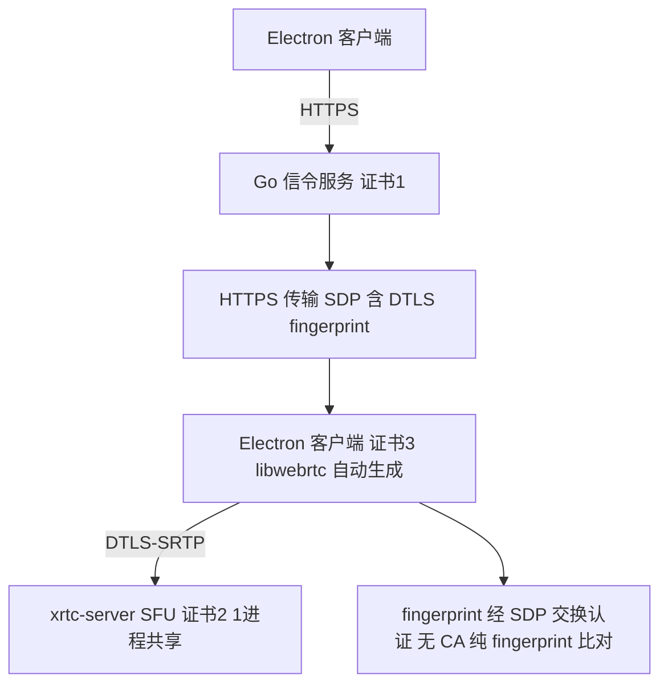
```mermaid
graph TD
    Client1[Electron 客户端] -->|HTTPS| Go[Go 信令服务 证书1]
    Go --> SDP[HTTPS 传输 SDP 含 DTLS fingerprint]
    SDP --> Client2[Electron 客户端 证书3 libwebrtc 自动生成]
    Client2 -->|DTLS-SRTP| SFU[xrtc-server SFU 证书2 1进程共享]
    Client2 --> Note[fingerprint 经 SDP 交换认证 无 CA 纯 fingerprint 比对]
```

### 1.2 证书 ①：HTTPS 证书（Go 信令服务）

- **谁持有**：Go 信令服务
- **数量**：1 个/进程
- **生成方式**：开发自签名（`openssl req -x509`），生产 CA 签发
- **文件**：参考工程 `conf/fullchain.pem` + `conf/privkey.pem`
- **用途**：客户端通过 HTTPS 连接信令服务，SDP offer/answer 经加密信道传输

```
Electron 客户端  ── HTTPS (TLS 1.2/1.3) ──→  Go 信令服务 (:8081)
                    证书 ① 公钥加密              证书 ① 私钥解密
```

**为什么 HTTPS 必不可少？** SDP 中包含 DTLS fingerprint——这个值决定了后续媒体层的身份认证。如果信令通道被中间人攻击，攻击者可以替换 SDP 中的 fingerprint，从而在 DTLS 握手时冒充对端。HTTPS 保证了 fingerprint 从发出到接收全程不被篡改。

### 1.3 证书 ②：DTLS 证书（xrtc-server SFU）

- **谁持有**：xrtc-server
- **数量**：1 个/xrtc-server 进程，所有 PushStream/PullStream 共享
- **生成方式**：`rtc::RTCCertificateGenerator::GenerateCertificate()` 自签名，有效期 1 年

生成代码（`src/server/rtc_server.cpp:55-73`）：

```cpp
int RtcServer::_generate_and_check_certificate() {
    if (!_certificate || _certificate->HasExpired(time(NULL) * 1000)) {
        rtc::KeyParams key_params;
        _certificate = rtc::RTCCertificateGenerator::GenerateCertificate(
            key_params, k_year_in_ms);   // 自签名，365 天有效
    }
    return 0;
}
```

共享方式——每条消息携带同一个证书指针（`src/server/rtc_server.cpp:225`）：

```cpp
// _process_rtc_msg() 中
msg->certificate = _certificate.get();  // 所有流共用一个证书
```

传递链：`RtcServer` → `RtcMsg::certificate` → `RtcWorker::_process_push/pull` → `RtcStreamManager::create_push/pull_stream` → `RtcStream::start` → `PeerConnection::init` → `TransportController::set_local_certificate` → `DtlsTransport::set_local_certificate`

**为什么可以共享？** DTLS 认证不走 CA 链，走 SDP fingerprint 比对。证书只是公私钥对的容器，复用同一对密钥不影响安全性——每个流独立的 DTLS 会话由各自的 `SSLStreamAdapter` 实例管理，handshake 时各自生成独立的 session key，不会跨流泄露。

**fingerprint 如何进入 SDP**：`PeerConnection::create_offer()` 中调用 `SessionDescription::add_transport_info(mid, ice_params, _certificate)`，内部计算 `_certificate->GetSSLCertificate().GetFingerprint("sha-256")` 并写入 `TransportDescription::identity_fingerprint`，最终序列化为 SDP 的 `a=fingerprint:sha-256 AA:BB:CC:...` 行。

### 1.4 证书 ③：DTLS 证书（客户端）

- **谁持有**：Electron 客户端（libwebrtc 内部）
- **数量**：1 个/`RTCPeerConnection` 实例
- **生成方式**：libwebrtc 在 `PeerConnection` 构造时自动生成 RSA/ECDSA 密钥对 + 自签名证书
- **开发者不需要写任何代码**：完全由 libwebrtc 内部管理

客户端的 fingerprint 写入 SDP answer 的 `a=fingerprint:sha-256 XX:YY:ZZ:...` 行。SFU 收到 answer 后解析 → `DtlsTransport::set_remote_fingerprint()` → `SetPeerCertificateDigest()`。

### 1.5 DTLS 握手中的证书交换

DTLS 1.2 完整的握手消息序列（与 TLS 1.2 相同，加了 cookie）：

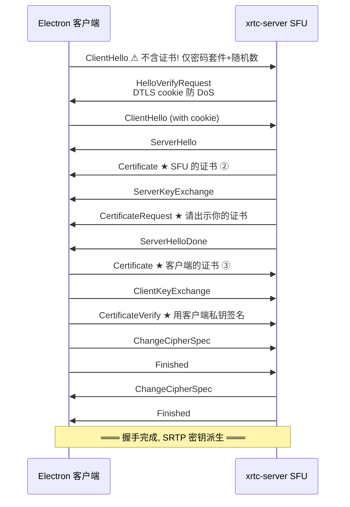
```mermaid
sequenceDiagram
    participant Client as Electron 客户端
    participant Server as xrtc-server SFU

    Client->>Server: ClientHello ⚠ 不含证书! 仅密码套件+随机数
    Server->>Client: HelloVerifyRequest<br/>DTLS cookie 防 DoS
    Client->>Server: ClientHello (with cookie)

    Server->>Client: ServerHello
    Server->>Client: Certificate ★ SFU 的证书 ②
    Server->>Client: ServerKeyExchange
    Server->>Client: CertificateRequest ★ 请出示你的证书
    Server->>Client: ServerHelloDone

    Client->>Server: Certificate ★ 客户端的证书 ③
    Client->>Server: ClientKeyExchange
    Client->>Server: CertificateVerify ★ 用客户端私钥签名
    Client->>Server: ChangeCipherSpec
    Client->>Server: Finished

    Server->>Client: ChangeCipherSpec
    Server->>Client: Finished

    Note over Client, Server: ═══ 握手完成, SRTP 密钥派生 ═══

```

**为什么 ClientHello 里没有证书？** 因为 DTLS 握手用的是标准 TLS 1.2 握手流程——Certificate 消息是独立的握手消息（类型 11），在 ServerHello 之后、ClientKeyExchange 之前。ClientHello 只包含随机数、密码套件列表、Session ID、支持的扩展等，不包含证书。

### 1.6 为什么不需要 CA？fingerprint 机制

这是 WebRTC DTLS 设计最精妙的地方：

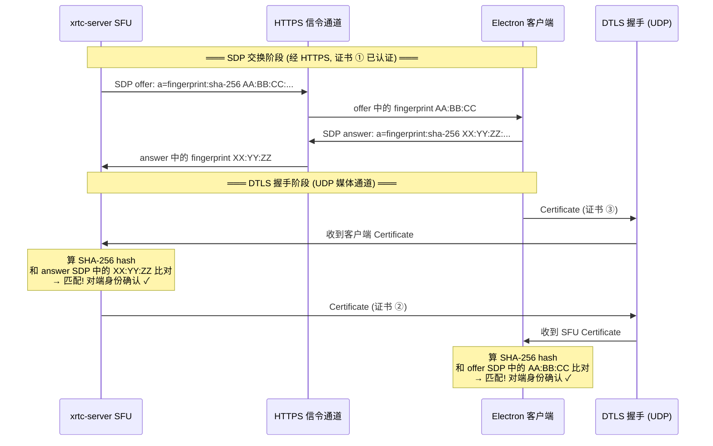
```mermaid
sequenceDiagram
    participant SFU as xrtc-server SFU
    participant SDP as HTTPS 信令通道
    participant Client as Electron 客户端
    participant DTLS as DTLS 握手 (UDP)

    Note over SFU, Client: ═══ SDP 交换阶段 (经 HTTPS, 证书 ① 已认证) ═══

    SFU->>SDP: SDP offer: a=fingerprint:sha-256 AA:BB:CC:...
    SDP->>Client: offer 中的 fingerprint AA:BB:CC
    Client->>SDP: SDP answer: a=fingerprint:sha-256 XX:YY:ZZ:...
    SDP->>SFU: answer 中的 fingerprint XX:YY:ZZ

    Note over SFU, Client: ═══ DTLS 握手阶段 (UDP 媒体通道) ═══

    Client->>DTLS: Certificate (证书 ③)
    DTLS->>SFU: 收到客户端 Certificate
    Note over SFU: 算 SHA-256 hash<br/>和 answer SDP 中的 XX:YY:ZZ 比对<br/>→ 匹配! 对端身份确认 ✓

    SFU->>DTLS: Certificate (证书 ②)
    DTLS->>Client: 收到 SFU Certificate
    Note over Client: 算 SHA-256 hash<br/>和 offer SDP 中的 AA:BB:CC 比对<br/>→ 匹配! 对端身份确认 ✓

```

**信任链**：
1. SDP 走 HTTPS → fingerprint 值被证书 ① 保护，不可能被中间人篡改
2. DTLS 握手时收到对端证书 → hash 比对 → 匹配即证明"你就是刚才通过 HTTPS 跟我协商 SDP 的那个人"
3. 自签名证书的一对一绑定完成，无需 CA 参与

RFC 8122 将这种模式称为 "Certificate Fingerprint"——SDP 中携带的 fingerprint 充当了"带外预共享的信任锚"，替代了 PKI 中 CA 的角色。

### 1.7 总结

| 证书 | 谁持有 | 数量 | 生成 | 认证方式 | 信任锚 | 用途 |
|------|--------|------|------|---------|--------|------|
| HTTPS | Go 信令服务 | 1/进程 | 自签名或 CA | TLS 标准 CA 链 / 自签名 | CA 根证书 | 保护 SDP 传输 |
| DTLS (SFU) | xrtc-server | 1/进程 | `RTCCertificateGenerator` | SDP offer fingerprint | HTTPS 信道 | DTLS 握手 + SRTP 密钥 |
| DTLS (客户端) | libwebrtc | 1/PeerConnection | libwebrtc 自动生成 | SDP answer fingerprint | HTTPS 信道 | DTLS 握手 + SRTP 密钥 |

**两层认证，三份证书**：HTTPS（证书 ①）保护信令面的 SDP 交换 → SDP 中的 fingerprint 成为媒体面的信任锚 → DTLS 握手（证书 ②+③）通过 fingerprint 比对完成双方身份认证 → 握手主密钥派生 SRTP 加密密钥。

### 1.8 证书、指纹、公钥的关系

三者容易混淆，核心关系一句话：**公钥嵌在证书里，指纹是证书的哈希，证书在 DTLS 握手的 Certificate 报文中发送。**

**证书（Certificate）= 公钥的容器**：

```
X.509 证书内容:
  ├─ Subject Public Key       ← 公钥在这里! (RSA 或 ECDSA)
  ├─ Subject / Issuer         ← 身份信息
  ├─ Validity Period          ← 有效期 (365天)
  └─ Signature                ← 用自己的私钥签名 (自签名)
```

`set_local_certificate()` → `_dtls->SetIdentity(cert->identity())` 把证书交给 OpenSSL。SetIdentity 只管"**我**是谁"——告诉 OpenSSL 握手时用这个证书证明自己的身份。

**指纹（Fingerprint）= 证书的 SHA-256 哈希**：

```cpp
// session_description.cpp:114 — offer 生成时
tdesc->identity_fingerprint = SSLFingerprint::CreateFromCertificate(*certificate);
// = SHA-256(整个证书的 DER 编码) → "AA:BB:CC:DD:..."
```

指纹本身不包含公钥——它是证书的"身份证号"。SDP 中 `a=fingerprint:sha-256 AA:BB:CC:...` 传的就是这个哈希值。

`set_remote_fingerprint()` → `_dtls->SetPeerCertificateDigest(alg, data, size)` 告诉 OpenSSL "**对端**的证书指纹应该是这个，不匹配就拒绝握手"。

**公钥在哪？什么时候发给对方？**

公钥嵌在证书里，证书在 DTLS 握手的 **Certificate 报文**中发送。回到抓包：

```
② Server Flight:
   ServerHello
   Certificate ★               ← SFU 的证书! 公钥在这里!
   ServerKeyExchange           ← 密钥交换参数 (与公钥配合完成密钥协商)
   CertificateRequest          ← "客户端, 把你的证书也发过来"
   ServerHelloDone

③ Client Flight:
   Certificate ★               ← 客户端的证书! 公钥在这里!
   ClientKeyExchange           ← 客户端密钥交换参数
   CertificateVerify           ← 用客户端私钥签名, 证明"我持有这个证书"
   ChangeCipherSpec
   EncryptedHandshakeMessage
```

**验证闭环**：

```
SFU 侧:
  ① SDP offer 发出自己的 fingerprint "AA:BB:CC..."
  ② DTLS 握手 Server Flight → Certificate 报文 → 客户端收到 SFU 的证书
  ③ 客户端: SHA-256(收到的证书) → 和 offer 的 "AA:BB:CC..." 比对 → 匹配 ✓

  ④ SDP answer 收到客户端的 fingerprint "XX:YY:ZZ..."
     → set_remote_fingerprint → SetPeerCertificateDigest("XX:YY:ZZ...")
  ⑤ DTLS 握手 Client Flight → Certificate 报文 → SFU 收到客户端的证书
  ⑥ OpenSSL: SHA-256(收到的证书) → 和 SetPeerCertificateDigest 的 "XX:YY:ZZ..." 比对 → 匹配 ✓
```

**为什么"带外"传递指纹？** 指纹走 HTTPS（信令信道），证书 + 公钥走 UDP（媒体信道）。攻击者即使截获了 DTLS 的 Certificate 报文，也无法伪造证书——因为他不知道 SDP 里的 fingerprint 值，伪造的证书哈希对不上。HTTPS 保护了 fingerprint 的传输安全，fingerprint 保护了 DTLS 证书的真实性。

**关键澄清**：指纹**不能**反推出证书——SHA-256 是单向哈希。`Hash(证书) → 指纹` 可行，`指纹 → 证书` 不可能。但 SHA-256 的碰撞抵抗保证了两份不同证书产生相同指纹的概率可忽略不计，所以**指纹匹配 = 证书唯一确认**。

---
## 2. TCP 信令 vs UDP 媒体：同一 libev LT 下的两种 I/O 哲学

libev 只有 LT（水平触发）模式，但 TCP 和 UDP 在 LT 下的读写策略截然不同。核心原因是**字节流 vs 数据报**的本质差异。

### 2.1 读策略

**TCP**（`src/server/signaling_worker.cpp:328-360`）：每次 READ 事件只做**一次** `read()`，读取精确的 `bytes_expected` 字节（36 或 body_len）。

```cpp
void SignalingWorker::_read_query(int fd) {
    int read_len = c->bytes_expected;                      // 精确期望字节数
    int qb_len = sdslen(c->querybuf);                      // 已有数据偏移
    c->querybuf = sdsMakeRoomFor(c->querybuf, read_len);
    nread = sock_read_data(fd, c->querybuf + qb_len, read_len);  // 一次 read()
    sdsIncrLen(c->querybuf, nread);
    _process_query_buffer(c);                              // 尝试推进状态机
}
```

**为什么不循环读到 EAGAIN？** 因为 `bytes_expected` 精准限定了当前阶段需要多少字节。多余数据属于下一个请求（短连接下不存在）。LT 保证：如果内核缓冲还有数据而这次没读完，libev 会**立即重新触发**。

**UDP**（`src/base/async_udp_socket.cpp:58-76`）：每次 READ 事件**循环** `recvfrom()` 直到 EAGAIN。

```cpp
void AsyncUdpSocket::recv_data() {
    while (true) {
        int len = sock_recv_from(_socket, _buf, _size, ...);
        if (len <= 0) return;  // EAGAIN → 退出循环
        signal_read_packet(this, _buf, len, remote_addr, ts);
    }
}
```

**为什么要循环？** UDP 是数据报，一个 `recvfrom` 只取一个。如果网络突发导致内核缓冲积压了多个数据报，LT 会对每个剩余数据报各触发一次 `epoll_wait` → 回调。while 循环一次性排空，避免多余系统调用。**本质是用 ET 风格跑在 LT 之上**。

### 2.2 写策略

**TCP**（`src/server/signaling_worker.cpp:362-393`）：
- 写事件**按需启用**：`_add_reply` 才 `start_io_event(WRITE)`，发完立即 `stop_io_event(WRITE)`
- **支持部分写**：`write()` 可能只发部分字节，用 `cur_resp_pos` 跟踪偏移，LT 重触发时继续
- **致命错误**：`write()` 返回 -1 → `_close_conn`

**UDP**（`src/base/async_udp_socket.cpp:129-163`）：
- 先乐观 `sendto()`，失败再入队 + 启用 WRITE
- **不支持部分写**：`sendto` 要么全发要么全不发（数据报原子性）
- **写缓冲区满不是致命错误**：入队等待下次触发，不关闭 socket

### 2.3 汇总对比

| 维度 | TCP 信令 | UDP 媒体 |
|------|---------|---------|
| **读策略** | 一次 `read()` 读精确字节数，靠 LT 重触发 | `while(true)` 循环到 EAGAIN |
| **读粒度** | 字节流，需 sds 累积 + 状态机拼包 | 数据报，每包完整独立 |
| **状态机** | STATE_HEAD → STATE_BODY | 无状态机（上层分拣） |
| **写启用** | 按需启用，发完关闭 | 按需启用，队列空关闭 |
| **部分写** | 支持（`cur_resp_pos` 跟踪偏移） | 不支持（数据报原子性） |
| **写失败** | `write()` -1 → 关闭连接 | `sendto()` 0 → 入队等待 |
| **连接生命周期** | 短连接（`bytes_processed=65536`） | 长连接（ICE 会话期间） |
| **反压** | TCP 流控 + `reply_list` | `_udp_packet_list` |

---

## 3. set_local_description：整个媒体栈的"接生婆"

`set_local_description` 不只是往 SDP 里填 candidate。它创建了 ICE channel、UDP socket、DTLS/SRTP 传输对象、以及连接这一切的信号链。它是整个媒体栈的出生证明。

### 3.1 入口时间线

```
RtcWorker::_process_push(msg)
  → RtcStreamManager::create_push_stream(uid, stream_name, ...)
    → new PushStream(...)
    → stream->start(certificate)          // ① 初始化 PC + 启动 30s 超时定时器
    → offer = stream->create_offer()      // ② 媒体栈诞生 + 返回 SDP 文本
    → _push_streams[stream_name] = stream
```

`start()` 做两件事（`src/stream/rtc_stream.cpp:81-85`）：

```cpp
void RtcStream::start(rtc::RTCCertificate* certificate) {
    _ice_timeout_watcher = _el->create_timer(ice_timeout_cb, this, false);
    _el->start_timer(_ice_timeout_watcher, k_ice_timeout * 1000);  // 30s 兜底超时
    _pc->init(certificate);  // 传递 DTLS 证书到 TransportController
}
```

30s 超时含义：**如果 30s 内 PC 状态没到 k_connected → 触发 `on_stream_exception` → 清理流资源**。是整个系统的兜底超时。

### 3.2 `create_offer()` 的四个阶段

`PeerConnection::create_offer()`（`src/pc/peer_connection.cpp:99-151`）：

**阶段 A — 随机生成 ICE 凭据**（line 107）：
```cpp
IceParameters ice_params = IceCredentials::create_random_ice_credentials();
```
生成的 `ice-ufrag` 和 `ice-pwd` 被后续三个地方消费：SDP 文本、STUN MESSAGE-INTEGRITY HMAC 计算、UDPPort 的身份标识。

**阶段 B — 构造 SDP 对象模型**（lines 109-146）：
- 创建 `AudioContentDescription` + `VideoContentDescription`
- `add_transport_info(mid, ice_params, certificate)` 把 ufrag/pwd/fingerprint 写入 `TransportDescription`
- BUNDLE group：audio + video 共享同一传输通道

**阶段 C — `set_local_description()`**（line 148）：整个媒体栈的出生点，见 §1.3。

**阶段 D — 序列化为 SDP 文本**（line 150）：candidate 信息已通过信号回调填入，SDP 含 `a=candidate:...` 行。

### 3.3 `TransportController::set_local_description()` 的 8 个副作用

（`src/pc/transport_controller.cpp:35-82`）

```cpp
int TransportController::set_local_description(SessionDescription* desc) {
    for (auto content : desc->contents()) {
        std::string mid = content->mid();

        // BUNDLE: audio + video 共享同一 ICE/DTLS 通道
        if (desc->is_bundle(mid) && mid != desc->get_first_bundle_mid()) continue;

        // === 副作用 ①: 创建 ICE channel ===
        _ice_agent->create_channel(_el, mid, IceCandidateComponent::RTP);

        // === 副作用 ②: 设置本地 ICE 凭据 (ufrag + pwd) ===
        auto td = desc->get_transport_info(mid);
        _ice_agent->set_ice_params(mid, IceCandidateComponent::RTP,
            IceParameters(td->ice_ufrag, td->ice_pwd));

        // === 副作用 ③: 创建 DtlsTransport, 绑定到 ICE channel ===
        DtlsTransport* dtls_transport = new DtlsTransport(
            _ice_agent->get_channel(mid, IceCandidateComponent::RTP));
        dtls_transport->set_local_certificate(_local_certificate);

        // === 副作用 ④: 连接 DTLS 状态信号 → TransportController ===
        dtls_transport->signal_receiving_state.connect(this, ...);
        dtls_transport->signal_writable_state.connect(this, ...);
        dtls_transport->signal_dtls_state.connect(this, ...);

        // === 副作用 ⑤: 连接 ICE 状态信号 → TransportController ===
        _ice_agent->signal_ice_state.connect(this, ...);

        // === 副作用 ⑥: 创建 DtlsSrtpTransport ===
        DtlsSrtpTransport* dtls_srtp = new DtlsSrtpTransport(...);
        dtls_srtp->set_dtls_transport(dtls_transport, nullptr);

        // === 副作用 ⑦: 连接 SRTP 收包信号 → 上层 ===
        dtls_srtp->signal_rtp_packet_received.connect(this, ...);
        dtls_srtp->signal_rtcp_packet_received.connect(this, ...);
    }

    // === 副作用 ⑧: 触发 candidate 收集 (创建 UDP sockets!) ===
    _ice_agent->gathering_candidate();
    return 0;
}
```

### 3.4 `gathering_candidate()` → UDP socket 绑定

```
IceAgent::gathering_candidate()
  → for each channel: channel->gathering_candidate()
    → IceTransportChannel::gathering_candidate()   (ice_transport_channel.cpp:85-121)
```

```cpp
void IceTransportChannel::gathering_candidate() {
    if (_ice_params.ice_ufrag.empty() || _ice_params.ice_pwd.empty()) return;
    auto network_list = _alloctor->get_networks();

    for (auto network : network_list) {
        UDPPort* port = new UDPPort(_el, _transport_name, _component, _ice_params);
        port->signal_unknown_address.connect(this, &IceTransportChannel::_on_unknown_address);

        Candidate c;
        port->create_ice_candidate(network, _alloctor->min_port(),
            _alloctor->max_port(), c);
        _local_candidates.push_back(c);
    }
    signal_candidate_allocate_done(this, _local_candidates);
}
```

`UDPPort::create_ice_candidate()`（`src/ice/udp_port.cpp:41-97`）的实际 socket 操作：

```cpp
int UDPPort::create_ice_candidate(Network* network, int min_port, int max_port, Candidate& c) {
    _socket = create_udp_socket(network->ip().family());   // socket()
    sock_setnonblock(_socket);                             // O_NONBLOCK
    sock_bind(_socket, ..., min_port, max_port);           // bind()
    sock_get_address(_socket, nullptr, &port);             // getsockname()

    _async_socket = std::make_unique<AsyncUdpSocket>(_el, _socket);
    _async_socket->signal_read_packet.connect(this, &UDPPort::_on_read_packet);
    // ★ 这个连接是整个 UDP 收包链路的起点

    c.username = _ice_params.ice_ufrag;
    c.password = _ice_params.ice_pwd;
    ...
}
```

**总结**：`set_local_description` 不仅把 candidate 填入 SDP，更创建了绑定在本地网卡上的 UDP socket，并通过 `signal_read_packet` 连接把它变成了后续所有 ICE/DTLS/SRTP 数据的入口。

## 4. Candidate Pair → IceConnection：从 UDP 四元组到逻辑通道

### 4.5 IceTransportChannel × Network → UDPPort 的数量关系

`IceTransportChannel` 是逻辑上的媒体传输通道，`UDPPort` 是附着在其上的物理 UDP socket。两者的数量关系受三层因素控制。

**第一层 — BUNDLE 控制逻辑通道数**（`transport_controller.cpp:44`）：

```cpp
if (desc->is_bundle(mid) && mid != desc->get_first_bundle_mid()) {
    continue;  // audio + video 共享同一个 ICE channel
}
```

**第二层 — RTCP mux 控制是否需要独立的 RTCP 通道**：创建时只传了 `IceCandidateComponent::RTP`。若不开启 RTCP mux，则需额外创建 `RTCP` 通道。

**第三层 — 网卡数量控制物理 socket 数**：`gathering_candidate()` 遍历 `NetworkManager::get_networks()`，为每个 Network 创建一个 `UDPPort`。

`NetworkManager` 有两种模式（`src/base/network.cpp:19-50`）：

| 模式 | 触发条件 | 行为 |
|------|---------|------|
| **云服务器手工配置** | `conf.netcard` + `conf.ipv4_addr` 非空 | 跳过网卡扫描，手工构造唯一的 Network 对象 |
| **本地自动扫描** | 上述配置为空 | `getifaddrs()` 遍历全部网卡，过滤 IPv4 非回环地址 |

云服务器必须手工配置的原因：公网 IP 在 NAT 环境下不绑定在任何本地网卡上，`getifaddrs()` 扫出来的是内网地址，客户端无法直连。

**数量公式**：

```
UDPPort 总数 = Network 数量 × IceTransportChannel 数量
```

| 场景 | Network 数 | IceTransportChannel 数 | UDPPort 总数 |
|------|-----------|----------------------|-------------|
| 云服务器（手工配公网 IP）+ BUNDLE + RTCP mux | 1 | 1 | **1** |
| 本地 eth0 + BUNDLE + RTCP mux | 1 | 1 | **1** |
| 本地 eth0 + wlan0 + BUNDLE + RTCP mux | 2 | 1 | **2** |
| 本地 eth0 + wlan0 + BUNDLE off + RTCP mux | 2 | 2 | **4** |
| 本地 eth0 + BUNDLE off + RTCP mux off | 1 | 4 | **4** |

每个 UDPPort 对应一个独立的 UDP socket，绑定在对应网卡的 IP 上。服务端 SDP offer 列出所有 candidate，客户端逐一尝试，ICE 协议从多条 path 中选出最优。

**层次全景**：

```
set_local_description()
  │
  ├─ IceAgent::create_channel() ──→ IceTransportChannel (逻辑通道)
  │    数量: BUNDLE + RTCP mux 决定
  │
  └─ IceAgent::gathering_candidate()
       │
       └─ for each channel:
            IceTransportChannel::gathering_candidate()
              │
              └─ for each Network (get_networks()):
                   UDPPort::create_ice_candidate()
                     ├─ socket() + bind() + O_NONBLOCK
                     ├─ AsyncUdpSocket 包裹
                     ├─ signal_read_packet → _on_read_packet
                     └─ Candidate 生成 (携带 ice-ufrag + ice-pwd)
```

### 4.6 Candidate Pair → IceConnection：从 UDP 四元组到逻辑通道

客户端也可能有多张网卡，每个网卡都可以向 SFU 的同一个 UDPPort 发送数据，形成多个 UDP 四元组。每个通过 STUN 校验的四元组对应一个 `IceConnection`。

**UDP 四元组 = Candidate Pair**：

```
客户端 WiFi:    192.168.1.100:50001  ──┐
                                      ├──→ SFU UDPPort 120.76.197.143:10028
客户端 以太网:  10.0.0.50:50002       ──┘

                                   同一个 UDPPort
                                   _connections map:
                                    key "192.168.1.100:50001" → IceConnection #1
                                    key "10.0.0.50:50002"     → IceConnection #2
```

`UDPPort` 内部用 `std::map<SocketAddress, IceConnection*> _connections` 按客户端地址索引（`src/ice/udp_port.cpp:107-110`）：

```cpp
IceConnection* UDPPort::get_connection(const rtc::SocketAddress& addr) {
    auto iter = _connections.find(addr);
    return iter == _connections.end() ? nullptr : iter->second;
}
```

当收到客户端 STUN Binding Request 且通过校验后，创建 `IceConnection`（`udp_port.cpp:327-342`）：

```cpp
IceConnection* UDPPort::create_connection(const Candidate& remote_candidate) {
    IceConnection* conn = new IceConnection(_el, this, remote_candidate);
    auto ret = _connections.insert(
        std::make_pair(conn->remote_candidate().address, conn));
    if (ret.second == false && ret.first->second != conn) {
        ret.first->second = conn;  // 同地址 → 替换旧连接
    }
    return conn;
}
```

**层次结构**：

```
UDPPort (物理层，一个 UDP socket，绑定一个本地地址)
  │
  ├─ IceConnection #1  四元组 (client_WiFi:50001, SFU:10028)
  │     ├─ write_state:     STATE_WRITABLE   ← ping 收到回复
  │     ├─ receiving:       true             ← 收到过对端数据
  │     ├─ rtt:             15ms
  │     └─ priority:        RFC 5245 计算值
  │
  ├─ IceConnection #2  四元组 (client_eth:50002, SFU:10028)
  │     ├─ write_state:     STATE_WRITE_INIT  ← 还没 ping 过
  │     ├─ receiving:       false
  │     ├─ rtt:             0
  │     └─ priority:        RFC 5245 计算值
  │
  └─ IceController ──── 从 N 个连接中选出 1 个最优
        │
        ├─ sort_and_switch_connection(): 5 级排序 + RTT 防抖(10ms)
        │     writable > write_state > receiving > priority > RTT
        │
        ├─ select_connection_to_ping(): 两层限速
        │     Channel 级 48ms/480ms，Connection 级 48ms/900ms/2500ms
        │
        └─ _selected_connection → 唯一的发送出口
```

**IceConnection 的职责**——它是"最小逻辑通道"，承载候选对上的完整 ICE 状态：

| 职责 | 代码位置 |
|------|---------|
| STUN ping/pong | `ping()` / `on_connection_request_response()` |
| write state 生命周期 | `set_write_state()`: INIT → WRITABLE → UNRELIABLE → TIMEOUT |
| receiving 方向探活 | `update_receiving()`: 综合 ping + data 时间戳 |
| RTT 平滑 | `received_ping_response()`: `rtt = old*0.75 + new*0.25` |
| 非 STUN 数据转发 | `on_read_packet()` → `signal_read_packet` → DtlsTransport |
| 数据发送 | `send_packet(data, len)` → `_port->send_to(remote_addr)` |

数据收发的唯一出口是 `_selected_connection`（`src/ice/ice_transport_channel.cpp:493-506`）：

```cpp
int IceTransportChannel::send_packet(const char* data, size_t len) {
    if (!_ice_controller->ready_to_send(_selected_connection)) return -1;
    return _selected_connection->send_packet(data, len);
}
```

**四层职责总结**：

| 层次 | 对象 | 职责 |
|------|------|------|
| 物理层 | UDPPort | 一个 UDP socket，绑定本地地址，`_connections` map 管理所有四元组 |
| 逻辑层 | IceConnection | 每个候选对一个，独立跟踪 write_state / receiving / RTT |
| 决策层 | IceController | 5 级排序 + 两层限速，选出最优连接 |
| 聚合层 | IceTransportChannel | 管理 UDPPort + IceController，向外暴露 writable/receiving 信号 |

所有 IceConnection 共享同一个物理 socket，但独立的状态决定了：哪个连接被选中发数据、哪个连接已失效需要淘汰。DTLS 握手、SRTP 加解密、RTP 转发最终都通过**那一个** `_selected_connection` 的 `send_packet()` 发出，通过 `on_read_packet()` → `signal_read_packet` 收进来。

### 4.7 IceConnection 状态分类

IceConnection 有 3 个类别的状态，分属不同层级：

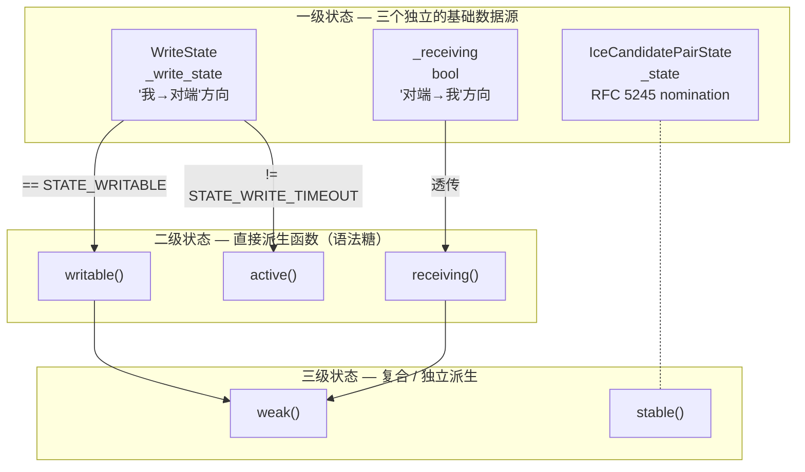
```mermaid
graph TD
    subgraph 一级["一级状态 — 三个独立的基础数据源"]
        WS["WriteState<br/>_write_state<br/>'我→对端'方向"]
        RC["_receiving<br/>bool<br/>'对端→我'方向"]
        PS["IceCandidatePairState<br/>_state<br/>RFC 5245 nomination"]
    end

    subgraph 二级["二级状态 — 直接派生函数（语法糖）"]
        wf["writable()"]
        af["active()"]
        rf["receiving()"]
    end

    subgraph 三级["三级状态 — 复合 / 独立派生"]
        wk["weak()"]
        st["stable()"]
    end

    WS -->|"== STATE_WRITABLE"| wf
    WS -->|"!= STATE_WRITE_TIMEOUT"| af
    RC -->|"透传"| rf
    wf --> wk
    rf --> wk
    PS -.- st
```

**一级状态**：三个互不隶属的独立数据源，各自有独立的更新路径。

| 状态 | 类型 | 值域 | 更新路径 | 语义 |
|------|------|------|---------|------|
| `WriteState` | 4 级枚举 | `WRITABLE(0)` / `UNRELIABLE(1)` / `INIT(2)` / `TIMEOUT(3)` | `received_ping_response()` 升级；`update_state()` 降级 | 我→对端是否畅通（ping 回复率） |
| `_receiving` | bool | `true` / `false` | `update_receiving()`：收包时间窗口 2.5s 内是否有数据 | 对端→我是否还活着 |
| `IceCandidatePairState` | 4 级枚举 | `WAITING` / `IN_PROGRESS` / `SUCCEEDED` / `FAILED` | `ping()` → IN_PROGRESS；`received_ping_response()` → SUCCEEDED；`fail_and_destroy()` → FAILED | RFC 5245 nomination 流程 |

WriteState 的降级链路（`update_state()`，`ice_connection.cpp:246`）：

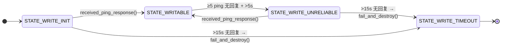
```mermaid
stateDiagram-v2
    direction LR
    [*] --> STATE_WRITE_INIT
    STATE_WRITE_INIT --> STATE_WRITABLE : received_ping_response()
    STATE_WRITABLE --> STATE_WRITE_UNRELIABLE : ≥5 ping 无回复 + >5s
    STATE_WRITE_UNRELIABLE --> STATE_WRITABLE : received_ping_response()
    STATE_WRITE_UNRELIABLE --> STATE_WRITE_TIMEOUT : >15s 无回复 → fail_and_destroy()
    STATE_WRITE_INIT --> STATE_WRITE_TIMEOUT : >15s 无回复 → fail_and_destroy()
    STATE_WRITE_TIMEOUT --> [*]
```

**二级状态**：纯粹的一级状态语法糖，不引入新信息。

| 函数 | 定义 | 等价表述 |
|------|------|---------|
| `writable()` | `_write_state == STATE_WRITABLE` | WriteState 的最健康档位 |
| `active()` | `_write_state != STATE_WRITE_TIMEOUT` | 还没死（UNRELIABLE / INIT 也算活跃） |
| `receiving()` | `_receiving` | 直接透传 |

**三级状态**：跨数据源复合或独立计算。

| 函数 | 定义 | 依赖 |
|------|------|------|
| `weak()` | `!(writable() && receiving())` | **WriteState + _receiving** — 唯一的读写复合状态 |
| `stable()` | `_rtt_samples > 4 && !_miss_response(now)` | **RTT 采样数 + 丢包检测** — 完全独立于 WriteState |

**`stable()` 独立于写状态的原因**：它衡量的是 RTT 测量的置信度，而非连接健康度。一个连接可以 `writable()=true` 但 `stable()=false`（ping 回复正常，只是 RTT 采样不足 5 次），也可以 `writable()=false` 但此时 `stable()` 根本不可达（WRITE_UNRELIABLE 时 RTT 采样通常也不足）。

**`weak()` 为什么容易混淆**：它是唯一横跨读写两个方向的判断。`weak()=true` 的触发原因可能完全不同：
- `writable()=false` → 写方向死了（ping 无回复）
- `receiving()=false` → 读方向死了（对端停止发包）
- 两者都 false → 双向失联

而 `weak()` 的消费者（ping 间隔选择、`_is_pingable` 的 interval 跳过）不关心原因，只关心结果——channel 是否处于"需要加速探测"的状态。

**五个布尔函数的对照**：

|  | writable | receiving | active | weak | stable |
|--|----------|-----------|--------|------|--------|
| **来源** | WriteState | _receiving | WriteState | 读写复合 | RTT + 丢包 |
| **含义** | 我→对端通畅 | 对端→我存活 | 连接未死亡 | 双向未全通 | RTT 可靠且无丢包 |
| **用于** | Controller 选路 | Channel 状态 | — | ping 间隔加速 | ping 间隔从 900→2500ms |

### 4.8 selected connection 的三道防线：为什么不等到 15 秒切换就已经发生了

当 selected connection 开始丢 ping 回复且对端停止发包时，`_compare_connections` 在 15 秒超时前提供了 **三道防线**，每一道在上一道失败后启动，层层放宽切换条件：

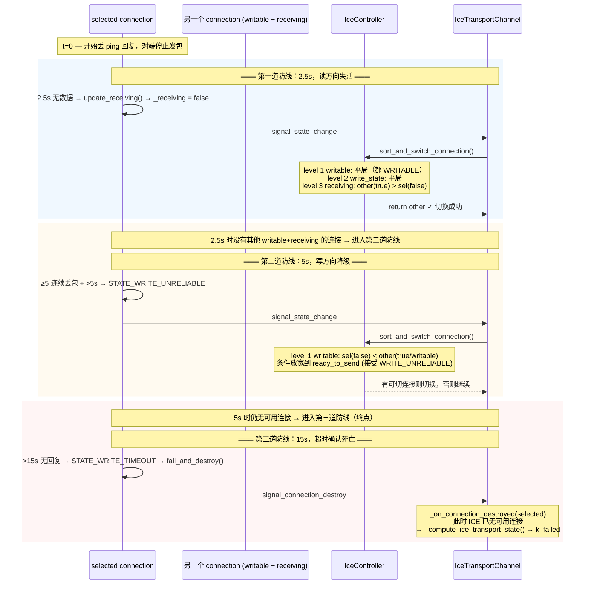
```mermaid
sequenceDiagram
    participant sel as selected connection
    participant other as 另一个 connection (writable + receiving)
    participant ctrl as IceController
    participant ch as IceTransportChannel

    Note over sel: t=0 — 开始丢 ping 回复，对端停止发包

    rect rgb(240, 248, 255)
        Note over sel,ch: ═══ 第一道防线：2.5s，读方向失活 ═══
        sel->>sel: 2.5s 无数据 → update_receiving() → _receiving = false
        sel->>ch: signal_state_change
        ch->>ctrl: sort_and_switch_connection()
        Note over ctrl: level 1 writable: 平局（都 WRITABLE）<br/>level 2 write_state: 平局<br/>level 3 receiving: other(true) > sel(false)
        ctrl-->>ch: return other ✓ 切换成功
    end

    rect rgb(255, 250, 240)
        Note over sel,ch: 2.5s 时没有其他 writable+receiving 的连接 → 进入第二道防线
        Note over sel,ch: ═══ 第二道防线：5s，写方向降级 ═══
        sel->>sel: ≥5 连续丢包 + >5s → STATE_WRITE_UNRELIABLE
        sel->>ch: signal_state_change
        ch->>ctrl: sort_and_switch_connection()
        Note over ctrl: level 1 writable: sel(false) < other(true/writable)<br/>条件放宽到 ready_to_send (接受 WRITE_UNRELIABLE)
        ctrl-->>ch: 有可切连接则切换，否则继续
    end

    rect rgb(255, 245, 245)
        Note over sel,ch: 5s 时仍无可用连接 → 进入第三道防线（终点）
        Note over sel,ch: ═══ 第三道防线：15s，超时确认死亡 ═══
        sel->>sel: >15s 无回复 → STATE_WRITE_TIMEOUT → fail_and_destroy()
        sel->>ch: signal_connection_destroy
        Note over ch: _on_connection_destroyed(selected)<br/>此时 ICE 已无可用连接<br/>→ _compute_ice_transport_state() → k_failed
    end
```

**为什么 15 秒 = ICE 已无可用连接？** 这不是推论，是逻辑必然：

1. **第一道防线 2.5s**：`receiving` 失活触发排序。如果存在另一个 `writable()=true && receiving()=true` 的连接，level 3 就能分出胜负——不需要等写状态降级。

2. **第二道防线 5s**：`STATE_WRITE_UNRELIABLE` 降级触发排序。条件放宽到 `ready_to_send()`（接受 WRITE_UNRELIABLE）。如果存在任何一个可发数据的连接，selected 被换掉。

3. **两轮切换都失败**：说明剩余连接要么是 `STATE_WRITE_INIT`（从未 ping 通，`ready_to_send()` 不接受），要么是 `_receiving=false`（读方向也死了），要么连接列表为空。但 15 秒内 round-robin 已经 ping 过每一个剩余连接至少一轮——没一个能升到 WRITABLE，证实它们确实不通。

4. **第三道防线 15s 不是"切换时机"，而是"已经确认无连接可用的终局宣告"**。`_on_connection_destroyed(selected)` 只是对这个既定事实的机械执行——清理引用、设置 `k_failed`，通知上层释放资源。

**换句话说**：15 秒超时走到 `fail_and_destroy`，不是 selected 一个人死了，是整个 ICE 的心跳已经停跳了 15 秒。所有连接都经过了 ping 验证，没有一条能通。

### 4.9 理论最短切换边界：每级决胜所需的最短时间

三道防线的逻辑可以进一步泛化——把 `_compare_connections` 的 5 级比较拆成各自的最短决胜时间：


```mermaid
gantt
    title _compare_connections 各级决胜的理论最短时间
    dateFormat X
    axisFormat %s

    section Level 4<br/>priority
    静态值 0s : 0, 1

    section Level 5<br/>RTT fallback
    1 RTT (≥100ms) : 1, 100

    section Level 3<br/>receiving
    2.5s (WEAK_CONNECTION_RECEIVE_TIMEOUT) : 1, 2500

    section Level 2<br/>write_state
    5s (WRITE_UNRELIABLE 降级) : 1, 5000

    section 实际有效边界
    读失活 / 写降级 : 1, 5000
```

**推导**：每级成为决胜条件的理论最短时间，就是 "selected 和下一个最优连接在该级及之前所有级都平局，仅在该级分胜负" 所需的最小等待时间。

| 级别 | 比较条件 | 理论最短决胜时间 | 实际上能否成为决胜级 |
|------|---------|:---:|------|
| Level 1 | `writable()` | — | **不能** — 只是 level 2 的布尔切面，不独立提供时间边界 |
| Level 2 | `write_state()` | **5s** | WRITABLE → WRITE_UNRELIABLE 降级，两个非 writable 连接间由 UNRELIABLE vs INIT 分胜负 |
| Level 3 | `receiving()` | **2.5s** | `WEAK_CONNECTION_RECEIVE_TIMEOUT` 后 `_receiving` 变为 false，与 receiving 的连接分胜负 |
| Level 4 | `priority()` | **0s** | **静态值**，连接创建即确定，无需等待。同一 local candidate 到两个不同 remote candidate 的 pair priority 几乎不可能相等 |
| Level 5 | RTT fallback | **1 RTT** | 理论可达，但需要 level 1-4 全部平局——在有 level 4 priority 的场景下几乎不可能 |

**实际有效的切换边界就是 2.5s 和 5s**。RTT 决胜只存在于理论分析——需要两个连接的 writable、write_state、receiving、priority 四个维度完全相同，这在真实部署中几乎不会发生。

**思考方法复现**：把排序条件拆开，问自己"selected 在什么条件下会被这个条件单独击败？那个条件最快什么时候满足？"——最小的那个满足时间就是当前的最优切换边界。

## 5. ICE ping 定时器 + 两层限速 + 5 级排序

### 5.1 大逻辑：排序 → 切换 → 更新状态

ICE 的核心逻辑线是 `_sort_connections_and_update_state`——每次连接状态变化时执行的三合一操作：

```cpp
void _sort_connections_and_update_state() {
    _maybe_switch_selected_connection(_ice_controller->sort_and_switch_connection());
    // ① 5 级排序 → 可能切换 selected

    _update_state();
    // ② 更新 writable / receiving / ice_state → 上报 IceAgent → TransportController → PC

    _maybe_start_pinging();
    // ③ 首次满足条件时启动定时器
}
```

**四个触发点**，按实际重要性排序：

| 触发点 | 重要性 | 场景 |
|--------|--------|------|
| `_on_connection_state_change` | ★★★ | 定时器巡检发现 connection 降级 / ping 回复触发升级 → 可能切换 selected |
| `_on_connection_destroyed` | ★★ | 连接销毁，若销毁的是 selected → 必须重新选路 |
| `_on_unknown_address` | ★ | 新连接创建（初始 write_state=INIT, receiving=false，排序垫底，不影响切换） |
| `set_remote_ice_params` | ★ | ANSWER 到了补密码，可能解锁首次 ping，但创建连接时同步调了 `_add_connection` 走触发点 3 |

后两个触发点"用处不大"——新连接刚创建时状态全是 INIT，排序必然垫底，不会触发 selected 切换。真正驱动 selected 变化的只有**定时器巡检**（降级）和**ping 回复**（升级）。

**理解这条逻辑链是理解整个 ICE 模块的关键**：先理解"大逻辑"做什么 → 理解"谁触发大逻辑" → 理解"触发源在什么条件下产生"。


### 5.2 关键常量速查

(速查表见 §5.5.1)

### 5.3 ICE ping 定时器的冷启动条件

`IceTransportChannel` 持有一个周期性定时器（`_ping_watcher`），周期在 48ms/480ms 之间自适应。冷启动的唯一门控是 `_maybe_start_pinging()`（`ice_transport_channel.cpp:414-428`）：

```cpp
void IceTransportChannel::_maybe_start_pinging() {
    if (_start_pinging) return;  // 已启动，跳过

    if (_ice_controller->has_pingable_connection()) {
        _el->start_timer(_ping_watcher, _cur_ping_interval * 1000);
        _start_pinging = true;
    }
}
```

`has_pingable_connection()` → `_is_pingable()` 要求 `remote_candidate` **同时具备** username 和 password（`ice_controller.cpp:181-186`）：

```cpp
if (remote.username.empty() || remote.password.empty()) {
    return false;
}
```

两把凭据的来源和时序：

| 凭据 | 何时填入 | 来源 |
|------|---------|------|
| `remote_candidate.username` | STUN Binding Request 解析成功 | USERNAME 属性中提取的 `remote_ufrag` |
| `remote_candidate.password` | ANSWER 到达后补填 | `set_remote_ice_params()` → `maybe_set_remote_ice_params()` |

**冷启动条件 = 至少一个 IceConnection 同时具备 ufrag（来自 STUN）和 password（来自 ANSWER）**。

`_maybe_start_pinging()` 在两个地方被调用，**谁后到谁触发**：

```
路径 A — STUN 先到，ANSWER 后到:
  STUN Request → _on_unknown_address → _add_connection
    → _sort_connections_and_update_state → _maybe_start_pinging()
    → password 为空, has_pingable_connection() = false → 跳过

  ANSWER 到 → set_remote_ice_params() → maybe_set_remote_ice_params()
    → 补填 password → _sort_connections_and_update_state
    → _maybe_start_pinging()
    → username+password 都到位 ★ 启动!

路径 B — ANSWER 先到，STUN 后到:
  ANSWER → _remote_ice_params 写入, 此时还没有 connection → 跳过

  STUN Request → _on_unknown_address
    → remote_candidate.password = _remote_ice_params.ice_pwd (已在 ANSWER 中填入)
    → 创建时密码就已经非空 → _add_connection
    → _sort_connections_and_update_state → _maybe_start_pinging() ★ 启动!
```

`_start_pinging` 保证只启动一次。

### 5.4 定时器的三职责 + 两层限速

`IceTransportChannel` 持有的定时器不止发 ping——它是整个 ICE 状态机的**心跳驱动**。`_on_check_and_ping()`（`ice_transport_channel.cpp:448-465`）每个周期做三件事：

```cpp
void IceTransportChannel::_on_check_and_ping() {
    _update_connection_states();                          // ① 巡检所有连接
    auto result = _ice_controller->select_connection_to_ping(...); // ② 选 ping 目标
    if (result.conn) _ping_connection(conn);             // ③ 发 ping
    // interval 变化 → 重启定时器
}
```

**① `_update_connection_states()`**——遍历所有连接调 `conn->update_state(now)`，检测 ping 超时 → 降级 write_state（WRITABLE → UNRELIABLE → TIMEOUT）。状态变化时 `signal_state_change` → 触发 `_on_connection_state_change` → `_sort_connections_and_update_state` → `sort_and_switch_connection()` **可能切换 selected connection**。

**② `select_connection_to_ping()`**——Channel 级 + Connection 级两层限速，选本轮应该 ping 的候选对。

**③ `_ping_connection(conn)`**——对选中的候选对发出 STUN Binding Request，验证可达性。

```
每个定时器周期:
  ① 巡检所有连接 → 超时的降级/淘汰
  ② 连接状态变化 → 信号上报 → 可能触发 selected 切换
  ③ 选一个候选对发 ping → 验证可达性
  ④ 根据 weak/strong 调整定时器频率
```

以下详述步骤②中的两层限速设计。定时器周期是所有候选对的"最小分辨率"：**通道稳定时加大周期省带宽，不稳定时缩小周期尽快收敛到最优**。

**第一层 — Channel 级**（`ice_controller.cpp:224-225`）：

```cpp
int ping_interval = (_weak() || need_ping_more_at_weak)
    ? WEAK_PING_INTERVAL    // 48ms
    : STRONG_PING_INTERVAL; // 480ms
```

`_weak()` = 没有 selected_connection，或者 selected 不满足 writable && receiving。`need_ping_more_at_weak` = 存在 ping 未满 3 次的连接（新连接快速初探）。

**Channel 级速率门的工作原理**（`select_connection_to_ping` 中）：

```cpp
if (now >= last_ping_sent_ms + ping_interval) {
    conn = _find_next_pingable_connection(now);
}
```

`last_ping_sent_ms` 是**整个 channel 共享的**上次 ping 时间——`_ping_connection` 中更新，不管 ping 的是哪个连接。稳态下 `now ≈ last_ping + ping_interval`，gate 恒成立。gate 仅在升降档瞬间起作用：。它在**模式切换瞬间**起作用：

```
升档 (48ms→480ms): 刚切到 strong, 上次 ping 才过了 48ms
  → gate: now >= last_ping + 480? → No → 不发 → 等 480ms 定时器到期再来 → Yes → 发
  → 效果: 立即减速，不给刚升级的 channel 额外发 ping

降档 (480ms→48ms): 切到 weak, 紧急
  → gate: now >= last_ping + 48? → 只要上次 ping 超过 48ms 前 → 立刻放行
  → 效果: 立即加速，不浪费时间
```

`-PING_INTERVAL_DIFF(5ms)` 是定时器可能提前触发的容差。

**第二层 — Connection 级**（`ice_controller.cpp:335-347`）：

| 条件 | 间隔 | 含义 |
|------|------|------|
| `< 3 次 ping` | 48ms | 新连接，快速摸清质量 |
| 连接不稳定 | 900ms | 中等频率 |
| 连接稳定 | 2500ms | 低频保活 |

**两层同时满足才真发包**：

```
定时器 48ms 触发 → _on_check_and_ping()
  → select_connection_to_ping()
    → _find_next_pingable_connection()
      → _is_pingable 过滤：
        Channel 级: now >= last_ping_sent_ms + 48ms  ← 定时器已保证
        Connection 级: now >= conn.last_ping_sent + 2500ms ← 稳定连接未到间隔
      → 跳过 → 本轮不发包
```

**自适应调速器的本质**：

```
定时器周期 = 所有候选对的"最小分辨率"
  │
  ├─ weak 时 48ms: 高频探测, 每 48ms 至少 ping 一个 pair, 快速收敛到最优
  └─ strong 时 480ms: 低频, 已经选出来了, 不需要频繁换

Connection 级在此基础上进一步限速:
  weak 时: timer=48ms, _is_pingable 中 _weak() 直接返回 true, 不查 Connection 级间隔
  strong 时: timer=480ms, 稳定连接 conn_interval=2500ms → 实际每 2500ms 才 ping 一次
```

**关键：weak 时 Connection 级间隔被跳过**。

`_is_pingable()` 中 `_weak()` 为 true 时直接 `return true`，根本不走到 `_is_connection_past_ping_interval`。因此 `_get_connection_ping_interval` 里的 `_weak()` 检查是死代码，已移除——该函数只区分稳定/不稳定两个级别：

```cpp
bool _is_pingable(IceConnection* conn, int64_t now) {
    if (remote.username.empty() || remote.password.empty()) return false;
    if (_weak()) return true;   // ← 直接放行，跳过 Connection 级限速
    return _is_connection_past_ping_interval(conn, now);  // strong 时才进入
}
```

因此 48ms 和 900ms 从来不共存——它们在不同模式下各管各的：

```
weak 模式:
  timer = 48ms
  → round-robin 公平轮转，每 48ms 任一凭据齐全的连接都可能被选中 ping
  → 某个连接收到 response → writable → sort_and_switch → 成为 selected
  → selected 稳定 → _weak() 变 false → 切换 strong 模式

strong 模式:
  timer = 480ms
  → selected 优先被 ping (2500ms 间隔)
  → 其他连接按各自间隔: 不稳定 900ms, 稳定 2500ms
```

这就是"快速收敛"的本质——48ms 高速轮询所有候选对，直到有一个胜出，此后降频省带宽。

**已知问题**：当前采用 Aggressive Nomination——每包 ping 都带 USE-CANDIDATE（`stun_request.cpp:120`），包括轮询探活其他 pair 的 ping。这会导致客户端被探活 ping "误导"切到非 selected 的 pair。正确做法是 Regular Nomination：只有 selected connection 的 ping 才带 USE-CANDIDATE。单网口场景下无实际影响（仅 1 个 IceConnection），多网卡时需修复。代码已标记 TODO。

### 5.5 代码级走读
> 从第一个 UDP 包到达、创建 IceConnection、冷启动定时器，到稳态每周期探活、选连接、排序、升降档的完整代码链路。所有代码位置指向 `src/ice/`。

### 5.5.1 关键常量速查

| 常量 | 值 | 定义位置 | 含义 |
|------|-----|---------|------|
| `WEAK_PING_INTERVAL` | 48ms | `ice_def.h` | Channel weak 时的发包间隔（10000bps 带宽假设） |
| `STRONG_PING_INTERVAL` | 480ms | `ice_def.h` | Channel strong 时的发包间隔（1000bps 带宽假设） |
| `STABLING_CONNECTION_PING_INTERVAL` | 900ms | `ice_def.h` | 单连接不稳定时的保活间隔 |
| `STABLE_CONNECTION_PING_INTERVAL` | 2500ms | `ice_def.h` | 单连接稳定时的保活间隔 |
| `MIN_PINGS_AT_WEAK_PING_INTERVAL` | 3 | `ice_def.h` | 新连接快速初探的 ping 次数阈值 |
| `k_min_inprovement` | 10ms | `ice_controller.cpp:11` | RTT 切换防抖：top 必须比当前 selected 至少小 10ms |
| `RTT_RATIO` | 3 | `ice_connection.cpp:19` | RTT 指数平滑权重：old : new = 3 : 1 |
| `CONNECTION_WRITE_CONNECT_FAILS` | 5 | `ice_def.h` | 连续未回复 ping 数 ≥5 → 触发降级检查 |
| `CONNECTION_WRITE_CONNECT_TIMEOUT` | 5000ms | `ice_def.h` | WRITABLE → UNRELIABLE 的超时阈值 |
| `CONNECTION_WRITE_TIMEOUT` | 15000ms | `ice_def.h` | UNRELIABLE/INIT → TIMEOUT 的超时阈值 |
| `WEAK_CONNECTION_RECEIVE_TIMEOUT` | 2500ms | `ice_def.h` | receiving 方向的超时 |
| `PING_INTERVAL_DIFF` | 5ms | `ice_transport_channel.cpp:13` | 时钟容差，防定时器触发早于精确间隔导致错过周期 |

### 5.5.2 冷启动：从第一个 UDP 包到定时器启动

整个 ICE 探活系统的起点不是定时器，而是一个 UDP 包的到达。

**第一步 — `_on_unknown_address`**（`ice_transport_channel.cpp:138`）。

客户端发来 STUN Binding Request。`UDPPort::_on_read_packet` 发现 `get_connection(addr)` 为 nullptr（未知地址），走 `get_stun_message` → CRC32 fingerprint 校验通过 → 发射 `signal_unknown_address`。`IceTransportChannel::_on_unknown_address` 接住后做五件事：

```cpp
// 1. 从 STUN 消息中提取 PRIORITY 属性
const StunUint32Attribute* priority_attr = stun_msg->get_uint32_t(STUN_ATTR_PRIORITY);

// 2. 构造 prflx candidate
Candidate remote_candidate;
remote_candidate.address = addr;          // 对端 IP:Port
remote_candidate.username = remote_ufrag; // 对端 ICE ufrag（从 STUN USERNAME 提取）
remote_candidate.password = _remote_ice_params.ice_pwd; // ⚠ 此时可能为空！
remote_candidate.type = PRFLX_PORT_TYPE;  // "prflx"

// 3. 创建 IceConnection
IceConnection* conn = port->create_connection(remote_candidate);

// 4. 注册到 controller + 连接三条信号线
_add_connection(conn);

// 5. 回复 STUN Binding Response（用 SFU 的 ice-pwd 做 MESSAGE-INTEGRITY）
conn->handle_stun_binding_request(stun_msg);

// 6. 首次排序 + 选路 + 可能启动定时器
_sort_connections_and_update_state();
```

**密码的"先有鸡还是先有蛋"**：第 2 步 `remote_candidate.password = _remote_ice_params.ice_pwd`——如果 ANSWER 还没到，`_remote_ice_params` 为空，密码就是空字符串。这会导致第 6 步 `_is_pingable` 返回 false，定时器暂不启动。后面客户端发来 ANSWER → `set_remote_ice_params` → `maybe_set_remote_ice_params` 补填密码 → 再次调 `_sort_connections_and_update_state` → 这次 `_is_pingable` 为 true → 定时器启动。

**第二步 — `_add_connection`**（`ice_transport_channel.cpp:195`）。连接三条信号线：

| 信号 | 触发时机 | 槽函数 | 做什么 |
|------|---------|--------|--------|
| `signal_state_change` | `set_write_state` / `update_receiving` 状态变化 | `_on_connection_state_change` | 重新排序 + 可能切换 selected |
| `signal_connection_destroy` | `IceConnection::destroy()` | `_on_connection_destroyed` | 从 controller 清理；若销毁的是 selected → 重选 |
| `signal_read_packet` | `on_read_packet` 判定非 STUN 包 | `_on_read_packet` | 透传给 DtlsTransport |

同时在 controller 侧：`_connections.push_back(conn)` + `_unpinged_connections.insert(conn)`（`ice_controller.cpp:164`）。

**第三步 — `_sort_connections_and_update_state`**（`ice_transport_channel.cpp:360`）。编排三件事：

```cpp
void IceTransportChannel::_sort_connections_and_update_state() {
    _maybe_switch_selected_connection(
        _ice_controller->sort_and_switch_connection());  // A. 排序 + 可能切换
    _update_state();                                      // B. 聚合 writable/receiving
    _maybe_start_pinging();                               // C. 可能首次启动定时器
}
```

**A. `sort_and_switch_connection()`**（`ice_controller.cpp:82`）。冷启动时 `_selected_connection == nullptr`，直接走到 `return top_connection`——"还没有 selected，排序后第一个就是"。`_switch_selected_connection` 将其设为 selected。

**B. `_update_state()`**（`ice_transport_channel.cpp:293`）：

```cpp
bool writable = _selected_connection && _selected_connection->writable();
_set_writable(writable);

bool receiving = false;
for (auto conn : _ice_controller->connections()) {
    if (conn->receiving()) { receiving = true; break; }  // 任意连接 receiving 就行
}
_set_receiving(receiving);
```

**方向不对称**：`writable` 只看 selected connection（数据发送走它），`receiving` 看任意连接（对端可能从多个路径发数据过来）。

**C. `_maybe_start_pinging()`**（`ice_transport_channel.cpp:414`）：

```cpp
void IceTransportChannel::_maybe_start_pinging() {
    if (_start_pinging) return;    // ★ 只启动一次，永不重复
    if (_ice_controller->has_pingable_connection()) {
        _el->start_timer(_ping_watcher, _cur_ping_interval * 1000);  // 48ms
        _start_pinging = true;
    }
}
```

`has_pingable_connection()`（`ice_controller.cpp:145`）遍历所有连接调 `_is_pingable`。只要有一个满足条件，定时器就启动。

**冷启动时序小结**：

```
UDP 收 STUN Binding Request
  → _on_unknown_address
    → create_connection (new IceConnection)
    → _add_connection (注册信号 + 加入 controller)
    → send_stun_binding_response (回复 Binding Response)
    → _sort_connections_and_update_state
      → sort_and_switch_connection (冷启动: 无 selected → 直接选 top)
      → _update_state (writable=false, receiving=false)
      → _maybe_start_pinging (密码空 → has_pingable=false → 暂不启动)

... ANSWER 到达 ...

set_remote_ice_params
  → maybe_set_remote_ice_params (补填 _remote_candidate.password)
  → _sort_connections_and_update_state
    → _maybe_start_pinging (密码非空 → has_pingable=true → start_timer 48ms ★)
```

---

### 5.5.3 稳态：`_on_check_and_ping` 每周期循环

定时器启动后，libev 每 `_cur_ping_interval`（初始 48ms）回调 `ice_ping_cb` → `_on_check_and_ping`（`ice_transport_channel.cpp:448`）。五个步骤：

```cpp
void IceTransportChannel::_on_check_and_ping() {
    _update_connection_states();                            // ① 探活降级
    auto result = _ice_controller->select_connection_to_ping(
        _last_ping_sent_ms - PING_INTERVAL_DIFF);          // ② 两层限速选连接
    if (result.conn) {
        _ping_connection(conn);                            // ③ 发出 STUN Binding Request
        _ice_controller->mark_connection_pinged(conn);     // ④ unpinged → pinged
    }
    if (_cur_ping_interval != result.ping_interval) {      // ⑤ 升降档
        _cur_ping_interval = result.ping_interval;
        _el->stop_timer(_ping_watcher);
        _el->start_timer(_ping_watcher, _cur_ping_interval * 1000);
    }
}
```

**`PING_INTERVAL_DIFF = 5ms` 时钟容差**：`select_connection_to_ping` 的参数是 `_last_ping_sent_ms - 5`。假如定时器因系统调度在 479ms 触发而非精确 480ms，用 `last_ping_sent_ms - 5` 相当于把门控放宽 5ms，避免因时钟粒度错过周期。

**① `_update_connection_states`**（`ice_transport_channel.cpp:474`）。遍历所有连接，逐个调 `conn->update_state(now)`。降级逻辑见 §13.7。

**② `select_connection_to_ping`**：核心调度逻辑，见 §5.4 两层限速。

**③ `_ping_connection`**（`ice_transport_channel.cpp:488`）：

```cpp
void IceTransportChannel::_ping_connection(IceConnection* conn) {
    _last_ping_sent_ms = rtc::TimeMillis();  // ★ Channel 级全局时间戳
    conn->ping(_last_ping_sent_ms);
}
```

`conn->ping(now)`（`ice_connection.cpp:354`）：创建 `ConnectionRequest`（含 STUN Binding Request + 随机 transaction_id），记录 `SentPing(id, now)` 到 `_pings_since_last_responses` 列表，通过 `StunRequestManager::send()` 序列化并发出。`_num_pings_sent++`。

**④ `mark_connection_pinged`**（`ice_controller.cpp:113`）：从 `_unpinged_connections` 移入 `_pinged_connections`。

**⑤ 升降档**：`_weak()` 状态变化导致 `ping_interval` 在 48ms ↔ 480ms 之间切换时，停止当前定时器、按新间隔重启。

---

### 5.5.4 第一层限速：Channel 级速率门

`select_connection_to_ping`（`ice_controller.cpp:214`）先定 `ping_interval`，再用它做门控。

```cpp
PingResult IceController::select_connection_to_ping(int64_t last_ping_sent_ms) {
    // Step 1: 确定 channel 级 ping_interval
    bool need_ping_more_at_weak = false;
    for (auto conn : _connections) {
        if (conn->num_pings_sent() < MIN_PINGS_AT_WEAK_PING_INTERVAL) {  // < 3
            need_ping_more_at_weak = true;
            break;
        }
    }
    int ping_interval = (_weak() || need_ping_more_at_weak)
        ? WEAK_PING_INTERVAL     // 48ms
        : STRONG_PING_INTERVAL;  // 480ms

    // Step 2: Channel 级门控
    int now = rtc::TimeMillis();
    const IceConnection* conn = nullptr;
    if (now >= last_ping_sent_ms + ping_interval) {  // ★ 两用的 last_ping_sent_ms
        conn = _find_next_pingable_connection(now);   // 进入连接级选择
    }

    return PingResult(conn, ping_interval);
}
```

**`ping_interval` 的三个决策分支**：

| 条件 | interval | 场景 |
|------|----------|------|
| `_weak()` = true | **48ms** | selected 连接断了，急需探测新路径 |
| 存在 `num_pings_sent < 3` 的连接 | **48ms** | 新建连接快速完成初探（3 次 ping） |
| 以上都不满足 | **480ms** | 已有稳定连接，低频保活即可 |

`_weak()` 定义（`ice_controller.h:54`）：

```cpp
bool _weak() {
    return _selected_connection == nullptr
        || _selected_connection->weak();
}
// IceConnection::weak(): return !(writable() && receiving());
// 即"双向都通"才不算 weak
```

**`need_ping_more_at_weak` 的作用**：即使 selected connection 是 writable + receiving（不是 weak），只要还存在某个新连接未完成 3 次初探，channel 也维持 48ms 快速节奏，给所有连接公平的初探机会。

**门控的含义**：`last_ping_sent_ms` 是 channel 级全局时间戳——每次 `_ping_connection` 更新。整个 channel 所有连接共享一个发包时钟，**一次定时器触发最多发一个 ping**。

---

### 5.5.5 第二层限速：Connection 级间隔 + Round-Robin

Channel 级放行后，`_find_next_pingable_connection`（`ice_controller.cpp:252`）做连接级选择：

```cpp
const IceConnection* IceController::_find_next_pingable_connection(int64_t now) {
    // ① selected connection 优先
    if (_selected_connection && _selected_connection->writable() &&
            _is_connection_past_ping_interval(_selected_connection, now)) {
        return _selected_connection;
    }

    // ② unpinged 集合中还有可 ping 的吗？
    bool has_pingable = false;
    for (auto conn : _unpinged_connections) {
        if (_is_pingable(conn, now)) { has_pingable = true; break; }
    }

    // ③ unpinged 全部不可 ping → 一轮结束，全部倒回，开始新一轮
    if (!has_pingable) {
        _unpinged_connections.insert(_pinged_connections.begin(),
            _pinged_connections.end());
        _pinged_connections.clear();
    }

    // ④ 在 unpinged 中选最 overdue 的连接
    IceConnection* find_conn = nullptr;
    for (auto conn : _unpinged_connections) {
        if (!_is_pingable(conn, now)) continue;
        if (_more_pingable(conn, find_conn)) {
            find_conn = conn;  // last_ping_sent 更小 → 等得更久 → 优先
        }
    }
    return find_conn;
}
```

**Round-Robin 双集合机制**：

```
unpinged: {A, B, C}  pinged: {}
  周期1: ping A → unpinged: {B, C}, pinged: {A}
  周期2: ping B → unpinged: {C},    pinged: {A, B}
  周期3: ping C → unpinged: {},     pinged: {A, B, C}
  周期4: unpinged 无可 ping → 倒回 → unpinged: {A, B, C}, pinged: {}  ← 新一轮
```

**为什么 selected connection 优先？** 它是数据发送的出口——所有 DTLS 握手包和 RTP 媒体包都经过它。优先 ping selected connection 保证数据通道的 writable 状态始终是最新鲜的。

**`_more_pingable`**（`ice_controller.cpp:293`）：比较 `last_ping_sent`，值更小的优先。等价于"谁等得最久就先 ping 谁"，保证 round-robin 公平。

**`_is_pingable` 的三级判断**（`ice_controller.cpp:181`）：

```cpp
bool IceController::_is_pingable(IceConnection* conn, int64_t now) {
    // ① 对端凭据必须完整（ANSWER 已到达）
    if (remote.username.empty() || remote.password.empty()) return false;

    // ② channel weak → 跳过连接级间隔限制，任何有凭据的连接都可以 ping
    if (_weak()) return true;

    // ③ channel strong → 必须过连接级 ping 间隔
    return _is_connection_past_ping_interval(conn, now);
}
```

**连接级间隔三级**（`_get_connection_ping_interval`，`ice_controller.cpp:335`）：

| 条件 | 间隔 | 语义 |
|------|------|------|
| `num_pings_sent < 3` | **48ms** | 新连接快速初探 |
| `!conn->stable(now)` | **900ms** | 连接不稳定，中频探测 |
| 以上都不满足 | **2500ms** | 连接稳定，低频保活 |

`conn->stable()` 的定义（`ice_connection.cpp:324`）：

```cpp
bool IceConnection::stable(int64_t now) const {
    return _rtt_samples > RTT_RATIO + 1    // RTT 样本 > 4（至少 5 次采样，平滑值可靠）
        && !_miss_response(now);           // 没有 ping 等待超过 2*RTT（无丢包）
}
```

---

### 5.5.6 两层限速完整矩阵

```
                    Channel 级门                          Connection 级门
                    ────────────                          ─────────────────
                    控制整体发包节奏                       保护单连接不被过度 ping

WEAK (48ms):       每 48ms 最多 1 个 ping                 _is_pingable 不检查间隔（跳过 Connection 级限速），但仍通过 _more_pingable 选最 overdue 的连接
STRONG (480ms):    每 480ms 最多 1 个 ping                新连接 48ms / 不稳定 900ms / 稳定 2500ms
```

**两层都通过才真正发包**。举例：

| 场景 | Channel 级 | Connection 级 | 实际效果 |
|------|-----------|--------------|---------|
| 新连接 + channel weak | 48ms | 跳过（48ms 初探） | ~48ms |
| 新连接 + channel strong | 480ms | 48ms | 实际受 channel 门限 ~480ms |
| 不稳定连接 + channel strong | 480ms | 900ms | 实际受 connection 门限 ~900ms |
| 稳定连接 + channel strong | 480ms | 2500ms | 实际受 connection 门限 ~2500ms |
| 连接断开 + channel weak | 48ms | 跳过 | 48ms 加速探测，尽快找到新路径 |

**关键**：Channel weak 时 connection 级门被绕过——此时 selected 连接已断，一切以最快找到新路径为优先，不需要保护连接。

---

### 5.5.7 连接写状态降级：`update_state`

`IceConnection::update_state()`（`ice_connection.cpp:244`）是探活的核心，每次 `_on_check_and_ping` 循环第一步就调它。

**RTT 容忍窗口**：

```cpp
int rtt = 2 * _rtt;  // 2 倍当前 RTT 作为容忍窗口
if (rtt < MIN_RTT) rtt = MIN_RTT;      // 钳位下限 100ms
else if (rtt > MAX_RTT) rtt = MAX_RTT; // 钳位上限 60s
```

**两阶段退化**：

```
阶段 1: STATE_WRITABLE → STATE_WRITE_UNRELIABLE
  条件 (AND):
    _too_many_ping_failed(5, rtt, now)   → 第 5 个未回复 ping 已过 rtt 容忍窗口
    _too_long_without_response(5000, now) → 最早未回复 ping 等待 >5s

阶段 2: STATE_WRITE_UNRELIABLE / STATE_WRITE_INIT → STATE_WRITE_TIMEOUT
  条件:
    _too_long_without_response(15000, now) → 最早未回复 ping 等待 >15s
```

`_too_many_ping_failed` 的逻辑（`ice_connection.cpp:211`）：

```cpp
bool IceConnection::_too_many_ping_failed(size_t max_pings, int rtt, int64_t now) {
    if (_pings_since_last_responses.size() < max_pings) return false;
    // 取第 max_pings 个（0-indexed = 第 5 个）未回复 ping
    int expected_response_time = _pings_since_last_responses[max_pings - 1].sent_time + rtt;
    return now > expected_response_time;
    // "第 5 个 ping 发出去后，过了 2*RTT 还没收到任何回复" → 连续失败 ≥5 次
}
```

**为什么阶段 1 需要两个条件同时成立？** 单次 ping 丢包是正常的（UDP 不可靠），必须连续 5 次失败 + 超过 5 秒才确认"不是偶然丢包、确实出了问题"。两个条件互补——RTT 容忍窗口适应快速变化的网络，5 秒硬超时兜底极端情况。

**`update_receiving` 末尾调用**（`ice_connection.cpp:414`）：

```cpp
void IceConnection::update_receiving(int64_t now) {
    bool receiving = false;
    if (_last_ping_sent < _last_ping_response_received) {
        receiving = true;  // 发了 ping，之后收到了对方的 ping response → 对端活着
    } else {
        receiving = last_received() > 0
            && (now < last_received() + receiving_timeout());  // 2500ms 窗口内收到过数据
    }
    if (_receiving != receiving) { _receiving = receiving; signal_state_change(this); }
}
```

第一条判断路径 `_last_ping_sent < _last_ping_response_received`：我们发的 ping 是对端用 `_remote_candidate.password (客户端密码)` 验证的，客户端回复的 Binding Response 也是用同一个密码做 MI，说明客户端确实知道自己的密码——对端身份确认、路径存活。

---

### 5.5.8 5 级排序算法 + RTT 防抖

`sort_and_switch_connection`（`ice_controller.cpp:82`）被 `_sort_connections_and_update_state` 调用——每次连接状态变化时触发，不仅仅是定时器周期。

```cpp
IceConnection* IceController::sort_and_switch_connection() {
    // Step 1: stable_sort — 多级比较器 + RTT fallback
    absl::c_stable_sort(_connections, [this](IceConnection* a, IceConnection* b) {
        int cmp = _compare_connections(a, b);
        if (cmp != 0) return cmp > 0;  // 前 5 级有明确胜负
        return a->rtt() < b->rtt();    // 第 6 级: RTT fallback
    });

    IceConnection* top = _connections.empty() ? nullptr : _connections[0];

    // Step 2: 三种不切换的情况
    if (!ready_to_send(top) || top == _selected_connection) return nullptr;

    // Step 3: 冷启动 — 还没有 selected，直接选
    if (!_selected_connection) return top;

    // Step 4: RTT 防抖 — top 的 RTT 必须比当前 selected 至少小 10ms
    if (top->rtt() <= _selected_connection->rtt() - k_min_inprovement) {
        return top;  // 值得切换
    }
    return nullptr;  // RTT 差距不够 → 不切换，防止 ping-pong 振荡
}
```

**为什么用 `stable_sort`？** 保证排序稳定——前 5 级相等 + RTT 相等的连接保持原有相对顺序，避免每次排序都改变 selected connection，造成不必要的切换。

**`_compare_connections` 5 级比较器**（`ice_controller.cpp:28`）：

| 级别 | 比较项 | 规则 | 为什么这一级不可或缺 |
|------|--------|------|-------------------|
| 1 | `writable()` | true > false | 能发数据是首要条件。writable=false 直接淘汰 |
| 2 | `write_state()` | 值小的 > 值大的 | writable 是二值, 两个 non-writable 连接需进一步区分: UNRELIABLE(1) 刚失联 > INIT(2) 未测试 > TIMEOUT(3) 已死 |
| 3 | `receiving()` | true > false | 对端→我方向还活着。两个都 writable 但一个对端已失活的数据通道不可靠 |
| 4 | `priority()` | 值大的 > 值小的 | RFC 5245 公式：`2^32*min(G,D) + 2*max(G,D) + (G>D?1:0)`，编码了 candidate 类型偏好 |
| 5 | `rtt()` | 值小的 > 值大的 | `stable_sort` lambda 中 fallback。前 4 级全相等时，RTT 最小的最优先 |

**为什么 write_state 单独一级？** `writable()` 是二值: true = STATE_WRITABLE(0), false = 其余三个状态。两个都 non-writable 时 `writable()` 打平, 但 UNRELIABLE(1)（刚失联，恢复概率高）比 TIMEOUT(3)（已死）更好——write_state 值越小越"接近"可用。

**`ready_to_send`**（`ice_controller.cpp:64`）：

```cpp
bool IceController::ready_to_send(IceConnection* conn) {
    return conn && (conn->writable() ||
            conn->write_state() == IceConnection::STATE_WRITE_UNRELIABLE);
}
```

`STATE_WRITE_UNRELIABLE` 也能发——"不太稳定但还没死，数据照样发，同时继续 ping 找更好的"。只有 `STATE_WRITE_TIMEOUT` 才真正不能发。

**RTT 防抖的经济学解释**：两连接 RTT 分别是 15ms 和 20ms，差距仅 5ms。如果无阈值就切换，可能下一个 ping 周期 RTT 变成 17ms vs 18ms 又切回去——切换本身有代价（selected 变更可能触发上层信号链）。10ms 阈值把这种微小的随机波动过滤掉，只在"新连接明显更好"时才切。

---

### 5.5.9 RTT 指数平滑

`received_ping_response`（`ice_connection.cpp:462`）：

```cpp
void IceConnection::received_ping_response(int rtt) {
    if (_rtt_samples > 0) {
        _rtt = rtc::GetNextMovingAverage(_rtt, rtt, RTT_RATIO);
        // 等价于: _rtt = (_rtt * 3 + rtt) / 4  →  旧值 75% + 新值 25%
    } else {
        _rtt = rtt;  // 首次测量直接赋值——平滑公式需要旧 _rtt，首次没有旧值可平滑
    }
    ++_rtt_samples;
    _last_ping_response_received = rtc::TimeMillis();
    _pings_since_last_responses.clear();  // 收到回复 → 清空未回复 ping 列表
    update_receiving(_last_ping_response_received);
    set_write_state(STATE_WRITABLE);
    set_state(IceCandidatePairState::SUCCEEDED);
}
```

**权重 3:1 的含义**：RTT 对单次网络抖动敏感，但平滑后不能太迟钝。3:1 是 RFC 6298 TCP RTO 的经典权重——足够平滑以过滤噪声，又足够灵敏以反映趋势变化。

**首次测量直接赋值**：指数平滑是递推公式 `_rtt = _rtt * 0.75 + rtt * 0.25`，需要旧 `_rtt` 参与计算。首次测量时没有旧值（构造函数初始值 3000 是任意的，不是真实测量），只能直接赋值建立基线。

---

### 5.5.10 write_state 超时 → k_failed → UAF 防护链

当一个连接的 `write_state` 降级到 `STATE_WRITE_TIMEOUT` → `active() = false` → `_compute_ice_transport_state()`（`ice_transport_channel.cpp:324`）检测到"曾经有连接，现在全部 inactive" → 返回 `k_failed`：

```cpp
IceTransportState IceTransportChannel::_compute_ice_transport_state() {
    bool has_connection = false;
    for (auto conn : connections()) {
        if (conn->active()) { has_connection = true; break; }
    }
    if (_had_connection && !has_connection) return IceTransportState::k_failed;  // ★
    ...
}
```

`k_failed` → `signal_ice_state_change` → `IceAgent::_update_state` → `signal_ice_state` → `TransportController::_on_ice_state` → `_update_state` → `k_failed` → `signal_connection_state` → `PeerConnection` → `RtcStream` → `on_connection_state(k_failed)` → `_remove_push_stream` → `delete push_stream` → `~RtcStream` → `_pc->destroy()`（10ms 延迟定时器）。

**这正是 §12.4 讲的 UAF 防护场景**。整个析构链从 `_on_check_and_ping` → `_update_connection_states` → `conn->update_state` 的调用栈内触发。`PeerConnection::destroy()` 的 10ms 延迟保证 `_on_check_and_ping` 返回后不会访问已析构的 `_ice_controller`。

---

### 5.5.11 `_sort_connections_and_update_state` 触发点

`_sort_connections_and_update_state` 捆绑了三件事：sort+switch、`_update_state`、`_maybe_start_pinging`。
四个触发点全部由事件驱动，但各自依赖的子步骤不同：

| # | 触发点 | 代码位置 | 场景 | 实际生效的子步骤 |
|---|--------|---------|------|-----------------|
| 1 | `set_remote_ice_params` | L82 | ANSWER 到达，补填对端密码 | `_maybe_start_pinging`（冷启动） |
| 2 | `_on_unknown_address` | L184 | 收到 STUN binding request，创建新 prflx connection | `_maybe_start_pinging`（冷启动） |
| 3 | `_on_connection_state_change` | L227 | 任何连接的 write_state 或 receiving 变化 | 三者全部生效 |
| 4 | `_on_connection_destroyed` | L245 | 销毁的是 selected connection | sort+switch + `_update_state` |

触发点 1、2 中 sort+switch 基本是空操作——连接刚创建或刚拿到凭据，`write_state` 还是 `STATE_WRITE_INIT`，`ready_to_send` 要求 `writable()`（即 `_write_state == STATE_WRITABLE`）或 `STATE_WRITE_UNRELIABLE`，新连接两者都不满足，`sort_and_switch_connection` 返回 nullptr。真正的目的是 `_maybe_start_pinging`：凭据到位 / 连接就绪后首次启动 ping 定时器。

触发点 4 的细节：销毁非 selected 时不调此函数，只走 `_update_state`——`receiving` 看任意连接，销毁一个后可能从 `receiving=true` 变 `false`，必须重算。

---

### 5.5.12 完整调用链总览

```
                                ═══ 冷启动 ═══

UDP 收 STUN Binding Request
  → UDPPort::_on_read_packet
    → signal_unknown_address
      → IceTransportChannel::_on_unknown_address
        → port->create_connection(remote_candidate)       // new IceConnection
        → _add_connection(conn)                           // 注册信号 + controller
        → conn->handle_stun_binding_request(stun_msg)     // 回复 Binding Response
        → _sort_connections_and_update_state
          → sort_and_switch_connection()                  // 冷启动: 无 selected → 直接选
          → _update_state()                               // writable + receiving 聚合
          → _maybe_start_pinging()                        // 密码空 → 暂不启动

ANSWER 到达
  → set_remote_ice_params
    → maybe_set_remote_ice_params (补填 password)
    → _sort_connections_and_update_state
      → _maybe_start_pinging()                            // 密码非空 → start_timer(48ms) ★

                                ═══ 稳态循环 ═══

libev timer (48ms / 480ms)
  → ice_ping_cb
    → _on_check_and_ping
      ├─ _update_connection_states
      │    └─ for each conn: conn->update_state(now)
      │         ├─ WRITABLE → UNRELIABLE?  (>=5 次失败 && >5s)
      │         ├─ UNRELIABLE/INIT → TIMEOUT?  (>15s 无回复)
      │         └─ update_receiving(now)
      │
      ├─ select_connection_to_ping(last_ping - 5ms)
      │    ├─ 定 ping_interval: _weak()? 或 need_ping_more? → 48ms : 480ms
      │    ├─ Channel 门: now >= last_ping_sent_ms + ping_interval?
      │    └─ _find_next_pingable_connection(now)
      │         ├─ selected 优先? (writable && 过连接级间隔)
      │         ├─ unpinged 无可 ping? → pinged 全部倒回 unpinged
      │         ├─ _is_pingable 过滤 (凭据 + weak/间隔)
      │         └─ _more_pingable 选最 overdue (last_ping_sent 最小)
      │
      ├─ _ping_connection(conn)
      │    ├─ _last_ping_sent_ms = now              ← Channel 级时间戳
      │    └─ conn->ping(now)
      │         ├─ new ConnectionRequest (STUN Binding + transaction_id)
      │         ├─ _pings_since_last_responses.push_back(SentPing)
      │         ├─ _request_manager.send() → UDP socket
      │         └─ _num_pings_sent++
      │
      ├─ mark_connection_pinged(conn)               ← unpinged → pinged
      │
      └─ 升降档: interval 变了? → 重启定时器

                                ═══ 收到 STUN Binding Response ═══

UDP 收包
  → IceConnection::on_read_packet
    → STUN_BINDING_RESPONSE case
      → validate_message_integrity(_remote_candidate.password)
      → _request_manager.check_response() → 按 transaction_id 匹配
        → ConnectionRequest::on_request_response
          → on_connection_request_response
            → received_ping_response(rtt)
              ├─ RTT 指数平滑 (old*0.75 + new*0.25)
              ├─ _pings_since_last_responses.clear()
              ├─ update_receiving → signal_state_change
              ├─ set_write_state(STATE_WRITABLE) → signal_state_change
              └─ set_state(SUCCEEDED)

                                ═══ 状态变化触发重排序 ═══

signal_state_change (由 set_write_state / update_receiving 发射)
  → _on_connection_state_change
    → _sort_connections_and_update_state
      → sort_and_switch_connection()
        ├─ stable_sort (5级比较 + RTT fallback)
        ├─ top 不是 writable/UNRELIABLE 或 top == selected → 不切
        ├─ 无 selected → 冷启动，直接选
        └─ top RTT <= selected RTT - 10ms → 切换
      → _update_state()
      → _maybe_start_pinging()  (已启动 → 跳过)
```

## 6. ICE 四层状态机

### 6.9 ICE 状态机：从 IceConnection 到 IceTransportChannel 到 IceAgent

ICE 状态机分四层，每层聚合上一层的信息。

**第一层：IceConnection —— 单个候选对的三维状态**

一个 `IceConnection` 代表一个 UDP 四元组（候选对），跟踪三个独立维度：

*Candidate Pair State（RFC 5245）*：

```
WAITING → IN_PROGRESS (发 ping) → SUCCEEDED (收到回复)
       → FAILED → destroy()
```

实际用处不大，更多是 RFC 合规。真正驱动上层行为的是下面两个。

*Write State —— "我们→对端"方向*：

```
INIT(2) ──收到ping response──→ WRITABLE(0)
          ──5个连续超时 + 等5s──→ UNRELIABLE(1)
          ──等15s──→ TIMEOUT(3)
```

升级在 `received_ping_response()` 中（收到 ping 响应直接跳到 WRITABLE），退化在 `update_state(now)` 中（`ice_connection.cpp:244-273`）：

| 退化阶段 | 条件 | 阈值 |
|---------|------|------|
| WRITABLE → UNRELIABLE | >=5 个连续 ping 超时 **且** 最早未回复等了 5s | `CONNECTION_WRITE_CONNECT_FAILS=5`, `CONNECTION_WRITE_CONNECT_TIMEOUT=5000` |
| UNRELIABLE/INIT → TIMEOUT | 最早未回复等了 15s | `CONNECTION_WRITE_TIMEOUT=15000` |

双条件设计："5 个连续超时"防止偶发丢包误判，"等 5s"防止大 RTT 时快速误判。RTT 容忍窗口 = `2 * _rtt`，钳位在 `[100ms, 60000ms]`。

*Receiving —— "对端→我们"方向*（`update_receiving()`，`ice_connection.cpp:414-430`）：

| 路径 | 条件 | 含义 |
|------|------|------|
| 1 | `_last_ping_sent < _last_ping_response_received` | 我发了 ping 之后收到了 response——对端在听 |
| 2 | `last_received() > 0 && now < last_received() + 2500ms` | 最近 2.5s 收到过任何数据 |

`last_received()` = max(最后一次收 ping, 最后一次收 ping response, 最后一次收数据)，三个时间戳按需更新。**writable 和 receiving 独立判断**——UDP 链路可以单向通。

*RTT 指数平滑 + 稳定判断*：

```cpp
// 首次: rtt = 测量值 (不参与平滑, 避免混入默认值3000)
// 后续: rtt = old*0.75 + new*0.25
```

`stable() = _rtt_samples > 4 && !_miss_response(now)`。至少 5 个样本 + 无等待超过 `2*rtt` 的 ping。

*weak() 的定义*：

```cpp
bool weak() { return !(writable() && receiving()); }
```

双向都通才叫 strong。这个定义直接影响 Controller 的 ping 频率选择。

**第二层：IceTransportChannel —— 聚合所有连接**

*writable = selected one*：

```cpp
bool writable = _selected_connection && _selected_connection->writable();
```

只看 selected connection。没有 selected → writable = false。

*receiving = any one*：

```cpp
bool receiving = false;
for (auto conn : connections()) {
    if (conn->receiving()) { receiving = true; break; }
}
```

与 writable 不对称——一个要求"选中的能发"，一个要求"任意一个在收"。

*两个单调标记*：

| 标记 | 置 true 时机 | 含义 |
|------|------------|------|
| `_had_connection` | `_add_connection()` 调用时 | 曾经创建过连接 |
| `_has_been_connection` | `_set_writable(true)` 调用时 | 曾经 writable 过 |

**永不回退**。用于区分不同失败类型。

*七个状态的优先级计算*（`_compute_ice_transport_state()`，`ice_transport_channel.cpp:324-350`）：

```
① _had_connection && !has_connection  → k_failed         "曾有连接, 全死"
② _has_been_connection && !writable  → k_disconnected    "曾经通, 现在断"
③ !_had_connection && !has_connection → k_new             "从未有连接"
④ has_connection && !writable        → k_checking        "有候选对, 在 ping"
⑤ 以上都不是                          → k_connected       "一切正常"
```

`k_failed` vs `k_disconnected` 的区别：

```
k_failed:       所有连接 TIMEOUT → 候选对全死 → 不可恢复
k_disconnected: selected 不通, 但候选对还在 → 可能切备用恢复
```

`k_failed` 最终触发 RtcStreamManager 销毁流（`rtc_stream_manager.cpp:181-191`）。销毁链路见 §12。

**第三层：IceAgent —— 聚合多个 Channel**

BUNDLE 下通常只有一个 Channel。多个 Channel 时逐状态计数，按优先级聚合（`ice_agent.cpp:76-118`）：

```
规则: failed > disconnected > new > checking > completed > connected
```

特殊处理：`k_checking → k_completed` 转换时人为注入 `k_connected` 信号，确保上层不跳过 `k_connected`（否则 30s 超时定时器不会被删除）。

**第四层：TransportController —— ICE + DTLS 聚合为 PC 状态**

`TransportController::_update_state()` 同时取 `DtlsTransport::dtls_state()` 和 `IceTransportChannel::state()`，每个 transport 算 dtls + ice 两份（`transport_controller.cpp:128-171`）：

```
规则: any failed → k_failed
      any ice_disconnected → k_disconnected
      all new+closed → k_new
      any checking/connecting → k_connecting
      all connected/completed/closed → k_connected
```

**注意**：DTLS 侧的 `dtls_state()` 是否变化会影响 PC 状态——DTLS 握手失败同样可以触发 `k_failed`。DTLS 状态机待后续深挖。

**状态变化传播链**：

```
每个定时器周期 _on_check_and_ping():
  → _update_connection_states() → conn->update_state()
    → write_state 退化 → signal_state_change
      → _sort_connections_and_update_state()
        → _update_state()
          → _set_writable → _has_been_connection = true → signal_writable_state_change
          → _set_receiving → signal_receiving_state_change
          → _compute_ice_transport_state → signal_ice_state_change
            → IceAgent._update_state → signal_ice_state
              → TransportController._update_state → signal_connection_state
                → RtcStream._on_connection_state
                  → k_connected: 删除 30s 超时定时器
                  → k_failed: _listener->on_connection_state → delete stream
```

这就是为什么 `PeerConnection::destroy()` 需要 10ms 延迟析构——整条信号链的起点在 `_on_check_and_ping()` 的调用栈内。若同步 `delete pc`，`_ice_controller` 被析构后调用方还要访问它 → coredump。

**已知问题**：receiving 信号链完整但上层未使用。

```
IceConnection::_receiving ← 唯一被实际使用的层 (Controller._weak())
  → IceTransportChannel::_set_receiving()  ← 存储, 无人查询
    → DtlsTransport::_set_receiving()      ← 存储, 无人查询
      → TransportController::_on_dtls_receiving_state → _update_state() ← 不看值
```

四层中只有 `IceController::_weak()` 直接读 `IceConnection::receiving()`。上层三层的 receiving 存储和信号转发**仅作为 `_update_state()` 的触发源**，但 `_update_state()` 内部不看 receiving bool，只看 `IceTransportState` / `DtlsTransportState` 枚举值。如果将来需要在 PC 状态判断中考虑 receiving（比如 receiving=false 时即使 writable 也降级为 k_disconnected），骨架已就位。

---

## 7. DTLS Transport 深挖

### 7.1 定位：被动的中间层

`DtlsTransport` 自己不主动做任何事。它坐在 ICE channel 旁边，靠三个信号驱动：

```cpp
// dtls_transport.cpp:131-138
DtlsTransport::DtlsTransport(IceTransportChannel* channel) : _channel(channel) {
    _channel->signal_read_packet.connect(this, &DtlsTransport::_on_read_packet);
    _channel->signal_writable_state_change.connect(this, &DtlsTransport::_on_writable_state);
    _channel->signal_receiving_state_change.connect(this, &DtlsTransport::_on_receiving_state);
}
```

构造函数不创建 OpenSSL 上下文，不启动握手。只保存指针 + 订阅信号。

### 7.2 三个开工条件——谁最后到谁触发

DtlsTransport 正式启动 DTLS 握手需要三个条件同时满足：

| 条件 | 含义 | 何时就绪 |
|------|------|---------|
| `_dtls` 已创建 | OpenSSL DTLS 上下文存在 | `_setup_dtls()` 被调用后 |
| `_remote_fingerprint_value` 非空 | 客户端 DTLS 证书指纹已知 | ANSWER SDP 到达后 |
| `_channel->writable()` 为 true | ICE 通道可发送数据 | STUN ping/pong 成功后 |

三个条件由**三个独立事件**交付，以任意顺序到达：

```
事件 A：收到 DTLS ClientHello (UDP)
  → _on_read_packet(k_new)
    → _catched_client_hello 缓存
    → _setup_dtls()                       ← 条件: _local_certificate 已设置
        OpenSSL 上下文创建 (_dtls 就绪 ✓)
        fingerprint 空的 → SetPeerCertificateDigest 跳过
    → _maybe_start_dtls()
      → _dtls ✓, fingerprint ✗, writable ✗ → 不启动

事件 B：ANSWER 到达 (TCP)
  → set_remote_fingerprint()
    → 存 _remote_fingerprint_alg/value (fingerprint 就绪 ✓)
    → 如果 _dtls 还没创建 → _setup_dtls()
    → 如果 _dtls 已存在 (事件A先到) → 补调 SetPeerCertificateDigest()
    → _maybe_start_dtls()
      → _dtls ✓, fingerprint ✓, writable ✗ → 不启动

事件 C：ICE writable
  → _on_writable_state(k_new)
    → _maybe_start_dtls()
      → _dtls ✓, fingerprint ✓, writable ✓ → StartSSL! ★
```

**最后一个到达的事件触发 StartSSL**。这种设计是 DTLS 层与 ICE 层异步解耦的核心——DTLS 不关心 ICE 何时通、SDP 何时到，它只等三者齐全。

### 7.3 `_setup_dtls`：OpenSSL 上下文的创建

`_setup_dtls()`（`dtls_transport.cpp:243-287`）创建完整的 OpenSSL DTLS 服务端上下文，可被多次调用（`_dtls` 不存在时才创建新的）：

```cpp
bool DtlsTransport::_setup_dtls() {
    // ① 创建 BIO 适配器: ICE ↔ OpenSSL
    auto downward = std::make_unique<StreamInterfaceChannel>(_channel);
    _downward = downward.get();

    // ② 创建 SSLStreamAdapter, 移入 downward (BIO 层)
    _dtls = SSLStreamAdapter::Create(std::move(downward));
    _dtls->SetIdentity(_local_certificate->identity()->Clone());
    _dtls->SetMode(SSL_MODE_DTLS);
    _dtls->SetMaxProtocolVersion(SSL_PROTOCOL_DTLS_12);
    _dtls->SetServerRole(SSL_SERVER);       // ★ SFU 是 DTLS 服务端

    // ③ 订阅 OpenSSL 回调
    _dtls->SignalEvent.connect(this, &_on_dtls_event);             // SE_OPEN/SE_READ/SE_CLOSE
    _dtls->SignalSSLHandshakeError.connect(this, &_on_dtls_handshake_error);

    // ④ 设置对端指纹 (如果已从 ANSWER 中获得)
    if (_remote_fingerprint_value.size()) {
        _dtls->SetPeerCertificateDigest(alg, data, size);
    }  // 否则留空, 等 set_remote_fingerprint() 补调

    // ⑤ 设置 SRTP 密码套件 (DTLS-SRTP 扩展)
    _dtls->SetDtlsSrtpCryptoSuites(_srtp_ciphers);

    // ⑥ 尝试启动
    _maybe_start_dtls();
    return true;
}
```

关键：SFU 作为 `SSL_SERVER`（DTLS 服务端），客户端是 DTLS 客户端（发起 ClientHello）。

### 7.4 `_maybe_start_dtls`：条件启动

```cpp
void DtlsTransport::_maybe_start_dtls() {
    if (_dtls && _channel->writable()) {        // 两个硬条件
        if (_dtls->StartSSL()) {                 // OpenSSL 启动握手
            _set_dtls_state(k_failed);
            return;
        }
        _set_dtls_state(k_connecting);
        if (_catched_client_hello.size()) {
            _handle_dtls_packet(_catched_client_hello);   // 重放缓存的 ClientHello
            _catched_client_hello.Clear();
        }
    }
}
```

不一定每次都成功——如果 ICE 没 writable 或 `_dtls` 还没创建，静默返回。设计上允许被多次调用，谁最后一个拿到条件的谁触发。

### 7.5 为什么 `_on_writable_state` 不需要调 `_setup_dtls`

`_setup_dtls()` 的两个触发事件（DTLS ClientHello 和 ANSWER）**永远早于** ICE writable 到达：

```
ClientHello + STUN (并发)          ANSWER (TCP)            ICE writable
──────────────────────────────────────────────────────────────────────
t0+rtt: 同时到达 SFU              t_full: 到达             t_full+*: 最晚
  → _on_read_packet(k_new)          → set_remote_fingerprint
    → _setup_dtls() ★                 → 补 SetPeerCertificateDigest
```

ICE writable 最快也要 `rtt + ANSWER传输时间 + 至少1个ping周期(48ms)`，而 DTLS ClientHello 在 `rtt` 后就到了，ANSWER 通过 TCP 也比 ICE writable 早。**它们之间差了至少一个 TCP 往返 + 48ms 定时器周期。**

所以 `_on_writable_state(k_new)` 被触发时，`_dtls` 已创建、fingerprint 已设置、`_catched_client_hello` 里几乎一定已经有数据等着被重放。它只负责**最后一脚**——`_maybe_start_dtls()`。

### 7.6 两套 `SignalEvent`——核心混淆点，必须区分

DtlsTransport 涉及两个都叫 `SignalEvent` 但**完全独立**的东西。名字相同、机制不同，是理解 DTLS 层的最大障碍。

**第一套：`StreamInterfaceChannel` 的 `SignalEvent`（BIO 内部通信）**

`StreamInterfaceChannel` 继承 `rtc::StreamInterface`，后者有一个成员 `SignalEvent`。它不是虚方法，而是一个 **sigslot 信号**——本质是一个重载了 `operator()` 的函数对象（functor）。调用 `SignalEvent(this, SE_READ, 0)` 即 `operator()(this, SE_READ, 0)`，触发所有已连接的槽。BIO 层通过订阅这个信号被唤醒：

```
_on_read_packet → _handle_dtls_packet
  → _downward->on_received_packet(data, size)
    ├─ BufferQueue.WriteBack(data)          // ① 缓存 DTLS 握手包
    └─ SignalEvent(this, SE_READ, 0)        // ② 发射 sigslot 信号, 唤醒 BIO 层
         │
         └─ SSLStreamAdapter 内部 BIO 回调被触发
              → 唤醒 OpenSSL
                → OpenSSL 调 StreamInterfaceChannel::Read()
                  → BufferQueue.ReadFront()  // 取走数据
```

**这套 SignalEvent 是 BIO 层内部的唤醒机制，DtlsTransport 不处理它。** 调用链完全在 `_handle_dtls_packet` 内部完成。

**第二套：`SSLStreamAdapter` 的 sigslot `SignalEvent`（握手通知）**

`SSLStreamAdapter` 有一个 **sigslot 信号**也叫 `SignalEvent`。DtlsTransport 在 `_setup_dtls()` 里订阅：

```cpp
_dtls->SignalEvent.connect(this, &DtlsTransport::_on_dtls_event);
```

```
OpenSSL 内部状态变化 → SSLStreamAdapter 发射 sigslot SignalEvent
  → _on_dtls_event(stream, sig, error)
    ├─ sig & SE_OPEN   → 握手完成 → _set_dtls_state(k_connected) ★
    ├─ sig & SE_READ   → 有解密后的应用数据 → _dtls->Read() 循环读
    └─ sig & SE_CLOSE  → 连接关闭 → _set_dtls_state(k_closed/k_failed)
```

**这套是 DtlsTransport 订阅的，跟 BIO 层那套没关系。**

| | 第一套 | 第二套 |
|---|--------|--------|
| 所属类 | `rtc::StreamInterface`（BIO 基类） | `rtc::SSLStreamAdapter`（OpenSSL 引擎） |
| 机制 | C++ 虚函数回调 | sigslot 信号/槽 |
| 谁调用 | `StreamInterfaceChannel::on_received_packet()` | `SSLStreamAdapter` 内部 |
| 谁处理 | BIO 层（OpenSSL 内部） | `DtlsTransport::_on_dtls_event()` |
| SE_READ 含义 | "BufferQueue 有数据，来 BIO Read" | "OpenSSL 解密了应用数据，来 SSL Read" |

### 7.7 StreamInterfaceChannel：上行（收）与下行（发）

`StreamInterfaceChannel` 解决一个阻抗不匹配问题：**OpenSSL 用同步 BIO（Read/Write 流式接口），ICE 是异步 UDP 包**。

**收和发的根本不对称——谁是事件的发起者？**

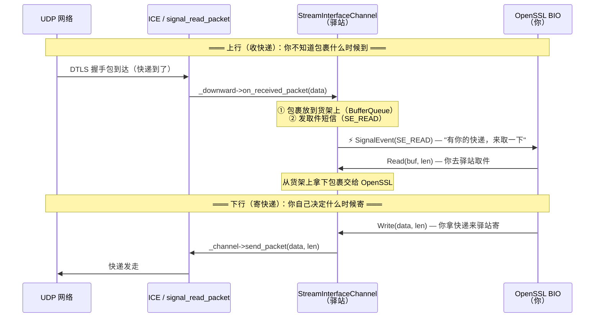
```mermaid
sequenceDiagram
    participant UDP as UDP 网络
    participant ICE as ICE / signal_read_packet
    participant SIC as StreamInterfaceChannel<br/>（驿站）
    participant SSL as OpenSSL BIO<br/>（你）

    Note over UDP,SSL: ═══ 上行（收快递）：你不知道包裹什么时候到 ═══

    UDP->>ICE: DTLS 握手包到达（快递到了）
    ICE->>SIC: _downward->on_received_packet(data)
    Note over SIC: ① 包裹放到货架上（BufferQueue）<br/>② 发取件短信（SE_READ）

    SIC->>SSL: ⚡ SignalEvent(SE_READ) — "有你的快递，来取一下"

    SSL->>SIC: Read(buf, len) — 你去驿站取件
    Note over SIC: 从货架上拿下包裹交给 OpenSSL

    Note over UDP,SSL: ═══ 下行（寄快递）：你自己决定什么时候寄 ═══

    SSL->>SIC: Write(data, len) — 你拿快递来驿站寄
    SIC->>ICE: _channel->send_packet(data, len)
    ICE->>UDP: 快递发走
```

**上行（收快递）**：OpenSSL 是你——你不知道 DTLS 握手包（快递）什么时候到。所以驿站需要两样东西：

| 机制 | 比喻 | 作用 |
|------|------|------|
| `SE_READ` 信号 | 取件短信 | 包裹到达时通知你"有快递，来取" |
| `BufferQueue` | 驿站货架 | 你没来取之前，包裹暂存货架上 |

两者缺一不可。没有短信，你永远不知道有快递；没有货架，快递员没法把包裹留下。

```
UDP → ICE → signal_read_packet → _handle_dtls_packet
  → _downward->on_received_packet(data, size)
    ├─ BufferQueue.WriteBack(data)           // 放到驿站货架
    └─ StreamInterface::SignalEvent(SE_READ) // 发取件短信

OpenSSL 收到短信来取:
  → StreamInterfaceChannel::Read(buf, len, ...)
    ├─ 货架空 → SR_BLOCK（回家等着，等下次短信）
    └─ 有包裹 → 取出 → SR_SUCCESS
```

**下行（寄快递）**：你自己决定什么时候寄——拿上包裹去驿站，直接发走。不需要短信，不需要货架。

```
OpenSSL 想寄握手响应
  → BIO Write → StreamInterfaceChannel::Write(data, len, ...)
    → _channel->send_packet(data, len)   // 直接经 ICE → UDP 发走
    → return SR_SUCCESS
```

**连接句柄所有权**：

```cpp
// _setup_dtls():
auto downward = std::make_unique<StreamInterfaceChannel>(_channel);
_downward = downward.get();                              // 保留裸指针
_dtls = SSLStreamAdapter::Create(std::move(downward));   // 所有权转移给 _dtls
```

- `_dtls` **拥有** StreamInterfaceChannel（通过 `std::unique_ptr`），负责生命周期
- `_downward` 是裸指针：`on_received_packet()` 是 `StreamInterfaceChannel` 自己的方法，不在 `rtc::StreamInterface` 接口里，无法通过 `_dtls` 调用。收包路径要用它把数据灌进队列

**BufferQueue 容量**：

```cpp
_packets(k_max_pending_packets=2, k_max_dtls_packet_len=2048)
```

最多缓存 2 个 DTLS 包。DTLS 握手包小且低频，2 个足够。积压超过 2 说明 OpenSSL 消费严重滞后——加大队列只是延迟暴露问题。

### 7.8 状态机：两个驱动力

DtlsTransport 状态变化由**两个独立驱动力**推动：

| 驱动力 | 来源 | 触发事件 |
|--------|------|---------|
| `_maybe_start_dtls()` | 由我们自己调 | ICE writable / ANSWER 到达 / ClientHello 到达（最后一个触发） |
| `_on_dtls_event()` | OpenSSL 通过 sigslot 通知 | 握手完成 / 连接关闭 / 有应用数据 |

```
k_new ───────────────────────────────────────────────────────────
  │
  │ _maybe_start_dtls() + StartSSL 成功
  ▼
k_connecting ─────────────────────────────────────────────────────
  │
  ├── _on_dtls_event(SE_OPEN)          → k_connected ★
  └── _on_dtls_handshake_error(error)  → k_failed
  │
k_connected ────────────────────────────────────────────────────
  │
  ├── _on_dtls_event(SE_CLOSE, error=0)  → k_closed
  └── _on_dtls_event(SE_CLOSE, error≠0) → k_failed
```

终态（`k_failed` / `k_closed`）无恢复机制——进入后只能等上层 STOP 或 k_failed 销毁。

**writable 的生命周期**：k_new 时透传 ICE writable，k_connected 后由 DTLS 自己管理。`_on_dtls_event(SE_OPEN)` 接管 writable=true，`SE_CLOSE` 接管 writable=false。

### 7.9 _on_read_packet：收包入口分拣

ICE 层已经把 STUN 过滤掉，到达此处的包按 DtlsTransport 状态分发：

| 状态 | 包类型 | 行为 |
|------|--------|------|
| `k_new` | DTLS ClientHello | 缓存 `_catched_client_hello` + 可能 `_setup_dtls()` |
| `k_new` | 非 ClientHello | 丢弃（不认识，也不是 RTP，因为还没握手） |
| `k_connecting` | DTLS Record | `_handle_dtls_packet` → 注入 OpenSSL |
| `k_connected` | DTLS Record | `_handle_dtls_packet` → 注入 OpenSSL |
| `k_connected` | RTP/RTCP | `is_rtp_packet()` 校验 → `signal_read_packet` 上交 DtlsSrtpTransport |
| `k_connected` | 非 DTLS 非 RTP | 丢弃并打警告 |
| `k_failed` / `k_closed` | 任意 | 忽略 |

### 7.10 `_handle_dtls_packet`：DTLS Record 结构校验

`_handle_dtls_packet` 不是解析 DTLS 握手内容——那由 OpenSSL 自己干。它做的是一层**TLV 结构完整性校验**，防止畸形包让 OpenSSL 读越界。

**DTLS Record 格式（RFC 6347）**：

```
Byte 0:       ContentType    (1B)  — 20=ChangeCipherSpec, 21=Alert, 22=Handshake, 23=AppData
Byte 1-2:     Version        (2B)  — DTLS 1.2 = 0xFEFD
Byte 3-4:     Epoch          (2B)
Byte 5-10:    Sequence Num   (6B)
Byte 11-12:   Length         (2B)  — 大端序, payload 字节数
Byte 13+:     Payload              — Length 指定的字节数
```

头固定 13 字节（`k_dtls_record_header_len`）。本质是 TLV 思想：读 Length → 跳 Value → 读下一个 Record → 直到 buffer 刚好耗尽。

```cpp
bool _handle_dtls_packet(const char* data, size_t size) {
    const uint8_t* tmp_data = reinterpret_cast<const uint8_t*>(data);
    size_t tmp_size = size;

    while (tmp_size > 0) {
        if (tmp_size < 13) return false;                        // 不够一个头

        size_t record_len = (tmp_data[11] << 8) | tmp_data[12]; // 读 Length (大端序)
        if (record_len + 13 > tmp_size) return false;            // 超限 → 畸形包

        tmp_data += 13 + record_len;                             // 跳到下一个 Record
        tmp_size -= 13 + record_len;
    }
    // 所有 Record 刚好覆盖整个 buffer → 合法
    return _downward->on_received_packet(data, size);            // 整包注入 OpenSSL
}
```

**一个 UDP 包可包含多个 DTLS Record**（RFC 6347 允许）。握手密集时 ServerHello + Certificate + ServerKeyExchange 可能合并在一个包送达，while 循环处理这种情形。

**它不做什么**：不解密、不解析握手消息体、不校验 MAC、不检查 ContentType（前面 `is_dtls_packet` 已校验过 `buf[0]` 在 20..63）。只回答一个问题——**Record 边界合法吗？合法就整包给 OpenSSL。**

### 7.11 DTLS 握手时序 + 状态变化

**图 A：握手启动 → SE_OPEN**

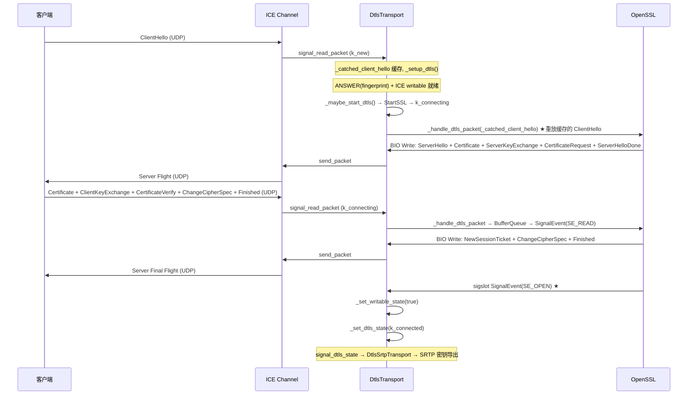
```mermaid
sequenceDiagram
    participant Client as 客户端
    participant ICE as ICE Channel
    participant DTLS as DtlsTransport
    participant SSL as OpenSSL

    Client->>ICE: ClientHello (UDP)
    ICE->>DTLS: signal_read_packet (k_new)
    Note over DTLS: _catched_client_hello 缓存, _setup_dtls()

    Note over DTLS: ANSWER(fingerprint) + ICE writable 就绪
    DTLS->>DTLS: _maybe_start_dtls() → StartSSL → k_connecting
    DTLS->>SSL: _handle_dtls_packet(_catched_client_hello) ★ 重放缓存的 ClientHello

    SSL->>DTLS: BIO Write: ServerHello + Certificate + ServerKeyExchange + CertificateRequest + ServerHelloDone
    DTLS->>ICE: send_packet
    ICE->>Client: Server Flight (UDP)

    Client->>ICE: Certificate + ClientKeyExchange + CertificateVerify + ChangeCipherSpec + Finished (UDP)
    ICE->>DTLS: signal_read_packet (k_connecting)
    DTLS->>SSL: _handle_dtls_packet → BufferQueue → SignalEvent(SE_READ)

    SSL->>DTLS: BIO Write: NewSessionTicket + ChangeCipherSpec + Finished
    DTLS->>ICE: send_packet
    ICE->>Client: Server Final Flight (UDP)

    SSL->>DTLS: sigslot SignalEvent(SE_OPEN) ★
    DTLS->>DTLS: _set_writable_state(true)
    DTLS->>DTLS: _set_dtls_state(k_connected)
    Note over DTLS: signal_dtls_state → DtlsSrtpTransport → SRTP 密钥导出
```

**图 B：应用数据期间（DTLS 层空闲）**

```
RTP/RTCP 经 SRTP 收发, DTLS 层不参与。
_on_dtls_event 的 SE_READ(SR_SUCCESS) 分支在此架构下几乎不触发。
```

**图 C：关闭 → SE_CLOSE**

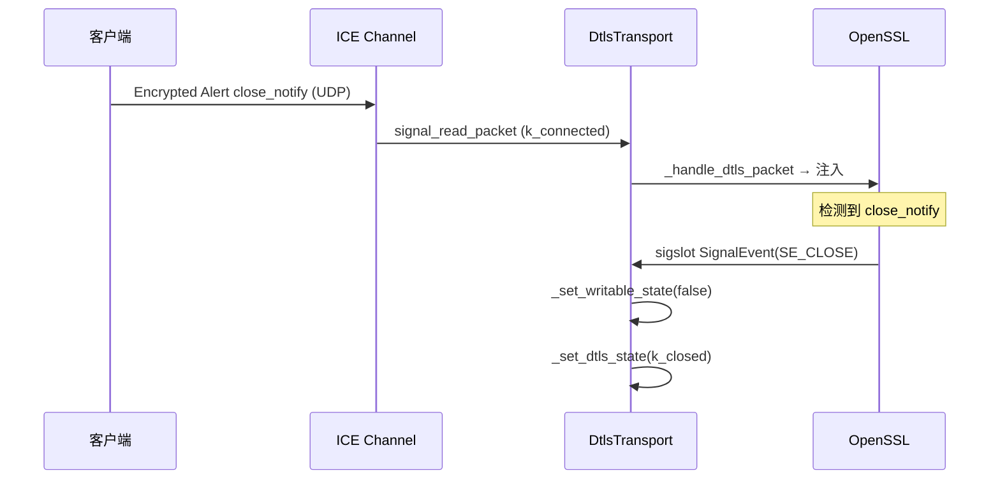
```mermaid
sequenceDiagram
    participant Client as 客户端
    participant ICE as ICE Channel
    participant DTLS as DtlsTransport
    participant SSL as OpenSSL

    Client->>ICE: Encrypted Alert close_notify (UDP)
    ICE->>DTLS: signal_read_packet (k_connected)
    DTLS->>SSL: _handle_dtls_packet → 注入
    Note over SSL: 检测到 close_notify

    SSL->>DTLS: sigslot SignalEvent(SE_CLOSE)
    DTLS->>DTLS: _set_writable_state(false)
    DTLS->>DTLS: _set_dtls_state(k_closed)
```

**`_on_dtls_event` 的三个信号总结**：

| 信号 | 触发时机 | 动作 |
|------|---------|------|
| `SE_OPEN` | 握手完成（Server Finished 发出后） | writable=true, state=k_connected |
| `SE_CLOSE` (error=0) | 对端发 close_notify | writable=false, state=k_closed |
| `SE_CLOSE` (error≠0) | 握手失败或异常断开 | state=k_failed |
| `Read()→SR_EOS` | SE_READ 循环中读到 close_notify | 与 SE_CLOSE(error=0) 同效果 |

### 7.12 SRTP 模块（DtlsSrtpTransport）完整生命周期

SRTP 模块的切入点就是 DTLS 的终点——`k_connected`。

**第一幕：出生（set_local_description）**

```cpp
// transport_controller.cpp:69-76
DtlsSrtpTransport* dtls_srtp = new DtlsSrtpTransport("audio", true);
dtls_srtp->set_dtls_transport(dtls_transport, nullptr);

// set_dtls_transport:
_rtp_dtls_transport->signal_dtls_state.connect(this, &_on_dtls_state);    // 等握手完成
_rtp_dtls_transport->signal_read_packet.connect(this, &_on_read_packet);  // 收包入口
_maybe_setup_dtls_srtp();  // 兜底调用 (实际不会命中, DTLS 还是 k_new)
```

此时 `_send_session` = null, `_recv_session` = null。`is_srtp_active()` = false。protect/unprotect 调用会被直接拒绝。

**第二幕：等待（ICE + DTLS 握手期间）**

SRTP 不干活。DTLS 还在握手中，没有主密钥，无法派生 SRTP 密钥。`_on_read_packet` 收包正常走——但 DTLS `k_new` 时只缓存 ClientHello、其余丢弃；`k_connecting` 时非 DTLS 包（RTP/RTCP）也被丢弃，因为客户端还没协商好 SRTP 密钥，发来的数据无法解密。RTP 要到 `k_connected` 后才会被 `signal_read_packet` 上交。

**第三幕：激活（DTLS k_connected）——密钥导出 + Session 创建**

唯一触发源：`signal_dtls_state(k_connected)` → `_on_dtls_state` → `_maybe_setup_dtls_srtp` → `_setup_dtls_srtp`：

```cpp
void _setup_dtls_srtp() {
    _extract_params(dtls, &crypto_suite, &send_key, &recv_key);
    set_rtp_params(send_cs, send_key, ..., recv_cs, recv_key, ...);
}
```

**密钥导出 `_extract_params`（`dtls_srtp_transport.cpp:239-285`）**：

① 获取 DTLS 协商的 crypto suite → 确定 key_len / salt_len。以 `SRTP_AES128_CM_SHA1_80` 为例：key_len=16, salt_len=14。

② 调用 `SSL_export_keying_material("EXTRACTOR-dtls_srtp", ...)`（RFC 5705）。DTLS 握手过程中双方各自派生出一段密钥材料，**只要 DTLS 握手成功，双方得到的 keying material 完全相同**。

③ 导出的 `dtls_buffer` 结构（总大小 = 2 × (key_len + salt_len)）：

```
dtls_buffer:
  [ client_write_key  | server_write_key  | client_write_salt | server_write_salt ]
    ← key_len bytes →   ← key_len bytes →   ← salt_len bytes →  ← salt_len bytes →
```

④ 拆分 + 分配方向：

```cpp
// 代码: dtls_srtp_transport.cpp:270-282
memcpy(&client_write_key[0],          &dtls_buffer[0],                    key_len);
memcpy(&server_write_key[0],          &dtls_buffer[key_len],              key_len);
memcpy(&client_write_key[key_len],    &dtls_buffer[2*key_len],            salt_len);
memcpy(&server_write_key[key_len],    &dtls_buffer[2*key_len + salt_len], salt_len);

*send_key = server_write_key;  // server_key + server_salt → SFU 加密发出
*recv_key = client_write_key;  // client_key + client_salt   → SFU 解密收到
```

| 方向 | 密钥构成 | 用途 |
|------|---------|------|
| send_key | server_write_key + server_write_salt | `_send_session` 加密 SFU → 客户端的 RTP/RTCP |
| recv_key | client_write_key + client_write_salt | `_recv_session` 解密客户端 → SFU 的 RTP/RTCP |

**为什么是 server_write_key 作为 send_key？** SFU 是 DTLS 服务端（`SSL_SERVER`）。`server_write_key` 是服务端用来写（加密发出）的密钥，客户端用它来读（解密收到）。`client_write_key` 是客户端用来写（加密发出）的，SFU 用它来读（解密收到）。命名从 TLS 握手角色的视角出发，跟媒体收发方向无关。

**Session 创建 `set_rtp_params`（`srtp_transport.cpp:13-49`）**：

```cpp
_send_session.reset(new SrtpSession());  // ssrc_any_outbound → 只允许 protect
_recv_session.reset(new SrtpSession());  // ssrc_any_inbound  → 只允许 unprotect
```

首次调用 `set_rtp_params` 时 session 为空，`new_session=true` → `set_send`/`set_recv`。注意：即使 DTLS 断开后重连，也是走 `set_send`/`set_recv`，**不是** `update_send`/`update_recv`。原因：

```
_on_dtls_state(k_disconnected / k_failed)
  → reset_params()           // _send_session = nullptr, _recv_session = nullptr
                              // DTLS 重连后:
_on_dtls_state(k_connected)
  → _maybe_setup_dtls_srtp()
    → is_srtp_active() = false (session 已被 reset)
    → _setup_dtls_srtp() → set_rtp_params(...)
      → _create_srtp_session() → new_session = true
      → set_send / set_recv   // ← 重新创建，不是 update
```

`update_send`/`update_recv` 仅在 session 已存在时被调用——当前实现中该路径不可达（`_maybe_setup_dtls_srtp` 的 `is_srtp_active()` 检查会提前返回）。是预留的密钥更新接口。

方向隔离：`_send_session` 只能加密（ssrc_any_outbound），`_recv_session` 只能解密（ssrc_any_inbound）。

**双触发幂等设计**：`_maybe_setup_dtls_srtp` 被两个调用者驱动：

| 调用者 | 时机 | 作用 |
|--------|------|------|
| `set_dtls_transport` | TransportController 创建 DtlsSrtpTransport 时 | 兜底——万一 DTLS 已经 connected 了?（实际不会命中） |
| `_on_dtls_state` | DTLS 握手完成, 信号通知 k_connected | 主路径——DTLS 通了就装 SRTP |

内部双检查保证只执行一次：

```cpp
void _maybe_setup_dtls_srtp() {
    if (is_srtp_active() || !is_dtls_writable()) return;  // 已装 或 DTLS 不可写 → 跳过
    _setup_dtls_srtp();
}
```

`is_srtp_active()` = `_send_session && _recv_session` 都不为空。SRTP 装好后无论哪个调用者再触发都是空操作。DTLS 断开时 `_on_dtls_state` 收到非 k_connected 状态 → `reset_params()` 销毁 session → `is_srtp_active()` 翻回 false，下次 DTLS 重连时重新安装。

**第四幕：工作**

收：`_on_read_packet` → `infer_rtp_packet_type` → `_on_rtp_packet_received` → `unprotect_rtp`（`_recv_session`）→ `signal_rtp_packet_received`。

发：`send_rtp(data, len)` → `protect_rtp`（`_send_session`）→ `_rtp_dtls_transport->send_packet` → ICE → UDP。

```
set_local_description()     DTLS SE_OPEN          is_srtp_active()=true
     │                           │                       │
     ▼                           ▼                       ▼
  ┌──────-┐  DTLS handshake  ┌──────┐  密钥导出+创建      ┌──────-┐
  │ 空壳   │ ──────────────→  │ 等待  │ ───────────────→ │ 就绪   │
  │session│                  │      │                   │session│
  │=null  │                  │=null │                   │=valid │
  └──────-┘                  └──────┘                   └──────-┘
  protect: 拒绝            protect: 拒绝             protect: 加密
  unprotect: 拒绝          unprotect: 拒绝           unprotect: 解密
```

### 7.13 `_extract_params`：RFC 5705 密钥导出逐行走读

`_extract_params`（`dtls_srtp_transport.cpp:239-285`）从 DTLS 主密钥中导出 SRTP 的加密/解密密钥。分三步：

**① 确认 crypto suite → 确定 key/salt 长度**：

```cpp
dtls_transport->get_srtp_crypto_suite(&selected_crypto_suite);
// DTLS 握手期间通过 SRTP 扩展协商的密码套件, 如 SRTP_AES128_CM_SHA1_80

GetSrtpKeyAndSaltLengths(selected_crypto_suite, &key_len, &salt_len);
// SRTP_AES128_CM_SHA1_80 → key_len=16 (AES-128-CTR), salt_len=14 (112-bit salt)
```

**② SSL_export_keying_material —— RFC 5705**：

```cpp
dtls_buffer = alloc(2 * (key_len + salt_len));  // 2 × (16+14) = 60 字节

dtls_transport->export_keying_material(
    "EXTRACTOR-dtls_srtp",   // RFC 5764 定义的标签
    nullptr, 0, false,       // 无 context
    &dtls_buffer[0], dtls_buffer.size());
```

`export_keying_material` → `DtlsTransport::export_keying_material` → `_dtls->ExportKeyingMaterial` → OpenSSL `SSL_export_keying_material`。DTLS 握手完成后，双方的主密钥相同，用同一个标签导出相同的密钥材料。

**③ 拆分 buffer — 分配加密/解密方向**：

```
dtls_buffer (60 字节):
  [client_write_key: 16B][server_write_key: 16B][client_write_salt: 14B][server_write_salt: 14B]
   offset=0               offset=16              offset=32                offset=46
```

```cpp
memcpy(&client_write_key[0],          &dtls_buffer[0],     key_len);   // [0, 16)
memcpy(&server_write_key[0],          &dtls_buffer[16],    key_len);   // [16, 32)
memcpy(&client_write_key[key_len],    &dtls_buffer[32],    salt_len);  // [32, 46)
memcpy(&server_write_key[key_len],    &dtls_buffer[46],    salt_len);  // [46, 60)

*send_key = server_write_key;  // server_key(16) + server_salt(14) = 30B → SFU 加密发出
*recv_key = client_write_key;  // client_key(16) + client_salt(14) = 30B → SFU 解密收到
```

| 密钥 | 构成 | 用途 | SFU 侧操作 |
|------|------|------|-----------|
| send_key | server_write_key + server_write_salt | 加密 SFU→客户端 的 RTP/RTCP | `_send_session->set_send` |
| recv_key | client_write_key + client_write_salt | 解密 客户端→SFU 的 RTP/RTCP | `_recv_session->set_recv` |

**命名反直觉**：SFU 是 DTLS 服务端（`SSL_SERVER`），`server_write_key` 是"服务端写数据的密钥"——即 SFU 发数据的加密密钥。`client_write_key` 是"客户端写数据的密钥"——即客户端发、SFU 收的解密密钥。

**`ZeroOnFreeBuffer`**：析构时 `memset(0)` 清零密钥材料，防止密钥残留内存被 dump。

### 7.14 libsrtp 全局初始化：引用计数

libsrtp 有两级 API：

| 级别 | API | 调用次数 | 含义 |
|------|-----|---------|------|
| 库级 | `srtp_init()` / `srtp_shutdown()` | 全局各一次 | 注册算法、分配全局状态 |
| 会话级 | `srtp_create()` / `srtp_protect()` / `srtp_dealloc()` | 每个 SrtpSession 各一次 | 创建独立的安全上下文 |

```cpp
// 全局引用计数
int g_libsrtp_usage_count = 0;          // 当前活跃的 SrtpSession 数量
GlobalMutex g_libsrtp_lock;             // 保护计数

// 首个 SrtpSession 构造 → srtp_init()
// 末个 SrtpSession 析构   → srtp_shutdown()
```

多流场景下，PushStream 和 PullStream 各自有 SrtpSession。**谁最后一个销毁 SrtpSession，谁负责 `srtp_shutdown()`**。

**潜在隐患**：最后一个 SrtpSession 析构调 `srtp_shutdown()` 时，如果另一个线程正在创建新 session 调 `srtp_init()`——存在竞态。

**优化方案**：改为单例。进程启动时 `srtp_init()`，进程退出时 `srtp_shutdown()`。每个 SrtpSession 创建时向单例注册指针，`srtp_install_event_handler` 的 thunk 通过单例查表分派事件到对应 session。生命周期跟进程绑定，消除引用计数的并发隐患。待后续评估。

### 7.15 `_do_set_key`：与 libsrtp 引擎的对接口

`_do_set_key`（`srtp_session.cpp:253-305`）是 `set_send` / `set_recv` / `update_send` / `update_recv` 的底层实现。它构造一个 `srtp_policy_t`，首次调用走 `srtp_create`，后续 DTLS 重连走 `srtp_update`。

**① 清零 + 查表填密码参数**：

```cpp
srtp_policy_t policy;
memset(&policy, 0, sizeof(policy));

srtp_crypto_policy_set_from_profile_for_rtp(&policy.rtp, cs);
srtp_crypto_policy_set_from_profile_for_rtcp(&policy.rtcp, cs);
// cs = SRTP_AES128_CM_SHA1_80 → cipher=AES-128-CTR, cipher_key_len=16, auth_tag_len=10
```

**② 方向隔离**：

```cpp
policy.ssrc.type = ssrc_any_outbound;  // outbound → 只能 srtp_protect (加密)
policy.ssrc.type = ssrc_any_inbound;   // inbound  → 只能 srtp_unprotect (解密)
policy.ssrc.value = 0;                 // 匹配任意 SSRC
```

`_send_session` 永远用 `ssrc_any_outbound`，`_recv_session` 永远用 `ssrc_any_inbound`。libsrtp 内部强制执行——outbound session 调 `srtp_unprotect` 会直接报错。

**③ 防重放窗口**：

```cpp
policy.window_size = 1024;     // 允许序列号乱序 1024 个包
policy.allow_repeat_tx = 1;    // 允许重复发送 (RTCP 重传)
```

RTP 序列号 16 位，会回转。`window_size = 1024` 表示"往前跳 1024 个 seqnum 仍然接受"。

**④ 创建或更新**：

```cpp
if (!_session) {
    srtp_create(&_session, &policy);        // 首次
    srtp_set_user_data(_session, this);     // 存 this 指针供事件回调
} else {
    srtp_update(_session, &policy);          // DTLS 重连, 更新密钥
}
```

**⑤ `auth_tag_len` 和加密时的 buffer 扩容**：

```cpp
_rtp_auth_tag_len = policy.rtp.auth_tag_len;    // 10
_rtcp_auth_tag_len = policy.rtcp.auth_tag_len;  // 10
```

加密时 libsrtp 在数据尾部追加 auth tag，buffer 必须提前扩容，否则越界写：

```
RTP 加密后:  [RTP Header][Encrypted Payload][AuthTag: 10B]
RTCP 加密后: [RTCP Header][Encrypted Payload][SRTCP Index: 4B][AuthTag: 10B]
```

RTCP 额外多 4 字节 SRTCP index——RTCP 包头没有 sequence number 字段，libsrtp 加密时在尾部插入一个 4 字节 index 用作防重放。所以扩容不同：

```cpp
// send_rtp: 只需要 auth_tag_len
CopyOnWriteBuffer packet(data, len, len + rtp_auth_tag_len);

// send_rtcp: 需要 auth_tag_len + 4 (SRTCP index)
CopyOnWriteBuffer packet(data, len, len + rtcp_auth_tag_len + sizeof(uint32_t));
```

解密时反操作——`unprotect_rtp` / `unprotect_rtcp` 验证 auth tag 后，`out_len` 比 `in_len` 小（auth tag 被剥离），调用方 `SetSize(out_len)` 截短 buffer。

## 8. SDP 字段 → ICE/DTLS 的"最后一公里"

### 8.1 字段提取

入口 `PeerConnection::set_remote_sdp()`（`src/pc/peer_connection.cpp:344`）：

```
"a=ice-ufrag:AbCd"   → TransportDescription::ice_ufrag  = "AbCd"
"a=ice-pwd:xxxxxx"   → TransportDescription::ice_pwd   = "xxxxxx"
"a=fingerprint:sha-256 AB:CD:..." → TransportDescription::identity_fingerprint
```

解析函数 `parse_transport_info()`（`peer_connection.cpp:171-207`）用 `starts_with` 匹配行前缀。提取完存入 `SessionDescription::_transport_infos`。

### 8.2 分发：同一个函数同时喂 ICE 和 DTLS

`TransportController::set_remote_description()`（`src/pc/transport_controller.cpp:219-245`）：

```cpp
auto td = remote_desc->get_transport_info(mid);
if (td) {
    // BRANCH A: ice-ufrag + ice-pwd → ICE 子系统
    _ice_agent->set_remote_ice_params(mid, IceCandidateComponent::RTP,
        IceParameters(td->ice_ufrag, td->ice_pwd));

    // BRANCH B: fingerprint → DTLS 子系统
    DtlsTransport* dtls = _get_dtls_transport(mid);
    if (dtls) {
        dtls->set_remote_fingerprint(td->identity_fingerprint->algorithm,
            td->identity_fingerprint->digest.data(),
            td->identity_fingerprint->digest.size());
    }
}
```

**注意顺序**：先设 ICE 参数，再设 DTLS 指纹。`set_remote_ice_params` 会触发 `_sort_connections_and_update_state()`，可能首次满足 ping 条件并启动 ICE 连通性检查。

### 8.3 ice-ufrag/pwd 的两把密码 + 各自消费点

ICE 涉及**两把**密码，对称分工。规则见 §16.1："发给谁，就用谁的密码"。

**本地密码 `_ice_params.ice_pwd`（SFU 密码）**：

| 消费点 | 场景 | 代码位置 |
|--------|------|---------|
| 验证客户端发来的 Binding Request | 收到 | `udp_port.cpp:195` — `validate_message_integrity(_ice_params.ice_pwd)` |
| 构造发给客户端的 Binding Response | 发出 | `ice_connection.cpp:62` — `add_message_integrity(_port->ice_pwd())` |

**远端密码 `_remote_ice_params.ice_pwd`（客户端密码）**：

进入 `IceTransportChannel` 后存在 `_remote_ice_params` 成员（`ice_transport_channel.cpp:75`），随后通过 `maybe_set_remote_ice_params` 补填到已有连接的 `remote_candidate.password`（`ice_connection.cpp:309-315`）。消费点：

| 消费点 | 场景 | 代码位置 |
|--------|------|---------|
| 分配给 `remote_candidate.password` | 创建 prflx 时赋值 | `ice_transport_channel.cpp:162` — 此时 ANSWER 可能未到，为空，需 §3.4 补填 |
| ping 门控 | 判断 `_is_pingable()` | `ice_controller.cpp:183` — `remote.password` 非空 = ANSWER 已到 |
| 构造发给客户端的 Binding Request (ping) | 发出 | `stun_request.cpp:131` — `add_message_integrity(remote_candidate().password)` |
| 验证客户端发来的 Binding Response | 收到 | `ice_connection.cpp:124` — `validate_message_integrity(_remote_candidate.password)` |

**注意**：之前说远端密码"不是 HMAC key，只是门控标志位"——这是错的。远端密码既做门控（`_is_pingable`），也做 HMAC key（ping 时构造 MI、收 response 时验证 MI）。"发给谁就用谁的密码"——发给客户端时用客户端密码，正是远端密码。

### 8.4 密码的"先有鸡还是先有蛋"问题

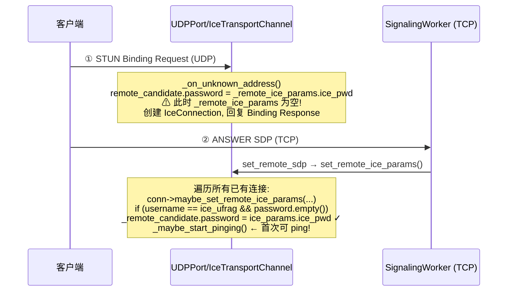
```mermaid
sequenceDiagram
    participant Client as 客户端
    participant UDP as UDPPort/IceTransportChannel
    participant TCP as SignalingWorker (TCP)

    Client->>UDP: ① STUN Binding Request (UDP)
    Note over UDP: _on_unknown_address()<br/>remote_candidate.password = _remote_ice_params.ice_pwd<br/>⚠ 此时 _remote_ice_params 为空!<br/>创建 IceConnection, 回复 Binding Response

    Client->>TCP: ② ANSWER SDP (TCP)
    TCP->>UDP: set_remote_sdp → set_remote_ice_params()
    Note over UDP: 遍历所有已有连接:<br/>conn->maybe_set_remote_ice_params(...)<br/>if (username == ice_ufrag && password.empty())<br/>  _remote_candidate.password = ice_params.ice_pwd ✓<br/>_maybe_start_pinging() ← 首次可 ping!

```

代码位置 `src/ice/ice_connection.cpp:309-315`：

```cpp
void IceConnection::maybe_set_remote_ice_params(const IceParameters& ice_params) {
    if (_remote_candidate.username == ice_params.ice_ufrag &&
            _remote_candidate.password.empty()) {
        _remote_candidate.password = ice_params.ice_pwd;
    }
}
```

### 8.5 `set_remote_fingerprint`：三种时序 + 两种边界

```cpp
bool set_remote_fingerprint(digest_alg, digest_data, digest_len) {
    // ① 幂等: 同样的指纹 → 忽略
    if (same as before) return true;

    // ② 客户端不支持 DTLS (alg 为空) → 禁用 DTLS
    if (alg.empty()) { _dtls_active = false; return false; }

    // ③ 本地证书还没设置 → 拒绝 (必须先 set_local_certificate)
    if (!_dtls_active) return false;

    // ④ 判断是否指纹变更
    bool is_fingerprint_change = _remote_fingerprint_alg.size() > 0;
    存入新的 fingerprint;

    // ⑤ 路径 A: _dtls 已存在 (ClientHello 先到触发了 _setup_dtls, 但当时缺指纹)
    //          → 对已有的 OpenSSL 上下文补调 SetPeerCertificateDigest
    if (_dtls && !is_fingerprint_change) {
        _dtls->SetPeerCertificateDigest(...);
        return true;
    }

    // ⑥ 路径 B: 指纹变更 (收到不同的 answer SDP)
    //          → 销毁旧 _dtls 重建
    if (_dtls && is_fingerprint_change) {
        _dtls.reset();
        _set_dtls_state(k_new);
    }

    // ⑦ 路径 C: _dtls 不存在 (ANSWER 正常先到)
    //          → _setup_dtls 内部读已存的指纹, 一把配好
    _setup_dtls();
}
```

| 分支 | 触发场景 | 行为 |
|------|---------|------|
| ① 幂等 | 相同 fingerprint 重复调用 | 忽略 |
| ② 不支持 | 客户端 SDP 无 fingerprint 行 | 禁用 DTLS |
| ③ 顺序错 | `set_local_certificate` 没调就调了这个 | 拒绝 |
| ⑤ 路径 A | ClientHello 先到 → `_setup_dtls` 跳过了指纹 → ANSWER 后到 | 补设到已有 `_dtls` |
| ⑥ 路径 B | 收到不同的 answer SDP | 销毁重建 |
| ⑦ 路径 C | ANSWER 正常先到 | `_setup_dtls` 一把配好 |

**`SetPeerCertificateDigest` 的作用**：告诉 OpenSSL"对端的证书指纹应该是这个值"。它是一个**被动设置**——只是存了一个期望值。真正的验证发生在 DTLS 握手收到对端 Certificate 报文时：OpenSSL 计算 `SHA-256(收到的证书)`，和 `SetPeerCertificateDigest` 存的期望值比对，不匹配则握手失败。

---

## 9. 三包竞态：STUN / DTLS ClientHello / ANSWER 时序全集

STUN Binding Request（UDP）、DTLS ClientHello（UDP）、ANSWER SDP（TCP）三者从客户端几乎同时发出，但在服务端以任意顺序到达。

### 9.1 六种时序

| # | 到达顺序 | 发生什么 | 延迟影响 |
|---|---------|---------|---------|
| **1** | STUN → DTLS → ANSWER | S 创建连接 → D 缓存到 `_catched_client_hello` → A 补指纹+密码 → ICE writable → 重放 D | **无延迟** |
| **2** | STUN → ANSWER → DTLS | S 创建连接 → A 补全凭据+指纹 → D 到达时 DTLS 已配好指纹 | **无延迟** |
| **3** | ANSWER → STUN → DTLS | A 先到（UDP 上无连接）→ S 创建连接+立即可 ping → ICE writable → D 到达 | **无延迟** |
| **4** | DTLS → STUN → ANSWER | D 先到**无连接** → `validate_fingerprint` 失败 → **UDPPort 静默丢弃** → S 创建 → A 补凭据 → 客户端**重传** D（1s） | **+1s DTLS 重传** |
| **5** | DTLS → ANSWER → STUN | D 被丢弃 → A 到达（无连接）→ S 创建 → 等重传 | **+1s** |
| **6** | ANSWER → DTLS → STUN | A 到达（无连接）→ D 被丢弃 → S 创建 → 等重传 | **+1s** |

### 9.2 时序 4 详细走读（唯一有延迟损失的路径）

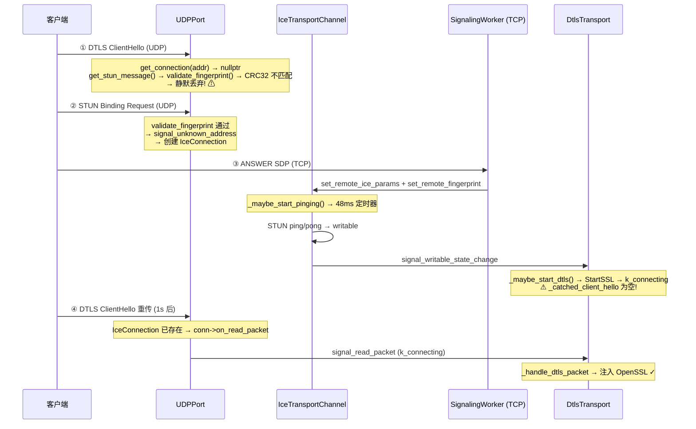
```mermaid
sequenceDiagram
    participant Client as 客户端
    participant UDP as UDPPort
    participant ICE as IceTransportChannel
    participant TCP as SignalingWorker (TCP)
    participant DTLS as DtlsTransport

    Client->>UDP: ① DTLS ClientHello (UDP)
    Note over UDP: get_connection(addr) → nullptr<br/>get_stun_message() → validate_fingerprint() → CRC32 不匹配<br/>→ 静默丢弃! ⚠

    Client->>UDP: ② STUN Binding Request (UDP)
    Note over UDP: validate_fingerprint 通过<br/>→ signal_unknown_address<br/>→ 创建 IceConnection

    Client->>TCP: ③ ANSWER SDP (TCP)
    TCP->>ICE: set_remote_ice_params + set_remote_fingerprint
    Note over ICE: _maybe_start_pinging() → 48ms 定时器

    ICE->>ICE: STUN ping/pong → writable
    ICE->>DTLS: signal_writable_state_change
    Note over DTLS: _maybe_start_dtls() → StartSSL → k_connecting<br/>⚠ _catched_client_hello 为空!

    Client->>UDP: ④ DTLS ClientHello 重传 (1s 后)
    Note over UDP: IceConnection 已存在 → conn->on_read_packet
    UDP->>DTLS: signal_read_packet (k_connecting)
    Note over DTLS: _handle_dtls_packet → 注入 OpenSSL ✓

```

**设计取舍**：UDPPort 不可能为每个未知 UDP 包都缓存（DoS 向量），所以选择"丢弃 + 依赖 DTLS 重传"。+1s 是 RFC 6347 规定的 DTLS 初始重传超时。

### 9.3 `_catched_client_hello` 的真实作用范围

只处理 **DTLS ClientHello 在 STUN 之后但在 DTLS 启动之前到达**的情况（时序 1），不处理 D 先于 STUN 到达的情况。

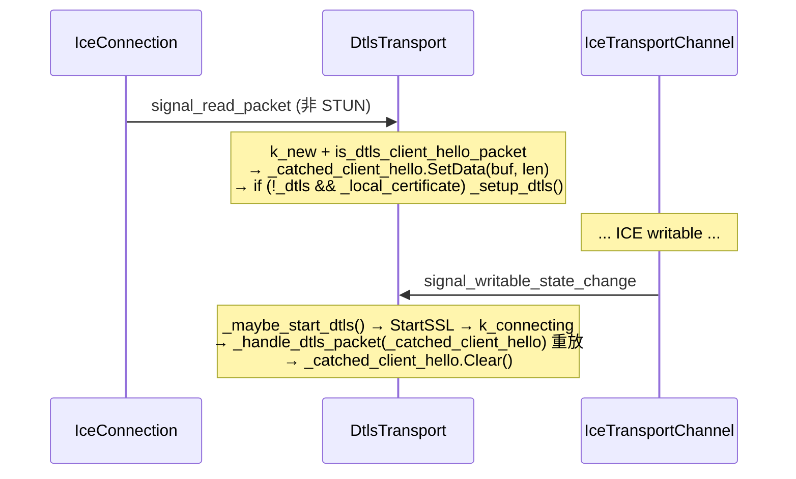
```mermaid
sequenceDiagram
    participant Conn as IceConnection
    participant DTLS as DtlsTransport
    participant ICE as IceTransportChannel

    Conn->>DTLS: signal_read_packet (非 STUN)
    Note over DTLS: k_new + is_dtls_client_hello_packet<br/>→ _catched_client_hello.SetData(buf, len)<br/>→ if (!_dtls && _local_certificate) _setup_dtls()

    Note over ICE: ... ICE writable ...

    ICE->>DTLS: signal_writable_state_change
    Note over DTLS: _maybe_start_dtls() → StartSSL → k_connecting<br/>→ _handle_dtls_packet(_catched_client_hello) 重放<br/>→ _catched_client_hello.Clear()

```

---

## 10. 同一个 UDP socket 如何服务三层协议

同一个 UDP socket、同一个端口，收包走同一条路径，然后在四个分拣层逐级分流。

### 10.1 收包分拣链（完整）

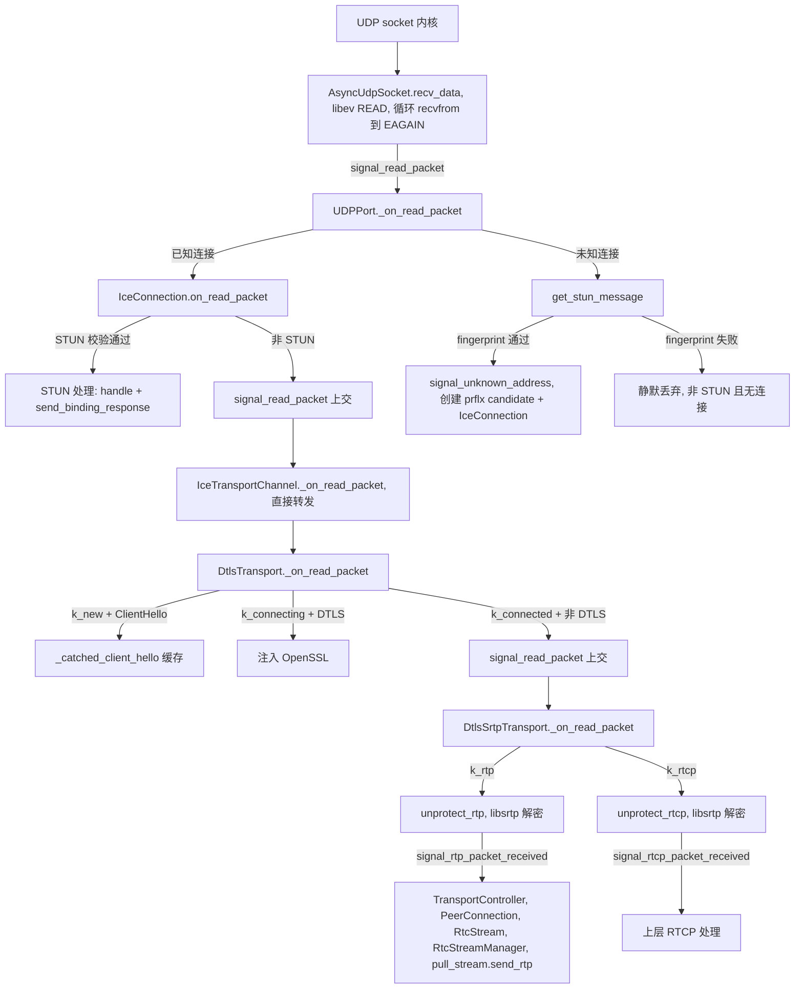
```mermaid
graph TD
    UDP[UDP socket 内核]
    UDP --> Async[AsyncUdpSocket.recv_data, libev READ, 循环 recvfrom 到 EAGAIN]
    Async -->|signal_read_packet| UDPPort[UDPPort._on_read_packet]

    UDPPort -->|已知连接| Conn[IceConnection.on_read_packet]
    UDPPort -->|未知连接| GetStun2[get_stun_message]

    Conn -->|STUN 校验通过| STUN[STUN 处理: handle + send_binding_response]
    Conn -->|非 STUN| SigRead1[signal_read_packet 上交]

    SigRead1 --> IceCh[IceTransportChannel._on_read_packet, 直接转发]
    IceCh --> DtlsRecv[DtlsTransport._on_read_packet]

    DtlsRecv -->|k_new + ClientHello| Cache[_catched_client_hello 缓存]
    DtlsRecv -->|k_connecting + DTLS| OpenSSL[注入 OpenSSL]
    DtlsRecv -->|k_connected + 非 DTLS| SigRead2[signal_read_packet 上交]

    SigRead2 --> SrtpRecv[DtlsSrtpTransport._on_read_packet]

    SrtpRecv -->|k_rtp| RtpDec[unprotect_rtp, libsrtp 解密]
    SrtpRecv -->|k_rtcp| RtcpDec[unprotect_rtcp, libsrtp 解密]

    RtpDec -->|signal_rtp_packet_received| RtpUp[TransportController, PeerConnection, RtcStream, RtcStreamManager, pull_stream.send_rtp]
    RtcpDec -->|signal_rtcp_packet_received| RtcpUp[上层 RTCP 处理]

    GetStun2 -->|fingerprint 通过| Unknown[signal_unknown_address, 创建 prflx candidate + IceConnection]
    GetStun2 -->|fingerprint 失败| Drop[静默丢弃, 非 STUN 且无连接]
```

### 10.2 四个分拣层

| 层级 | 分拣点 | 判断依据 | 去向 |
|------|--------|---------|------|
| **第 1 层** | `UDPPort::_on_read_packet` | 是否有已知连接？ | 有 → IceConnection；无 → `get_stun_message` |
| **第 2 层** | `IceConnection::on_read_packet` | CRC32 fingerprint 校验 | 通过 → STUN 处理；失败 → `signal_read_packet` 上交 |
| **第 3 层** | `DtlsTransport::_on_read_packet` | `buf[0]` 在 20-63？+ `buf[13]==1`? | DTLS → OpenSSL；其他 → `signal_read_packet` 上交 |
| **第 4 层** | `DtlsSrtpTransport::_on_read_packet` | `buf[1] & 0x7F` 在 [64,96)? | RTP → `unprotect_rtp`；RTCP → `unprotect_rtcp` |

### 10.3 发包容积链（完整）

加密 RTP 的发送路径从上到下贯穿整个栈：

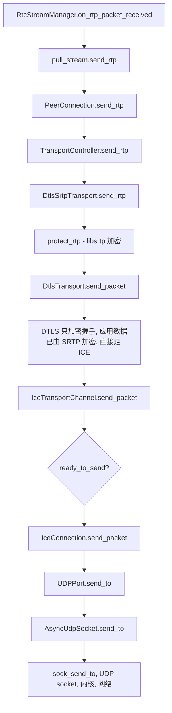
```mermaid
graph TD
    Mgr[RtcStreamManager.on_rtp_packet_received]
    Mgr --> Pull[pull_stream.send_rtp]
    Pull --> PC[PeerConnection.send_rtp]
    PC --> TC[TransportController.send_rtp]
    TC --> SrtpSend[DtlsSrtpTransport.send_rtp]

    SrtpSend --> Protect[protect_rtp - libsrtp 加密]
    Protect --> DtlsSend[DtlsTransport.send_packet]
    Note1[DTLS 只加密握手, 应用数据已由 SRTP 加密, 直接走 ICE]

    DtlsSend --> Note1
    Note1 --> IceCh[IceTransportChannel.send_packet]
    IceCh --> Ready{ready_to_send?}
    Ready --> Conn[IceConnection.send_packet]
    Conn --> Port[UDPPort.send_to]
    Port --> Async[AsyncUdpSocket.send_to]
    Async --> Kernel[sock_send_to, UDP socket, 内核, 网络]
```

---

## 11. 信号链：ICE writable → DTLS → SRTP → RTP 就绪

这是最具"多米诺骨牌效应"的一条链。

### 11.1 信号订阅全景

在 `TransportController::set_local_description()` 中建立：

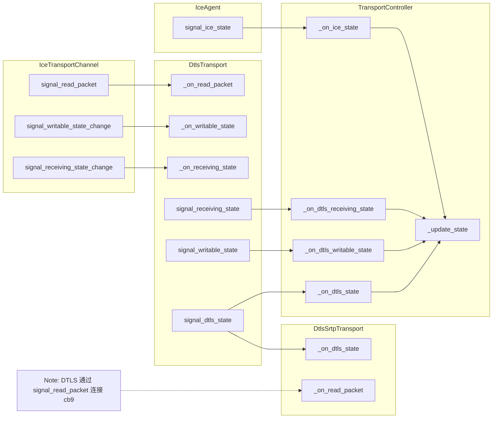
```mermaid
graph LR
    subgraph ICE[IceTransportChannel]
        sig1[signal_read_packet]
        sig2[signal_writable_state_change]
        sig3[signal_receiving_state_change]
    end

    subgraph DTLS[DtlsTransport]
        cb1[_on_read_packet]
        cb2[_on_writable_state]
        cb3[_on_receiving_state]
        sig4[signal_receiving_state]
        sig5[signal_writable_state]
        sig6[signal_dtls_state]
    end

    subgraph TC[TransportController]
        cb4[_on_dtls_receiving_state]
        cb5[_on_dtls_writable_state]
        cb6[_on_dtls_state]
        cb7[_on_ice_state]
        update[_update_state]
    end

    subgraph ICEAG[IceAgent]
        sig7[signal_ice_state]
    end

    subgraph SRTP[DtlsSrtpTransport]
        cb8[_on_dtls_state]
        cb9[_on_read_packet]
    end

    sig1 --> cb1
    sig2 --> cb2
    sig3 --> cb3
    sig4 --> cb4 --> update
    sig5 --> cb5 --> update
    sig6 --> cb6 --> update
    sig7 --> cb7 --> update
    sig6 --> cb8
    Note[Note: DTLS 通过 signal_read_packet 连接 cb9]
    Note -..-> cb9

```

### 11.2 多米诺骨牌

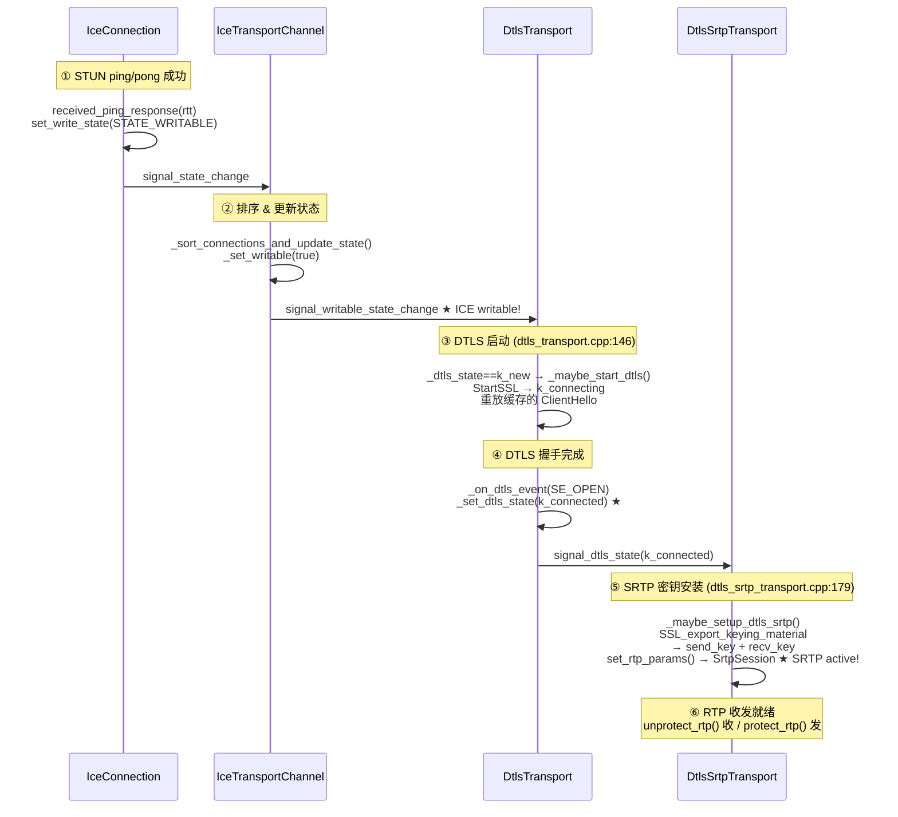
```mermaid
sequenceDiagram
    participant Conn as IceConnection
    participant Ch as IceTransportChannel
    participant DTLS as DtlsTransport
    participant SRTP as DtlsSrtpTransport

    Note over Conn: ① STUN ping/pong 成功
    Conn->>Conn: received_ping_response(rtt)<br/>set_write_state(STATE_WRITABLE)
    Conn->>Ch: signal_state_change

    Note over Ch: ② 排序 & 更新状态
    Ch->>Ch: _sort_connections_and_update_state()<br/>_set_writable(true)
    Ch->>DTLS: signal_writable_state_change ★ ICE writable!

    Note over DTLS: ③ DTLS 启动 (dtls_transport.cpp:146)
    DTLS->>DTLS: _dtls_state==k_new → _maybe_start_dtls()<br/>StartSSL → k_connecting<br/>重放缓存的 ClientHello

    Note over DTLS: ④ DTLS 握手完成
    DTLS->>DTLS: _on_dtls_event(SE_OPEN)<br/>_set_dtls_state(k_connected) ★
    DTLS->>SRTP: signal_dtls_state(k_connected)

    Note over SRTP: ⑤ SRTP 密钥安装 (dtls_srtp_transport.cpp:179)
    SRTP->>SRTP: _maybe_setup_dtls_srtp()<br/>SSL_export_keying_material<br/>→ send_key + recv_key<br/>set_rtp_params() → SrtpSession ★ SRTP active!

    Note over SRTP: ⑥ RTP 收发就绪<br/>unprotect_rtp() 收 / protect_rtp() 发

```

### 11.3 PC 状态聚合

4 个信号源汇聚到 `TransportController::_update_state()`（`src/pc/transport_controller.cpp:128-171`）：

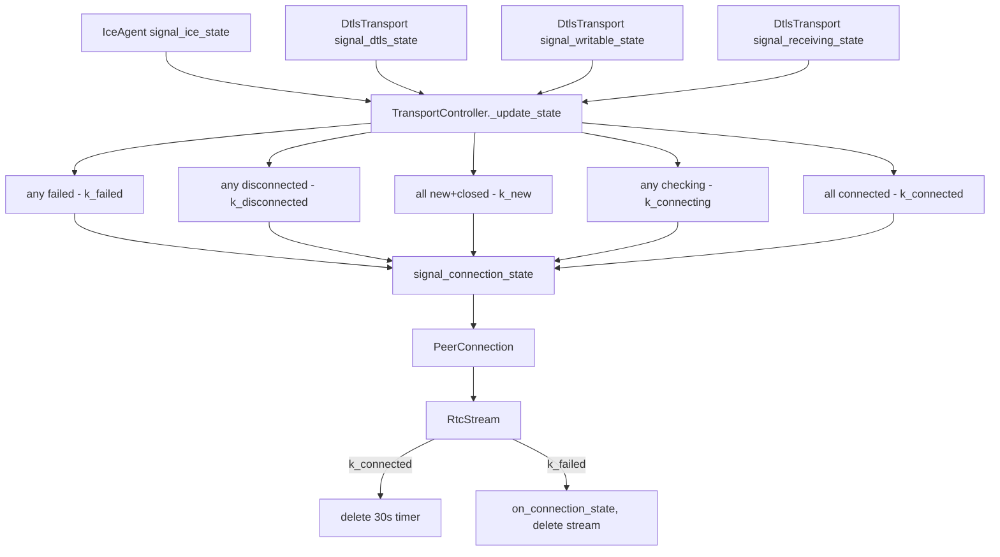
```mermaid
graph TD
    ICE[IceAgent signal_ice_state]
    DTLS1[DtlsTransport signal_dtls_state]
    DTLS2[DtlsTransport signal_writable_state]
    DTLS3[DtlsTransport signal_receiving_state]

    ICE --> Update[TransportController._update_state]
    DTLS1 --> Update
    DTLS2 --> Update
    DTLS3 --> Update

    Update --> R1[any failed - k_failed]
    Update --> R2[any disconnected - k_disconnected]
    Update --> R3[all new+closed - k_new]
    Update --> R4[any checking - k_connecting]
    Update --> R5[all connected - k_connected]

    R1 --> Sig[signal_connection_state]
    R2 --> Sig
    R3 --> Sig
    R4 --> Sig
    R5 --> Sig

    Sig --> PC[PeerConnection]
    PC --> Stream[RtcStream]
    Stream -->|k_connected| DelTimer[delete 30s timer]
    Stream -->|k_failed| Cleanup[on_connection_state, delete stream]
```

---

## 12. RTP/RTCP 数据包处理

### 12.1 RTP 固定头结构（RFC 3550）

RTP 包头固定 12 字节，SRTP 加密只覆盖 payload，包头原封不动：

```
Byte  0               1               2               3
      0 1 2 3 4 5 6 7 0 1 2 3 4 5 6 7 0 1 2 3 4 5 6 7 0 1 2 3 4 5 6 7
     +-+-+-+-+-+-+-+-+-+-+-+-+-+-+-+-+-+-+-+-+-+-+-+-+-+-+-+-+-+-+-+-+
     |V=2|P|X|  CC   |M|     PT      |       Sequence Number         |
     +-+-+-+-+-+-+-+-+-+-+-+-+-+-+-+-+-+-+-+-+-+-+-+-+-+-+-+-+-+-+-+-+
     |                           Timestamp                           |
     +-+-+-+-+-+-+-+-+-+-+-+-+-+-+-+-+-+-+-+-+-+-+-+-+-+-+-+-+-+-+-+-+
     |           Synchronization Source (SSRC) Identifier            |
     +-+-+-+-+-+-+-+-+-+-+-+-+-+-+-+-+-+-+-+-+-+-+-+-+-+-+-+-+-+-+-+-+
```

| 字段 | 位置 | 位宽 | 含义 |
|------|------|------|------|
| V | byte 0, bit 6-7 | 2 | 版本号，固定为 2 |
| P | byte 0, bit 5 | 1 | Padding |
| X | byte 0, bit 4 | 1 | 扩展头标记 |
| CC | byte 0, bit 0-3 | 4 | CSRC Count |
| M | byte 1, bit 7 | 1 | Marker，帧边界标记 |
| PT | byte 1, bit 0-6 | 7 | Payload Type |
| SeqNum | byte 2-3 | 16 | 序列号，每包 +1，大端序 |
| Timestamp | byte 4-7 | 32 | 采样时间戳 |
| SSRC | byte 8-11 | 32 | 同步源标识，大端序 |

代码只读三个字段——SFU 不解码，不需要 Timestamp、PT、Marker：

```cpp
// 版本号 → byte 0 高 2 位
bool has_correct_rtp_version(packet) { return (packet[0] >> 6) == 2; }

// 序列号 → byte 2-3, 大端序, 用于丢包检测日志
uint16_t parse_rtp_sequence_number(packet) { return ReadBigEndian(packet + 2); }

// SSRC → byte 8-11, 大端序, 用于流识别日志
uint32_t parse_rtp_ssrc(packet) { return ReadBigEndian(packet + 8); }
```

### 12.2 两级解复用

```
UDP 收包 → DtlsTransport (第一级) → DtlsSrtpTransport (第二级)
             DTLS vs 非 DTLS            RTP vs RTCP
```

**第一级**——`DtlsTransport::_on_read_packet()`（`dtls_transport.cpp:176-233`）。在 SRTP 解密**之前**执行，RTP header 不加密，version bits 可见：

| 判断 | 条件 | 去向 |
|------|------|------|
| DTLS | `len >= 13 && buf[0] 在 20..63` | OpenSSL |
| RTP/RTCP | `len >= 12 && (buf[0] & 0xC0) == 0x80` 且 DTLS 已 connected | `signal_read_packet` 上交 |

- DTLS ContentType: 20=ChangeCipherSpec, 21=Alert, 22=Handshake, 23=ApplicationData
- `(buf[0] & 0xC0) == 0x80` = RTP 版本位 == 2（二进制 `10`）

**第二级**——`infer_rtp_packet_type()`，在 SRTP **解密之后**执行，此时 byte 1 的 PT 可见。

RTCP 的 PT 完整 8 位取值为 192-223（如 SR=200=0xC8, RR=201, PLI=206）。`& 0x7F` 后变为 64-95。RTP 的 PT 范围为 0-127，`& 0x7F` 后在非 RTCP 保留区。

**为什么是 `& 0x7F`？** Byte 1 的结构：

```
Byte 1: [bit7=Marker][bit6][bit5][bit4][bit3][bit2][bit1][bit0=PT低]
         ← RTP 的 M 位 →  ←─── Payload Type (7 bits) ────→
```

RTP 有 Marker 位（bit7），`& 0x7F` 把它抹掉，取纯 PT 值。RTCP 没有 Marker 位，byte1 的完整 8 位就是 PT。通过 `& 0x7F` 统一到同一尺度下比较——[64,96) 为 RTCP 保留（RFC 5761），其余为 RTP。

**为什么分两层**：SRTP 不加密 RTP/RTCP 头（12 字节明文），PT 实际上第一层也可见。两层分离的原因是**架构分工**——`DtlsTransport` 只管 DTLS 握手 + DTLS vs 非 DTLS 的粗筛（version bits 够用了），精确的 RTP vs RTCP 区分留给 `DtlsSrtpTransport`（SRTP 模块的职责）。各层做各层的事。

**完整分拣 → 转发链路**：

```
UDP 收包 → IceConnection::on_read_packet
  ├─ STUN → 直接处理 (CRC32 fingerprint 校验后)
  └─ 非 STUN → signal_read_packet ↑

    → DtlsTransport::_on_read_packet (第一层: DTLS vs 非 DTLS)
      k_connecting: DTLS→OpenSSL, 其余丢弃
      k_connected: DTLS→OpenSSL, RTP/RTCP→signal_read_packet ↑

      → DtlsSrtpTransport::_on_read_packet (第二层: RTP vs RTCP)
        → infer_rtp_packet_type
          ├─ k_rtp → unprotect_rtp → signal_rtp_packet_received ↑
          └─ k_rtcp → unprotect_rtcp → signal_rtcp_packet_received ↑

            → TransportController → PeerConnection → RtcStream → RtcStreamManager
              RTP:  push → pull (单向)
              RTCP: push → pull + pull → push (双向)
```

### 12.3 收包 + 解密

从 ICE 上交到 DtlsSrtpTransport 的收包处理——调用链已经在 §12.2 的完整链路图中展示，这里聚焦解密步。

**入口**（`dtls_srtp_transport.cpp:104-120`）：

```cpp
void DtlsSrtpTransport::_on_read_packet(DtlsTransport*, const char* data, size_t len, int64_t ts) {
    RtpPacketType packet_type = infer_rtp_packet_type(data);
    if (packet_type == k_unknown) return;

    rtc::CopyOnWriteBuffer packet(data, len);
    if (packet_type == k_rtcp) _on_rtcp_packet_received(packet, ts);
    else                        _on_rtp_packet_received(packet, ts);
}
```

**RTP 解密**（`_on_rtp_packet_received`，`dtls_srtp_transport.cpp:127-152`）：

```cpp
void _on_rtp_packet_received(CopyOnWriteBuffer packet, int64_t ts) {
    if (!is_srtp_active()) return;                    // SRTP 未激活 → 丢弃

    char* data = packet.data<char>();
    int len = packet.size();

    if (!unprotect_rtp(data, len, &len)) {            // 原地解密 (_recv_session)
        // 每 100 次失败打一次日志, 含 seqnum + ssrc
        return;
    }

    packet.SetSize(len);                              // 截掉 auth tag
    signal_rtp_packet_received(this, &packet, ts);    // 明文 RTP → 上层转发
}
```

`unprotect_rtp` 委托给 `_recv_session->unprotect_rtp`。解密后 `len` 变小（auth tag 被剥离），`SetSize(len)` 截短 buffer。若解密失败（auth tag 校验不通过）→ 丢弃，每 100 次打一次日志防 flooding。

**RTCP 解密**结构相同，差异在于 `unprotect_rtcp` 额外处理 4 字节 SRTCP index。

**方向隔离**：

| Session | 方向 | libsrtp 策略 | 允许的操作 |
|---------|------|-------------|-----------|
| `_send_session` | 加密发出 | `ssrc_any_outbound` | 仅 `protect_rtp/protect_rtcp` |
| `_recv_session` | 解密收到 | `ssrc_any_inbound` | 仅 `unprotect_rtp/unprotect_rtcp` |

### 12.4 RtcStreamManager 转发逻辑

```cpp
// rtc_stream_manager.cpp:193-214

// RTP: push → pull 单向
void on_rtp_packet_received(stream, data, len) {
    if (k_push == stream->type()) {
        PullStream* pull = _find_pull_stream(stream->stream_name());
        if (pull) pull->send_rtp(data, len);
    }
    // pull 端不会产生 RTP (它是 sendonly), 忽略
}

// RTCP: 双向
void on_rtcp_packet_received(stream, data, len) {
    if (k_push == stream->type()) {
        PullStream* pull = _find_pull_stream(stream->stream_name());
        if (pull) pull->send_rtcp(data, len);         // push → pull: SR/RR/PLI
    } else if (k_pull == stream->type()) {
        PushStream* push = _find_push_stream(stream->stream_name());
        if (push) push->send_rtcp(data, len);         // pull → push: PLI/NACK
    }
}
```

**RTP 单向**：推流端是 `recvonly`，只有推流端的 RTP 到达时才转发给拉流端。拉流端是 `sendonly`，不产生 RTP。

**RTCP 双向**：推流端发 SR（Sender Report）让拉流端做音视频同步；拉流端发 PLI（Picture Loss Indication）请求 I 帧、NACK 请求重传，必须到达推流端。

### 12.5 发包路径：加密 → ICE 发出

```cpp
// dtls_srtp_transport.cpp:42-69
int send_rtp(const char* data, size_t len) {
    if (!is_srtp_active()) return -1;

    // ① 查 auth_tag_len → 扩容 buffer
    int rtp_auth_tag_len = 0;
    get_send_auth_tag_len(&rtp_auth_tag_len, nullptr);
    CopyOnWriteBuffer packet(data, len, len + rtp_auth_tag_len);  // capacity = len + 10

    // ② 原地加密 → encrypt payload + 追加 auth tag
    char* buf = (char*)packet.data();
    int size = packet.size();
    protect_rtp(buf, size, packet.capacity(), &size);   // size 变为 len + 10

    packet.SetSize(size);

    // ③ 加密后经 ICE 发出 (绕过 DTLS, 已由 SRTP 加密)
    return _rtp_dtls_transport->send_packet((const char*)packet.cdata(), packet.size());
}
```

**RTCP 加密**（`send_rtcp`）逻辑相同，差异是扩容时额外 4 字节留给 SRTCP index。

**绕过 DTLS**：`_rtp_dtls_transport->send_packet()` = `DtlsTransport::send_packet()` = `_channel->send_packet()`。DTLS 只加密握手消息，应用数据由 SRTP 加密后直接经 ICE 发出。这是 RFC 5764 的设计——DTLS 握手 → 密钥导出 → SRTP 接管应用数据。

**完整发包链**：

```
RtcStreamManager::on_rtp_packet_received
  → pull_stream->send_rtp()
    → PeerConnection::send_rtp()                // hardcoded mid="audio" (BUNDLE)
      → TransportController::send_rtp()
        → DtlsSrtpTransport::send_rtp()
          ├─ protect_rtp (_send_session, 加密)
          └─ _rtp_dtls_transport->send_packet()
              → DtlsTransport::send_packet()     // 直接走 ICE
                → IceTransportChannel::send_packet()
                  → _selected_connection->send_packet()
                    → UDPPort::send_to() → UDP socket
```

---

## 13. PULL 流 + SSRC 透传

PushStream 和 PullStream 是两个完全独立的媒体栈实例，各有一套 ICE/DTLS/SRTP。两者的连接点只在 `RtcStreamManager`——它从 push 端提取 SSRC 注入 pull 端 offer，并在运行时做 RTP/RTCP 应用层转发。

### 13.1 Stream、Track、SSRC 的概念关系

以实际 SFU 发给推流客户端的 SDP offer 为例（推流客户端 answer 中的 SSRC 行结构相同）：

```
m=audio ...
a=ssrc:318529680 cname:SW9JZ1cbEsO7ZIyo
a=ssrc:318529680 msid:stream_id audio_label

m=video ...
a=ssrc-group:FID 3016580959 2334272334
a=ssrc:3016580959 cname:SW9JZ1cbEsO7ZIyo
a=ssrc:3016580959 msid:stream_id video_label
a=ssrc:2334272334 cname:SW9JZ1cbEsO7ZIyo
a=ssrc:2334272334 msid:stream_id video_label
```

**Stream**（`stream_id`）：一个 RTCPeerConnection 上所有需要同步播放的 media source 的集合。同一个 stream_id 出现在 audio 和 video 两个 m= section 中——拉流端据此知道音频 SSRC 和视频 SSRC 属于同一路流，需要做唇音同步。

如果推流端同时推摄像头 + 桌面共享两路视频，SDP 里会有两个不同的 stream_id，各自独立播放：

```
m=audio ... a=ssrc:100 msid:streamA audio_track   ← streamA 的音频
m=video ... a=ssrc:200 msid:streamA video_track   ← streamA 的视频, 同 stream, 需同步

m=video ... a=ssrc:300 msid:streamB screen_track  ← streamB, 桌面共享, 独立
```

流 A 的 audio + video 需要同步，流 B 独立播放，跟流 A 互不干扰。

**Track**（`audio_label` / `video_label`）：一路独立的媒体轨道。audio_label 是音频 track，video_label 是视频 track。

**SSRC**（32 位无符号整数）：RTP 包头的流标识。一个 Track 至少对应一个 SSRC。若开启 RTX（重传），需要两个 SSRC，用 `ssrc-group:FID` 关联：

```
Stream "stream_id"
  ├─ Track "audio_label" (音频, Opus)
  │     └─ SSRC 318529680
  │
  └─ Track "video_label" (视频, H.264)
        ├─ SSRC 3016580959  (主流, H.264 编码)
        └─ SSRC 2334272334  (RTX 重传流, FID 指向 3016580959)
```

**SDP 行对应关系**：

| SDP 行 | 含义 |
|--------|------|
| `a=ssrc:N cname:XXX` | SSRC N 的 CNAME——实际做音视频同步的锚点（见下） |
| `a=ssrc:N msid:stream track` | SSRC N 属于哪个 Stream 的哪个 Track（建连时的映射关系） |

**CNAME 的作用**：SSRC 可能因碰撞而变（RFC 3550 规定冲突时换号），CNAME 在会话生命周期内不变。RTCP 的 SDES 包里携带 CNAME + NTP 时间戳，拉流端据此关联"这些不同 SSRC 实际来自同一个时钟源"，做唇音同步。**MSID 管"这些 SSRC 属于同一路流"，CNAME 管"这些流来自同一个人且能同步"。**
| `a=ssrc-group:FID M R` | M 是主流 SSRC，R 是重传流 SSRC |

**为什么 PullStream 的 offer 必须透传原始 SSRC**：SRTP 加密只覆盖 RTP payload，不加密包头。SFU 解密→重加密后，RTP 包头的 SSRC 是推流端原始值，原封不动到达拉流端：

```
推流客户端发出的 RTP:
  [RTP Header: SSRC=3016580959, seq=1234][Payload: 加密的 H.264]
                                                ↑
                                          SRTP 只加密这部分

SFU: unprotect_rtp (解密 payload) → protect_rtp (用拉流端密钥重加密)
     → 包头 SSRC 始终是 3016580959, SFU 没动过

拉流客户端收到:
  [RTP Header: SSRC=3016580959][Payload: 加密]
```

SFU 不解码、不转码、不改 RTP 包头。SSRC 是推流端定的，经过 SFU 后不变。所以 PullStream 的 offer 必须在 SDP 中声明这个 SSRC——不是"匹配"，是**提前告知**拉流客户端"你将收到 SSRC=3016580959 的包，它对应 video track (H.264)，RTX 流是 2334272334"。客户端才知道把这个 SSRC 的包交给哪个解码器。如果 offer 不声明，客户端收到未知 SSRC → 不知道编码类型 → 丢弃。

### 13.2 创建流程

```
SignalingWorker::_process_pull()
  → g_rtc_server->send_rtc_msg(msg)
    → CRC32(stream_name) 路由到同一 RtcWorker
      → RtcWorker::_process_pull()
        → RtcStreamManager::create_pull_stream()
```

`create_pull_stream()` 内部五步（`rtc_stream_manager.cpp:52-82`）：

```cpp
// ① 查找已有 PushStream
PushStream* push_stream = _find_push_stream(stream_name);
if (!push_stream) return -1;  // 没推流就拉不了

// ② 从 push 的 remote SDP 提取 SSRC
std::vector<StreamParams> audio_source, video_source;
push_stream->get_audio_source(audio_source);
push_stream->get_video_source(video_source);

// ③ 移除旧的 pull（同一 stream_name 只有一个）
_remove_pull_stream(uid, stream_name);

// ④ 新建 PullStream，注入 push 的 SSRC
PullStream* stream = new PullStream(_el, _allocator.get(), uid, stream_name, ...);
stream->add_audio_source(audio_source);
stream->add_video_source(video_source);
stream->start(certificate);

// ⑤ 生成带 SSRC 的 offer，存 map
offer = stream->create_offer();
_pull_streams[stream_name] = stream;
```

### 13.3 PushStream 如何提取 SSRC

`push_stream.cpp:36-61`——`get_audio_source()` / `get_video_source()` 委托给 `_get_source(mid, source)`：

```cpp
auto remote_desc = _pc->remote_desc();      // push 端收到 answer 后存入的
auto content = remote_desc->get_content(mid); // "audio" / "video"
source = content->streams();                 // vector<StreamParams>
```

`StreamParams`（`pc/stream_params.h`）承载：

```cpp
struct StreamParams {
    std::string id;                     // track id
    std::vector<uint32_t> ssrcs;        // 推流端真实 SSRC
    std::vector<SsrcGroup> ssrc_groups; // FID 等分组
    std::string cname;                  // CNAME
    std::string stream_id;              // msid
};
```

这些数据来自 push 客户端 ANSWER SDP 的 `a=ssrc:` 行解析（`peer_connection.cpp:215-273` 的 `parse_ssrc_info()`）。

### 13.4 PullStream 的 offer 怎么用这些 SSRC

```cpp
// pull_stream.cpp:22-33
options.send_audio = _audio;     // sendonly
options.recv_audio = false;
options.send_video = _video;
options.recv_video = false;
```

`PeerConnection::create_offer()` 对 `send` 方向（line 115-119, 127-133）：

```cpp
if (options.send_audio) {
    for (auto stream : _audio_source) {       // push 端的 SSRC
        audio->add_stream(stream);            // 注入到 SDP m=audio section
    }
}
```

SDP 序列化（`session_description.cpp:252`）写出 push 端原始 SSRC：

```
a=ssrc-group:FID 67890 67891
a=ssrc:67890 cname:clientVideoCname
a=ssrc:67890 msid:stream1 video_track
```

**关键约束**：SFU 不转码，只做 SRTP 解密→重加密。SSRC 是 RTP 包头核心标识，一旦改写，拉流端无法把收到的 RTP 与 SDP 声明的流对应。

### 13.5 PushStream vs PullStream 对比

| 维度 | PushStream | PullStream |
|------|-----------|-----------|
| SDP direction | `a=recvonly` | `a=sendonly` |
| offer 中 SSRC | 无 | push 端的原始 SSRC |
| send_audio/video | false | true |
| recv_audio/video | true | false |
| 数据方向 | 从 push 客户端接收 | 发送给 pull 客户端 |
| 媒体栈 | 独立 ICE/DTLS/SRTP | 独立 ICE/DTLS/SRTP |

---

## 14. STOP 与资源清理链

### 14.1 三条清理路径，一个收敛点

一个 RtcStream 可以通过三条路径被销毁，最终都收敛到 `_remove_push_stream` / `_remove_pull_stream`：

| 路径 | 入口 | 触发条件 | 调用链 | 响应 | UID 校验 |
|------|------|---------|--------|------|---------|
| ① 主动停止 | `stop_push/stop_pull` | 客户端发 STOP_PUSH / STOP_PULL | SignalingWorker → RtcServer → RtcWorker → RtcStreamManager | JSON `{errno:0}` | 外部传入 |
| ② ICE 失败 | `on_connection_state(k_failed)` | 所有 connection TIMEOUT → k_failed | ICE ping timer 回调栈内，信号上报 | 无响应 | stream 对象取 |
| ③ 兜底超时 | `on_stream_exception()` | 30s 内 PC 没到 k_connected | `ice_timeout_cb` 独立 timer | 无响应 | stream 对象取 |

**路径②和③的互斥**：`RtcStream::_on_connection_state` 在 `k_failed` 时同步删除 30s 定时器（`rtc_stream.cpp:32-36`），防止路径②触发后路径③二次触发。反方向：路径③先触发时会 delete stream，析构链中 `~RtcStream` 也会删定时器，路径②不会再来。

### 14.2 UID 校验 + delete
```cpp
void RtcStreamManager::_remove_push_stream(uint64_t uid, const string& stream_name) {
    PushStream* push_stream = _find_push_stream(stream_name);
    if (push_stream && uid == push_stream->get_uid()) {
        _push_streams.erase(stream_name);   // 先从 map 移除
        delete push_stream;                  // 再销毁
    }
}
```

### 14.3 析构瀑布
`delete push_stream` 触发的完整析构路径：

```
~PushStream()                                       // 日志
  → ~RtcStream()
    ├─ delete_timer(_ice_timeout_watcher)           // 取消 30s 超时
    └─ _pc->destroy()                               // ★ 不直接 delete

_pc->destroy():
  → create_timer(destroy_timer_cb, 10ms)            // 一次性定时器
  → return                                          // 当前栈退出

[10ms 后，事件循环空闲]
destroy_timer_cb():
  → delete pc

~PeerConnection():                                   // private 析构
  → ~unique_ptr<TransportController>

~TransportController():
  ├─ for each DtlsSrtpTransport: delete
  │    → ~SrtpTransport()
  │      ├─ reset _send_session (SrtpSession)       // libsrtp 发送 session
  │      └─ reset _recv_session (SrtpSession)       // libsrtp 接收 session
  ├─ for each DtlsTransport: delete
  │    → ~SSLStreamAdapter()                         // OpenSSL DTLS 上下文
  └─ delete _ice_agent

~IceAgent():
  → for each IceTransportChannel: delete

~IceTransportChannel():
  ├─ delete_timer(_ping_watcher)                     // 停 ping 定时器
  ├─ for each IceConnection: conn->destroy()
  │    → signal_connection_destroy → IceController 清理引用
  │    → delete this
  ├─ for each UDPPort: delete port
  │    ~UDPPort():
  │      ├─ close(_socket)                           // ★ 关闭 UDP socket fd
  │      └─ ~AsyncUdpSocket()
  │           ├─ delete_io_event(_socket_watcher)    // 从 libev 移除
  │           └─ delete[] _buf                       // 释放 1500 字节缓冲
  └─ _ice_controller.reset()                         // unique_ptr 销毁
```

### 14.4 为什么需要 10ms 延迟析构
```
ICE ping timer (48ms) → _on_check_and_ping()
  → _update_connection_states()
    → conn->update_state(now)
      → set_write_state(STATE_WRITE_TIMEOUT)
        → signal_state_change
          → _on_connection_state_change
            → _sort_connections_and_update_state
              → _compute_ice_transport_state → k_failed
                → signal_ice_state_change
                  → IceAgent::_update_state → signal_ice_state
                    → TransportController::_on_ice_state → _update_state → k_failed
                      → signal_connection_state → PeerConnection → RtcStream
                        → _listener->on_connection_state(k_failed)
                          → _remove_push_stream → delete push_stream
                            → ~RtcStream → _pc->destroy()
                              → create_timer(10ms) → return
  ← 回到 _on_check_and_ping()                        ★ 如果没有延迟，_ice_controller 已被 delete！
  → _ice_controller->select_connection_to_ping()     ★ nullptr dereference → coredump
```

**10ms**：足够当前 event loop 迭代完成并返回 libev，但人眼无感知。`~PeerConnection()` 设为 private + `destroy_timer_cb` 为 friend，编译期强制走延迟析构路径。

---

## 15. 完整生命周期时间线

### Phase 1 — 媒体栈诞生 (set_local_description)

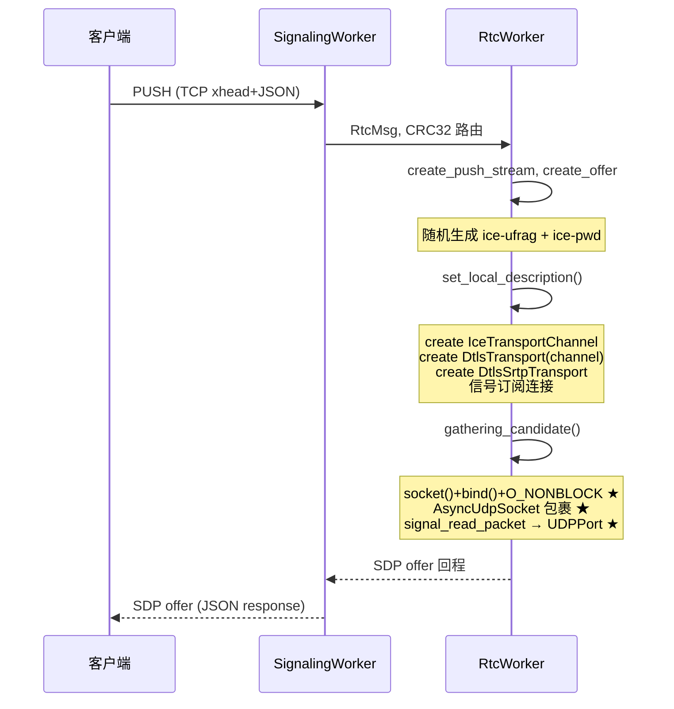
```mermaid
sequenceDiagram
    participant Client as 客户端
    participant Sig as SignalingWorker
    participant Rtc as RtcWorker

    Client->>Sig: PUSH (TCP xhead+JSON)
    Sig->>Rtc: RtcMsg, CRC32 路由
    Rtc->>Rtc: create_push_stream, create_offer
    Note over Rtc: 随机生成 ice-ufrag + ice-pwd
    Rtc->>Rtc: set_local_description()
    Note over Rtc: create IceTransportChannel<br/>create DtlsTransport(channel)<br/>create DtlsSrtpTransport<br/>信号订阅连接
    Rtc->>Rtc: gathering_candidate()
    Note over Rtc: socket()+bind()+O_NONBLOCK ★<br/>AsyncUdpSocket 包裹 ★<br/>signal_read_packet → UDPPort ★
    Rtc-->>Sig: SDP offer 回程
    Sig-->>Client: SDP offer (JSON response)
```

### Phase 2 — 远端信息注入 (set_remote_description)

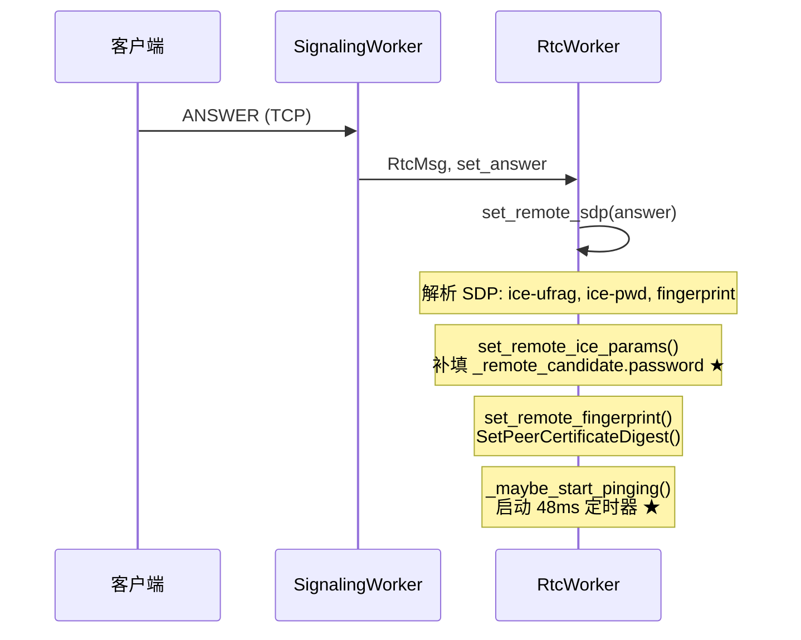
```mermaid
sequenceDiagram
    participant Client as 客户端
    participant Sig as SignalingWorker
    participant Rtc as RtcWorker

    Client->>Sig: ANSWER (TCP)
    Sig->>Rtc: RtcMsg, set_answer
    Rtc->>Rtc: set_remote_sdp(answer)
    Note over Rtc: 解析 SDP: ice-ufrag, ice-pwd, fingerprint
    Note over Rtc: set_remote_ice_params()<br/>补填 _remote_candidate.password ★
    Note over Rtc: set_remote_fingerprint()<br/>SetPeerCertificateDigest()
    Note over Rtc: _maybe_start_pinging()<br/>启动 48ms 定时器 ★
```

### Phase 3 — ICE 连通性检查

```mermaid
sequenceDiagram
    participant Client as 客户端
    participant ICE as IceTransportChannel

    loop 48ms 定时器
        ICE->>ICE: _on_check_and_ping()
        Note over ICE: _update_connection_states()<br/>select_connection_to_ping()
        ICE->>Client: STUN Binding Request (UDP)
        Client->>ICE: STUN Binding Response
        Note over ICE: MI 校验<br/>received_ping_response(rtt)<br/>set_write_state(WRITABLE) ★
    end
```

### Phase 4 — DTLS 握手

```mermaid
sequenceDiagram
    participant Client as 客户端
    participant ICE as IceTransportChannel
    participant DTLS as DtlsTransport

    ICE->>DTLS: signal_writable_state_change ★
    DTLS->>DTLS: _maybe_start_dtls()
    Note over DTLS: StartSSL, k_connecting<br/>重放 _catched_client_hello
    DTLS->>Client: DTLS 握手包 (UDP)
    Client->>DTLS: DTLS 握手包
    Note over DTLS: StreamInterfaceChannel 桥接<br/>signal_read_packet → BufferQueue<br/>SignalEvent(SE_READ) → OpenSSL
    Note over DTLS: _on_dtls_event(SE_OPEN)<br/>_set_dtls_state(k_connected) ★
```

### Phase 5 — SRTP 密钥安装

```mermaid
sequenceDiagram
    participant DTLS as DtlsTransport
    participant SRTP as DtlsSrtpTransport

    DTLS->>SRTP: signal_dtls_state(k_connected) ★
    SRTP->>SRTP: _maybe_setup_dtls_srtp()
    Note over SRTP: SSL_export_keying_material<br/>send_key = server_write_key + server_salt<br/>recv_key = client_write_key + client_salt
    Note over SRTP: set_rtp_params()<br/>send_session.set_send()<br/>recv_session.set_recv() ★ SRTP active!
```

### Phase 6 — RTP 流转发

```mermaid
sequenceDiagram
    participant Client as 推流客户端
    participant SRTP as DtlsSrtpTransport
    participant Mgr as RtcStreamManager
    participant Pull as 拉流端

    Client->>SRTP: SRTP RTP (UDP)
    SRTP->>SRTP: unprotect_rtp() 解密
    SRTP->>Mgr: signal_rtp_packet_received
    Mgr->>Mgr: on_rtp_packet_received
    Note over Mgr: k_push → _find_pull_stream<br/>→ pull_stream.send_rtp()
    Mgr->>Pull: protect_rtp() 加密 → ICE → UDP
    Note over Client, Pull: RTCP 双向: push ↔ pull (PLI + SR)
```

---

## 16. FAQ：你应该知道但可能没问的问题

### 16.1 STUN MESSAGE-INTEGRITY 的密码使用规则："发给谁，就用谁的密码"

STUN Binding Request 的 MI 用**接收方**的密码计算，Binding Response 复用**同一个**密码。双方各有自己的 ice-pwd，形成完美的对称：

| 场景 | 方向 | 密码 | 代码位置 |
|------|------|------|---------|
| 客户端 → SFU 的 Request | 收到 | `_ice_params.ice_pwd`（SFU 密码） | `udp_port.cpp:195` 验证 |
| SFU → 客户端的 Response | 发出 | `_port->ice_pwd()` = 同上 | `ice_connection.cpp:62` 构造 |
| SFU → 客户端的 Request (ping) | 发出 | `remote_candidate().password` = `_remote_ice_params.ice_pwd`（客户端密码） | `stun_request.cpp:131` 构造 |
| 客户端 → SFU 的 Response | 收到 | `_remote_candidate.password` = 同上 | `ice_connection.cpp:124` 验证 |

**规则**：Request 发给谁就用谁的密码，Response 跟 Request 用同一个密码。

另外，远端密码也是 `_is_pingable` 的门控条件——**密码非空才说明 ANSWER 已到达、对端身份已确认**，此时连接才可 ping。

### 16.2 `DtlsTransport::send_packet()` 为什么绕过 DTLS 加密？

```cpp
// src/pc/dtls_transport.cpp:554
int DtlsTransport::send_packet(const char* data, size_t len) {
    return _channel->send_packet(data, len);  // 直接走 ICE!
}
```

因为调用者是 `DtlsSrtpTransport::send_rtp()`——数据在到达这里之前**已经被 SRTP 加密过了**。DTLS 只加密握手消息（通过 OpenSSL 内部 BIO write），应用数据不需要经过 DTLS 层。这是 DTLS-SRTP 标准（RFC 5764）的设计：**DTLS 握手 → 密钥导出 → SRTP 接管应用数据**。

### 16.3 30s ICE 超时和 PC 状态 `k_connected` 的关系

```cpp
// src/stream/rtc_stream.cpp:72-78
void ice_timeout_cb(...) {
    if (stream->_state != PeerConnectionState::k_connected) {
        stream->_listener->on_stream_exception(stream);  // 删除流
    }
}
```

30s 一次性定时器在 `start()` 时创建。如果 30s 内 PC 到达 `k_connected`，定时器被删除。如果没到达，触发异常清理。这是 ICE/DTLS 握手的总超时兜底。

### 16.4 PushStream 和 PullStream 的 `create_offer()` 本质区别

```cpp
// push_stream.cpp: recvonly → SDP 不含 SSRC
// pull_stream.cpp: sendonly → SDP 含 push 端的 SSRC (透传)
```

虽然方向不同，但它们调用的是**同一个** `PeerConnection::create_offer()` → **同一个** `TransportController::set_local_description()`。这意味着 PushStream 和 PullStream **各自**拥有独立的 ICE channel、UDP socket、DTLS 上下文、SRTP session。两者之间的 RTP 数据通过 `RtcStreamManager` 做应用层转发：push 收（解密）→ pull 发（加密）。

### 16.5 `DtlsTransport` 和 `DtlsSrtpTransport` 的"组合优于继承"关系

```mermaid
graph TD
    SRTP[DtlsSrtpTransport, 不继承 DtlsTransport]
    DTLS[DtlsTransport*, _rtp_dtls_transport]

    SRTP -->|持有指针| DTLS
    SRTP -->|订阅 signal_dtls_state| OnState[_on_dtls_state]
    SRTP -->|订阅 signal_read_packet| OnRead[_on_read_packet]
    SRTP --> Send[_send_session, SrtpSession, ssrc_any_outbound]
    SRTP --> Recv[_recv_session, SrtpSession, ssrc_any_inbound]

```

`DtlsTransport` **不知道**自己上面有 `DtlsSrtpTransport`。两者可独立测试。`_maybe_setup_dtls_srtp` 被 `_on_dtls_state`（握手完成信号）和 `set_dtls_transport`（兜底）双触发，内部用 `is_srtp_active() || !is_dtls_writable()` 做幂等——"信号驱动 + 手动兜底"解决时序竞争。

### 16.6 `PeerConnection::destroy()` 延迟析构

```cpp
// src/pc/peer_connection.cpp:88-96
void PeerConnection::destroy() {
    _destroy_timer = _el->create_timer(destroy_timer_cb, this, false);
    _el->start_timer(_destroy_timer, 10000);  // 10ms 后 delete this
}
```

问题场景：ICE timer → `_on_check_and_ping()` → `_update_connection_states()` → conn timeout → signal 上报 → delete stream → 析构 IceController。但 `_on_check_and_ping` 返回后还要调用 `_ice_controller->select_connection_to_ping()`——如果在回调栈内同步析构，`_ice_controller` 已被释放 → coredump。

延迟 10ms 确保当前 event loop 迭代完整退出后才析构。`~PeerConnection()` 设为 private，编译期拦截所有直接 `delete`。

### 16.7 `StreamInterfaceChannel` 的 BIO 桥接

```cpp
// src/pc/dtls_transport.cpp:62-84
class StreamInterfaceChannel {
    BufferQueue _packets;  // 容量 2, 每个最大 2048 字节

    // ICE 收包 → 写入 BufferQueue → 唤醒 OpenSSL
    bool on_received_packet(const char* data, size_t size) {
        _packets.WriteBack(data, size, nullptr);
        SignalEvent(this, rtc::SE_READ, 0);  // "叫 OpenSSL 来读"
    }

    // OpenSSL 调用 Read() → 从 BufferQueue 取
    rtc::StreamResult Read(void* buffer, size_t buffer_len, size_t* read, ...) {
        if (!_packets.ReadFront(buffer, buffer_len, read))
            return rtc::SR_BLOCK;  // 队列空 → 阻塞 OpenSSL
        return rtc::SR_SUCCESS;
    }

    // OpenSSL 调用 Write() → 直接经 ICE 发出
    rtc::StreamResult Write(const void* data, size_t data_len, ...) {
        _channel->send_packet((const char*)data, data_len);
    }
};
```

两个方向的 `SignalEvent` 含义不同：我们发 `SE_READ` 是"叫 OpenSSL 来读 BufferQueue"，OpenSSL 发 `SE_OPEN` 是"握手完成"、发 `SE_READ` 是"解密数据就绪"。谁点火、谁接收是关键区分。

### 16.8 为什么 BUNDLE + RTCP mux 默认开启？有什么影响？

历史原因：老版浏览器不支持、需要独立 ICE channel。现代 WebRTC（2015 年后）强制要求两者开启。当前 xrtc-server 的配置入口只支持 BUNDLE + RTCP mux，不支持关闭。

影响：始终只有 1 个 IceTransportChannel。`IceAgent::_update_state` 的多 channel 聚合逻辑在 BUNDLE + mux 下变成单 channel 透传。非 BUNDLE 场景下 1 音频 + 1 视频需要 4 个 UDP 端口（audio RTP、audio RTCP、video RTP、video RTCP），当前 1 个。

### 16.9 IceTransportChannel 的 writable vs receiving 为什么独立？

writable = selected_connection 是否 writable（"我们→对端"方向）。receiving = 任意连接是否 receiving（"对端→我们"方向）。

两者独立是因为 UDP 链路可以单向通——对端在发数据但我们发不出去，或者我们能发但对端没数据过来。`_weak() = !(writable && receiving)` 要求双向都健康才叫 strong。

### 16.10 SSRC 为什么要透传？不能换一个吗？

SFU 不解码不转码，SRTP 加密只覆盖 payload，RTP 包头的 SSRC 原封不动到达拉流端。如果换了 SSRC，拉流端无法把收到的 RTP 包跟 SDP 声明的 SSRC 匹配，不知道该用 H.264 还是 Opus 解码器 → 丢弃。所以 PullStream 的 offer 必须声明和推流端完全一致的 SSRC。

### 16.11 为什么 ICE 用定时器巡检方式而不是事件驱动方式？

连接状态只会在"收到 ping response"和"定时器到期"两个时机变化。如果没有定时器，一个连接 ping 出去后永远收不到回复，就永远不会被发现已经断了。定时器巡检是**探测超时的唯一手段**——必须主动检查，不能被动等待。
